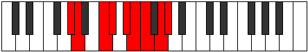

# Mode Sanyllic

## Links

- [Documentation](index.md)
- [Scales Index](Scales.md)
- [Modes Index](Modes.md)
- [Chords Index](Chords.md)

## Parent Scale

[Thyptyllic](ScaleThyptyllic.md)

## Number

[2995](https://ianring.com/musictheory/scales/2995)

## Perfection

- 5 Perfect notes
- 3 Perfect notes

## Perfection Profile

[true true true true false false true false]

## Permutations

| Tonic | Notes | Signature | Illustration | Audio |
|-------|-------|-----------|--------------|-------|
| [C](ModeCNaturalSanyllic.md) | C, C#, E, F, **G**, **G#**, A, **B**, C | C |  | [midi](ModeCNaturalSanyllic.mid) [ogg](ModeCNaturalSanyllic.ogg) |
| [C#](ModeCSharpSanyllic.md) | C#, D, F, F#, **G#**, **A**, A#, **C**, C# | C |  | [midi](ModeCSharpSanyllic.mid) [ogg](ModeCSharpSanyllic.ogg) |
| [Db](ModeDFlatSanyllic.md) | Db, D, F, Gb, **Ab**, **A**, Bb, **C**, Db | C |  | [midi](ModeDFlatSanyllic.mid) [ogg](ModeDFlatSanyllic.ogg) |
| [D](ModeDNaturalSanyllic.md) | D, D#, F#, G, **A**, **A#**, B, **C#**, D | C |  | [midi](ModeDNaturalSanyllic.mid) [ogg](ModeDNaturalSanyllic.ogg) |
| [D#](ModeDSharpSanyllic.md) | D#, E, G, G#, **A#**, **B**, C, **D**, D# | C |  | [midi](ModeDSharpSanyllic.mid) [ogg](ModeDSharpSanyllic.ogg) |
| [Eb](ModeEFlatSanyllic.md) | Eb, E, G, Ab, **Bb**, **B**, C, **D**, Eb | C |  | [midi](ModeEFlatSanyllic.mid) [ogg](ModeEFlatSanyllic.ogg) |
| [E](ModeENaturalSanyllic.md) | E, F, G#, A, **B**, **C**, C#, **D#**, E | C |  | [midi](ModeENaturalSanyllic.mid) [ogg](ModeENaturalSanyllic.ogg) |
| [F](ModeFNaturalSanyllic.md) | F, F#, A, A#, **C**, **C#**, D, **E**, F | C |  | [midi](ModeFNaturalSanyllic.mid) [ogg](ModeFNaturalSanyllic.ogg) |
| [F#](ModeFSharpSanyllic.md) | F#, G, A#, B, **C#**, **D**, D#, **F**, F# | C |  | [midi](ModeFSharpSanyllic.mid) [ogg](ModeFSharpSanyllic.ogg) |
| [Gb](ModeGFlatSanyllic.md) | Gb, G, Bb, B, **Db**, **D**, Eb, **F**, Gb | C |  | [midi](ModeGFlatSanyllic.mid) [ogg](ModeGFlatSanyllic.ogg) |
| [G](ModeGNaturalSanyllic.md) | G, G#, B, C, **D**, **D#**, E, **F#**, G | C |  | [midi](ModeGNaturalSanyllic.mid) [ogg](ModeGNaturalSanyllic.ogg) |
| [G#](ModeGSharpSanyllic.md) | G#, A, C, C#, **D#**, **E**, F, **G**, G# | C |  | [midi](ModeGSharpSanyllic.mid) [ogg](ModeGSharpSanyllic.ogg) |
| [Ab](ModeAFlatSanyllic.md) | Ab, A, C, Db, **Eb**, **E**, F, **G**, Ab | C |  | [midi](ModeAFlatSanyllic.mid) [ogg](ModeAFlatSanyllic.ogg) |
| [A](ModeANaturalSanyllic.md) | A, A#, C#, D, **E**, **F**, F#, **G#**, A | C |  | [midi](ModeANaturalSanyllic.mid) [ogg](ModeANaturalSanyllic.ogg) |
| [A#](ModeASharpSanyllic.md) | A#, B, D, D#, **F**, **F#**, G, **A**, A# | C |  | [midi](ModeASharpSanyllic.mid) [ogg](ModeASharpSanyllic.ogg) |
| [Bb](ModeBFlatSanyllic.md) | Bb, B, D, Eb, **F**, **Gb**, G, **A**, Bb | C |  | [midi](ModeBFlatSanyllic.mid) [ogg](ModeBFlatSanyllic.ogg) |
| [B](ModeBNaturalSanyllic.md) | B, C, D#, E, **F#**, **G**, G#, **A#**, B | C |  | [midi](ModeBNaturalSanyllic.mid) [ogg](ModeBNaturalSanyllic.ogg) |
