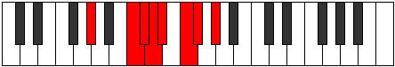

# Mode Saptian

## Links

- [Documentation](index.md)
- [Scales Index](Scales.md)
- [Modes Index](Modes.md)
- [Chords Index](Chords.md)

## Parent Scale

[Saptian](ScaleSaptian.md)

## Number

[1777](https://ianring.com/musictheory/scales/1777)

## Perfection

- 4 Perfect notes
- 3 Perfect notes

## Perfection Profile

[true false true false false true true]

## Permutations

| Tonic | Notes | Signature | Illustration | Audio |
|-------|-------|-----------|--------------|-------|
| [C](ModeCNaturalSaptian.md) | C, **D##**, E#, **F#**, **G**, A, Bb, C | C |  | [midi](ModeCNaturalSaptian.mid) [ogg](ModeCNaturalSaptian.ogg) |
| [C#](ModeCSharpSaptian.md) | C#, **D###**, E##, **F##**, **G#**, A#, B, C# | C |  | [midi](ModeCSharpSaptian.mid) [ogg](ModeCSharpSaptian.ogg) |
| [Db](ModeDFlatSaptian.md) | Db, **E#**, F#, **G**, **Ab**, Bb, Cb, Db | C |  | [midi](ModeDFlatSaptian.mid) [ogg](ModeDFlatSaptian.ogg) |
| [D](ModeDNaturalSaptian.md) | D, **E##**, F##, **G#**, **A**, B, C, D | C |  | [midi](ModeDNaturalSaptian.mid) [ogg](ModeDNaturalSaptian.ogg) |
| [D#](ModeDSharpSaptian.md) | D#, **E###**, F###, **G##**, **A#**, B#, C#, D# | C |  | [midi](ModeDSharpSaptian.mid) [ogg](ModeDSharpSaptian.ogg) |
| [Eb](ModeEFlatSaptian.md) | Eb, **F##**, G#, **A**, **Bb**, C, Db, Eb | C |  | [midi](ModeEFlatSaptian.mid) [ogg](ModeEFlatSaptian.ogg) |
| [E](ModeENaturalSaptian.md) | E, **F###**, G##, **A#**, **B**, C#, D, E | C |  | [midi](ModeENaturalSaptian.mid) [ogg](ModeENaturalSaptian.ogg) |
| [F](ModeFNaturalSaptian.md) | F, **G##**, A#, **B**, **C**, D, Eb, F | C |  | [midi](ModeFNaturalSaptian.mid) [ogg](ModeFNaturalSaptian.ogg) |
| [F#](ModeFSharpSaptian.md) | F#, **G###**, A##, **B#**, **C#**, D#, E, F# | C |  | [midi](ModeFSharpSaptian.mid) [ogg](ModeFSharpSaptian.ogg) |
| [Gb](ModeGFlatSaptian.md) | Gb, **A#**, B, **C**, **Db**, Eb, Fb, Gb | C |  | [midi](ModeGFlatSaptian.mid) [ogg](ModeGFlatSaptian.ogg) |
| [G](ModeGNaturalSaptian.md) | G, **A##**, B#, **C#**, **D**, E, F, G | C |  | [midi](ModeGNaturalSaptian.mid) [ogg](ModeGNaturalSaptian.ogg) |
| [G#](ModeGSharpSaptian.md) | G#, **A###**, B##, **C##**, **D#**, E#, F#, G# | C |  | [midi](ModeGSharpSaptian.mid) [ogg](ModeGSharpSaptian.ogg) |
| [Ab](ModeAFlatSaptian.md) | Ab, **B#**, C#, **D**, **Eb**, F, Gb, Ab | C |  | [midi](ModeAFlatSaptian.mid) [ogg](ModeAFlatSaptian.ogg) |
| [A](ModeANaturalSaptian.md) | A, **B##**, C##, **D#**, **E**, F#, G, A | C |  | [midi](ModeANaturalSaptian.mid) [ogg](ModeANaturalSaptian.ogg) |
| [A#](ModeASharpSaptian.md) | A#, **B###**, C###, **D##**, **E#**, F##, G#, A# | C |  | [midi](ModeASharpSaptian.mid) [ogg](ModeASharpSaptian.ogg) |
| [Bb](ModeBFlatSaptian.md) | Bb, **C##**, D#, **E**, **F**, G, Ab, Bb | C |  | [midi](ModeBFlatSaptian.mid) [ogg](ModeBFlatSaptian.ogg) |
| [B](ModeBNaturalSaptian.md) | B, **C###**, D##, **E#**, **F#**, G#, A, B | C |  | [midi](ModeBNaturalSaptian.mid) [ogg](ModeBNaturalSaptian.ogg) |
