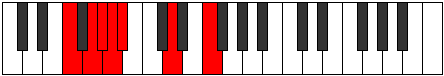
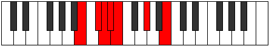

# Mode Saptimic

## Links

- [Documentation](index.md)
- [Scales Index](Scales.md)
- [Modes Index](Modes.md)
- [Chords Index](Chords.md)

## Parent Scale

[Starimic](ScaleStarimic.md)

## Number

[573](https://ianring.com/musictheory/scales/573)

## Perfection

- 3 Perfect notes
- 3 Perfect notes

## Perfection Profile

[false true false false true true]

## Permutations

| Tonic | Notes | Signature | Illustration | Audio |
|-------|-------|-----------|--------------|-------|
| [C](ModeCNaturalSaptimic.md) | **C**, D, **Eb**, **Fb**, Gbb, A, **C** | C |  | [midi](ModeCNaturalSaptimic.mid) [ogg](ModeCNaturalSaptimic.ogg) |
| [C#](ModeCSharpSaptimic.md) | **C#**, D#, **E**, **F**, Gb, A#, **C#** | C |  | [midi](ModeCSharpSaptimic.mid) [ogg](ModeCSharpSaptimic.ogg) |
| [Db](ModeDFlatSaptimic.md) | **Db**, Eb, **Fb**, **Gbb**, Abbb, Bb, **Db** | C |  | [midi](ModeDFlatSaptimic.mid) [ogg](ModeDFlatSaptimic.ogg) |
| [D](ModeDNaturalSaptimic.md) | **D**, E, **F**, **Gb**, Abb, B, **D** | C |  | [midi](ModeDNaturalSaptimic.mid) [ogg](ModeDNaturalSaptimic.ogg) |
| [D#](ModeDSharpSaptimic.md) | **D#**, E#, **F#**, **G**, Ab, B#, **D#** | C |  | [midi](ModeDSharpSaptimic.mid) [ogg](ModeDSharpSaptimic.ogg) |
| [Eb](ModeEFlatSaptimic.md) | **Eb**, F, **Gb**, **Abb**, Bbbb, C, **Eb** | C |  | [midi](ModeEFlatSaptimic.mid) [ogg](ModeEFlatSaptimic.ogg) |
| [E](ModeENaturalSaptimic.md) | **E**, F#, **G**, **Ab**, Bbb, C#, **E** | C |  | [midi](ModeENaturalSaptimic.mid) [ogg](ModeENaturalSaptimic.ogg) |
| [F](ModeFNaturalSaptimic.md) | **F**, G, **Ab**, **Bbb**, Cbb, D, **F** | C |  | [midi](ModeFNaturalSaptimic.mid) [ogg](ModeFNaturalSaptimic.ogg) |
| [F#](ModeFSharpSaptimic.md) | **F#**, G#, **A**, **Bb**, Cb, D#, **F#** | C |  | [midi](ModeFSharpSaptimic.mid) [ogg](ModeFSharpSaptimic.ogg) |
| [Gb](ModeGFlatSaptimic.md) | **Gb**, Ab, **Bbb**, **Cbb**, Dbbb, Eb, **Gb** | C |  | [midi](ModeGFlatSaptimic.mid) [ogg](ModeGFlatSaptimic.ogg) |
| [G](ModeGNaturalSaptimic.md) | **G**, A, **Bb**, **Cb**, Dbb, E, **G** | C |  | [midi](ModeGNaturalSaptimic.mid) [ogg](ModeGNaturalSaptimic.ogg) |
| [G#](ModeGSharpSaptimic.md) | **G#**, A#, **B**, **C**, Db, E#, **G#** | C |  | [midi](ModeGSharpSaptimic.mid) [ogg](ModeGSharpSaptimic.ogg) |
| [Ab](ModeAFlatSaptimic.md) | **Ab**, Bb, **Cb**, **Dbb**, Ebbb, F, **Ab** | C |  | [midi](ModeAFlatSaptimic.mid) [ogg](ModeAFlatSaptimic.ogg) |
| [A](ModeANaturalSaptimic.md) | **A**, B, **C**, **Db**, Ebb, F#, **A** | C |  | [midi](ModeANaturalSaptimic.mid) [ogg](ModeANaturalSaptimic.ogg) |
| [A#](ModeASharpSaptimic.md) | **A#**, B#, **C#**, **D**, Eb, F##, **A#** | C |  | [midi](ModeASharpSaptimic.mid) [ogg](ModeASharpSaptimic.ogg) |
| [Bb](ModeBFlatSaptimic.md) | **Bb**, C, **Db**, **Ebb**, Fbb, G, **Bb** | C |  | [midi](ModeBFlatSaptimic.mid) [ogg](ModeBFlatSaptimic.ogg) |
| [B](ModeBNaturalSaptimic.md) | **B**, C#, **D**, **Eb**, Fb, G#, **B** | C |  | [midi](ModeBNaturalSaptimic.mid) [ogg](ModeBNaturalSaptimic.ogg) |
