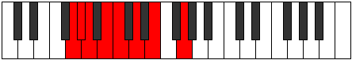

# Mode Sarian

## Links

- [Documentation](index.md)
- [Scales Index](Scales.md)
- [Modes Index](Modes.md)
- [Chords Index](Chords.md)

## Parent Scale

[Aerathian](ScaleAerathian.md)

## Number

[695](https://ianring.com/musictheory/scales/695)

## Perfection

- 5 Perfect notes
- 2 Perfect notes

## Interval Pattern

1, 1, 2, 1, 2, 2, 3

## Perfection Profile

[true false true false true true true]

## Permutations

| Tonic | Notes | Signature | Illustration | Audio |
|-------|-------|-----------|--------------|-------|
| [C](ModeCNaturalSarian.md) | C, **Db**, Ebb, **Fb**, Gbb, Abb, Bbb, C | C |  | [midi](https://github.com/edipermadi/music/blob/main/docs/ModeCNaturalSarian.mid?raw=true) |
| [C#](ModeCSharpSarian.md) | C#, **D**, Eb, **F**, Gb, Ab, Bb, C# | C |  | [midi](https://github.com/edipermadi/music/blob/main/docs/ModeCSharpSarian.mid?raw=true) |
| [Db](ModeDFlatSarian.md) | Db, **Ebb**, Fbb, **Gbb**, Abbb, Bbbb, Cbb, Db | C |  | [midi](https://github.com/edipermadi/music/blob/main/docs/ModeDFlatSarian.mid?raw=true) |
| [D](ModeDNaturalSarian.md) | D, **Eb**, Fb, **Gb**, Abb, Bbb, Cb, D | C |  | [midi](https://github.com/edipermadi/music/blob/main/docs/ModeDNaturalSarian.mid?raw=true) |
| [D#](ModeDSharpSarian.md) | D#, **E**, F, **G**, Ab, Bb, C, D# | C |  | [midi](https://github.com/edipermadi/music/blob/main/docs/ModeDSharpSarian.mid?raw=true) |
| [Eb](ModeEFlatSarian.md) | Eb, **Fb**, Gbb, **Abb**, Bbbb, Cbb, Dbb, Eb | C |  | [midi](https://github.com/edipermadi/music/blob/main/docs/ModeEFlatSarian.mid?raw=true) |
| [E](ModeENaturalSarian.md) | E, **F**, Gb, **Ab**, Bbb, Cb, Db, E | C |  | [midi](https://github.com/edipermadi/music/blob/main/docs/ModeENaturalSarian.mid?raw=true) |
| [F](ModeFNaturalSarian.md) | F, **Gb**, Abb, **Bbb**, Cbb, Dbb, Ebb, F | C |  | [midi](https://github.com/edipermadi/music/blob/main/docs/ModeFNaturalSarian.mid?raw=true) |
| [F#](ModeFSharpSarian.md) | F#, **G**, Ab, **Bb**, Cb, Db, Eb, F# | C |  | [midi](https://github.com/edipermadi/music/blob/main/docs/ModeFSharpSarian.mid?raw=true) |
| [Gb](ModeGFlatSarian.md) | Gb, **Abb**, Bbbb, **Cbb**, Dbbb, Ebbb, Fbb, Gb | C |  | [midi](https://github.com/edipermadi/music/blob/main/docs/ModeGFlatSarian.mid?raw=true) |
| [G](ModeGNaturalSarian.md) | G, **Ab**, Bbb, **Cb**, Dbb, Ebb, Fb, G | C |  | [midi](https://github.com/edipermadi/music/blob/main/docs/ModeGNaturalSarian.mid?raw=true) |
| [G#](ModeGSharpSarian.md) | G#, **A**, Bb, **C**, Db, Eb, F, G# | C |  | [midi](https://github.com/edipermadi/music/blob/main/docs/ModeGSharpSarian.mid?raw=true) |
| [Ab](ModeAFlatSarian.md) | Ab, **Bbb**, Cbb, **Dbb**, Ebbb, Fbb, Gbb, Ab | C |  | [midi](https://github.com/edipermadi/music/blob/main/docs/ModeAFlatSarian.mid?raw=true) |
| [A](ModeANaturalSarian.md) | A, **Bb**, Cb, **Db**, Ebb, Fb, Gb, A | C |  | [midi](https://github.com/edipermadi/music/blob/main/docs/ModeANaturalSarian.mid?raw=true) |
| [A#](ModeASharpSarian.md) | A#, **B**, C, **D**, Eb, F, G, A# | C |  | [midi](https://github.com/edipermadi/music/blob/main/docs/ModeASharpSarian.mid?raw=true) |
| [Bb](ModeBFlatSarian.md) | Bb, **Cb**, Dbb, **Ebb**, Fbb, Gbb, Abb, Bb | C |  | [midi](https://github.com/edipermadi/music/blob/main/docs/ModeBFlatSarian.mid?raw=true) |
| [B](ModeBNaturalSarian.md) | B, **C**, Db, **Eb**, Fb, Gb, Ab, B | C |  | [midi](https://github.com/edipermadi/music/blob/main/docs/ModeBNaturalSarian.mid?raw=true) |
