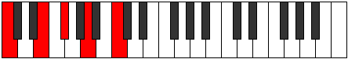

# Mode Saric

## Links

- [Documentation](index.md)
- [Scales Index](Scales.md)
- [Modes Index](Modes.md)
- [Chords Index](Chords.md)

## Parent Scale

[Saric](ScaleSaric.md)

## Number

[593](https://ianring.com/musictheory/scales/593)

## Perfection

- 1 Perfect notes
- 3 Perfect notes

## Interval Pattern

4, 2, 3, 3

## Perfection Profile

[false false false true]

## Permutations

| Tonic | Notes | Signature | Illustration | Audio |
|-------|-------|-----------|--------------|-------|
| [C](ModeCNaturalSaric.md) | **C**, **E**, **F#**, A, **C** | C |  | [midi](https://github.com/edipermadi/music/blob/main/docs/ModeCNaturalSaric.mid?raw=true) |
| [C#](ModeCSharpSaric.md) | **C#**, **F**, **G**, A#, **C#** | C |  | [midi](https://github.com/edipermadi/music/blob/main/docs/ModeCSharpSaric.mid?raw=true) |
| [Db](ModeDFlatSaric.md) | **Db**, **F**, **G**, Bb, **Db** | C |  | [midi](https://github.com/edipermadi/music/blob/main/docs/ModeDFlatSaric.mid?raw=true) |
| [D](ModeDNaturalSaric.md) | **D**, **F#**, **G#**, B, **D** | C |  | [midi](https://github.com/edipermadi/music/blob/main/docs/ModeDNaturalSaric.mid?raw=true) |
| [D#](ModeDSharpSaric.md) | **D#**, **G**, **A**, C, **D#** | C |  | [midi](https://github.com/edipermadi/music/blob/main/docs/ModeDSharpSaric.mid?raw=true) |
| [Eb](ModeEFlatSaric.md) | **Eb**, **G**, **A**, C, **Eb** | C |  | [midi](https://github.com/edipermadi/music/blob/main/docs/ModeEFlatSaric.mid?raw=true) |
| [E](ModeENaturalSaric.md) | **E**, **G#**, **A#**, C#, **E** | C |  | [midi](https://github.com/edipermadi/music/blob/main/docs/ModeENaturalSaric.mid?raw=true) |
| [F](ModeFNaturalSaric.md) | **F**, **A**, **B**, D, **F** | C |  | [midi](https://github.com/edipermadi/music/blob/main/docs/ModeFNaturalSaric.mid?raw=true) |
| [F#](ModeFSharpSaric.md) | **F#**, **A#**, **C**, D#, **F#** | C |  | [midi](https://github.com/edipermadi/music/blob/main/docs/ModeFSharpSaric.mid?raw=true) |
| [Gb](ModeGFlatSaric.md) | **Gb**, **Bb**, **C**, Eb, **Gb** | C |  | [midi](https://github.com/edipermadi/music/blob/main/docs/ModeGFlatSaric.mid?raw=true) |
| [G](ModeGNaturalSaric.md) | **G**, **B**, **C#**, E, **G** | C |  | [midi](https://github.com/edipermadi/music/blob/main/docs/ModeGNaturalSaric.mid?raw=true) |
| [G#](ModeGSharpSaric.md) | **G#**, **C**, **D**, F, **G#** | C |  | [midi](https://github.com/edipermadi/music/blob/main/docs/ModeGSharpSaric.mid?raw=true) |
| [Ab](ModeAFlatSaric.md) | **Ab**, **C**, **D**, F, **Ab** | C |  | [midi](https://github.com/edipermadi/music/blob/main/docs/ModeAFlatSaric.mid?raw=true) |
| [A](ModeANaturalSaric.md) | **A**, **C#**, **D#**, F#, **A** | C |  | [midi](https://github.com/edipermadi/music/blob/main/docs/ModeANaturalSaric.mid?raw=true) |
| [A#](ModeASharpSaric.md) | **A#**, **D**, **E**, G, **A#** | C |  | [midi](https://github.com/edipermadi/music/blob/main/docs/ModeASharpSaric.mid?raw=true) |
| [Bb](ModeBFlatSaric.md) | **Bb**, **D**, **E**, G, **Bb** | C |  | [midi](https://github.com/edipermadi/music/blob/main/docs/ModeBFlatSaric.mid?raw=true) |
| [B](ModeBNaturalSaric.md) | **B**, **D#**, **F**, G#, **B** | C |  | [midi](https://github.com/edipermadi/music/blob/main/docs/ModeBNaturalSaric.mid?raw=true) |
