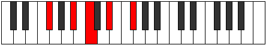
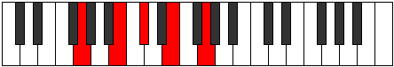
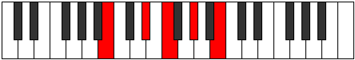

# Mode Saric

## Links

- [Documentation](index.md)
- [Scales Index](Scales.md)
- [Modes Index](Modes.md)
- [Chords Index](Chords.md)

## Parent Scale

[Saric](ScaleSaric.md)

## Number

[593](https://ianring.com/musictheory/scales/593)

## Perfection

- 1 Perfect notes
- 3 Perfect notes

## Perfection Profile

[false false false true]

## Permutations

| Tonic | Notes | Signature | Illustration | Audio |
|-------|-------|-----------|--------------|-------|
| [C](ModeCNaturalSaric.md) | **C**, **E**, **F#**, A, **C** | C |  | [midi](ModeCNaturalSaric.mid) [ogg](ModeCNaturalSaric.ogg) |
| [C#](ModeCSharpSaric.md) | **C#**, **F**, **G**, A#, **C#** | C |  | [midi](ModeCSharpSaric.mid) [ogg](ModeCSharpSaric.ogg) |
| [Db](ModeDFlatSaric.md) | **Db**, **F**, **G**, Bb, **Db** | C |  | [midi](ModeDFlatSaric.mid) [ogg](ModeDFlatSaric.ogg) |
| [D](ModeDNaturalSaric.md) | **D**, **F#**, **G#**, B, **D** | C |  | [midi](ModeDNaturalSaric.mid) [ogg](ModeDNaturalSaric.ogg) |
| [D#](ModeDSharpSaric.md) | **D#**, **G**, **A**, C, **D#** | C |  | [midi](ModeDSharpSaric.mid) [ogg](ModeDSharpSaric.ogg) |
| [Eb](ModeEFlatSaric.md) | **Eb**, **G**, **A**, C, **Eb** | C |  | [midi](ModeEFlatSaric.mid) [ogg](ModeEFlatSaric.ogg) |
| [E](ModeENaturalSaric.md) | **E**, **G#**, **A#**, C#, **E** | C |  | [midi](ModeENaturalSaric.mid) [ogg](ModeENaturalSaric.ogg) |
| [F](ModeFNaturalSaric.md) | **F**, **A**, **B**, D, **F** | C |  | [midi](ModeFNaturalSaric.mid) [ogg](ModeFNaturalSaric.ogg) |
| [F#](ModeFSharpSaric.md) | **F#**, **A#**, **C**, D#, **F#** | C |  | [midi](ModeFSharpSaric.mid) [ogg](ModeFSharpSaric.ogg) |
| [Gb](ModeGFlatSaric.md) | **Gb**, **Bb**, **C**, Eb, **Gb** | C |  | [midi](ModeGFlatSaric.mid) [ogg](ModeGFlatSaric.ogg) |
| [G](ModeGNaturalSaric.md) | **G**, **B**, **C#**, E, **G** | C |  | [midi](ModeGNaturalSaric.mid) [ogg](ModeGNaturalSaric.ogg) |
| [G#](ModeGSharpSaric.md) | **G#**, **C**, **D**, F, **G#** | C |  | [midi](ModeGSharpSaric.mid) [ogg](ModeGSharpSaric.ogg) |
| [Ab](ModeAFlatSaric.md) | **Ab**, **C**, **D**, F, **Ab** | C |  | [midi](ModeAFlatSaric.mid) [ogg](ModeAFlatSaric.ogg) |
| [A](ModeANaturalSaric.md) | **A**, **C#**, **D#**, F#, **A** | C |  | [midi](ModeANaturalSaric.mid) [ogg](ModeANaturalSaric.ogg) |
| [A#](ModeASharpSaric.md) | **A#**, **D**, **E**, G, **A#** | C |  | [midi](ModeASharpSaric.mid) [ogg](ModeASharpSaric.ogg) |
| [Bb](ModeBFlatSaric.md) | **Bb**, **D**, **E**, G, **Bb** | C |  | [midi](ModeBFlatSaric.mid) [ogg](ModeBFlatSaric.ogg) |
| [B](ModeBNaturalSaric.md) | **B**, **D#**, **F**, G#, **B** | C |  | [midi](ModeBNaturalSaric.mid) [ogg](ModeBNaturalSaric.ogg) |
