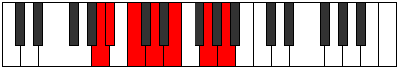

# Mode Sarimic

## Links

- [Documentation](index.md)
- [Scales Index](Scales.md)
- [Modes Index](Modes.md)
- [Chords Index](Chords.md)

## Parent Scale

[Phracrimic](ScalePhracrimic.md)

## Number

[1195](https://ianring.com/musictheory/scales/1195)

## Perfection

- 4 Perfect notes
- 2 Perfect notes

## Perfection Profile

[true false true true false true]

## Permutations

| Tonic | Notes | Signature | Illustration | Audio |
|-------|-------|-----------|--------------|-------|
| [C](ModeCNaturalSarimic.md) | C, **Db**, Eb, F, **G**, A#, C | C |  | [midi](ModeCNaturalSarimic.mid) [ogg](ModeCNaturalSarimic.ogg) |
| [C#](ModeCSharpSarimic.md) | C#, **D**, E, F#, **G#**, A##, C# | C |  | [midi](ModeCSharpSarimic.mid) [ogg](ModeCSharpSarimic.ogg) |
| [Db](ModeDFlatSarimic.md) | Db, **Ebb**, Fb, Gb, **Ab**, B, Db | C |  | [midi](ModeDFlatSarimic.mid) [ogg](ModeDFlatSarimic.ogg) |
| [D](ModeDNaturalSarimic.md) | D, **Eb**, F, G, **A**, B#, D | C |  | [midi](ModeDNaturalSarimic.mid) [ogg](ModeDNaturalSarimic.ogg) |
| [D#](ModeDSharpSarimic.md) | D#, **E**, F#, G#, **A#**, B##, D# | C |  | [midi](ModeDSharpSarimic.mid) [ogg](ModeDSharpSarimic.ogg) |
| [Eb](ModeEFlatSarimic.md) | Eb, **Fb**, Gb, Ab, **Bb**, C#, Eb | C |  | [midi](ModeEFlatSarimic.mid) [ogg](ModeEFlatSarimic.ogg) |
| [E](ModeENaturalSarimic.md) | E, **F**, G, A, **B**, C##, E | C |  | [midi](ModeENaturalSarimic.mid) [ogg](ModeENaturalSarimic.ogg) |
| [F](ModeFNaturalSarimic.md) | F, **Gb**, Ab, Bb, **C**, D#, F | C |  | [midi](ModeFNaturalSarimic.mid) [ogg](ModeFNaturalSarimic.ogg) |
| [F#](ModeFSharpSarimic.md) | F#, **G**, A, B, **C#**, D##, F# | C |  | [midi](ModeFSharpSarimic.mid) [ogg](ModeFSharpSarimic.ogg) |
| [Gb](ModeGFlatSarimic.md) | Gb, **Abb**, Bbb, Cb, **Db**, E, Gb | C |  | [midi](ModeGFlatSarimic.mid) [ogg](ModeGFlatSarimic.ogg) |
| [G](ModeGNaturalSarimic.md) | G, **Ab**, Bb, C, **D**, E#, G | C |  | [midi](ModeGNaturalSarimic.mid) [ogg](ModeGNaturalSarimic.ogg) |
| [G#](ModeGSharpSarimic.md) | G#, **A**, B, C#, **D#**, E##, G# | C |  | [midi](ModeGSharpSarimic.mid) [ogg](ModeGSharpSarimic.ogg) |
| [Ab](ModeAFlatSarimic.md) | Ab, **Bbb**, Cb, Db, **Eb**, F#, Ab | C |  | [midi](ModeAFlatSarimic.mid) [ogg](ModeAFlatSarimic.ogg) |
| [A](ModeANaturalSarimic.md) | A, **Bb**, C, D, **E**, F##, A | C |  | [midi](ModeANaturalSarimic.mid) [ogg](ModeANaturalSarimic.ogg) |
| [A#](ModeASharpSarimic.md) | A#, **B**, C#, D#, **E#**, F###, A# | C |  | [midi](ModeASharpSarimic.mid) [ogg](ModeASharpSarimic.ogg) |
| [Bb](ModeBFlatSarimic.md) | Bb, **Cb**, Db, Eb, **F**, G#, Bb | C |  | [midi](ModeBFlatSarimic.mid) [ogg](ModeBFlatSarimic.ogg) |
| [B](ModeBNaturalSarimic.md) | B, **C**, D, E, **F#**, G##, B | C |  | [midi](ModeBNaturalSarimic.mid) [ogg](ModeBNaturalSarimic.ogg) |
