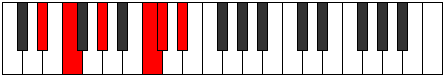
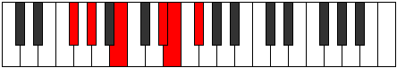
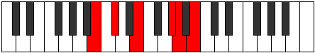

# Mode Saritonic

## Links

- [Documentation](README.md)
- [Scales Index](Scales.md)
- [Modes Index](Modes.md)
- [Chords Index](Chords.md)

## Parent Scale

[Lothitonic](ScaleLothitonic.md)

## Number

[1573](https://ianring.com/musictheory/scales/1573)

## Transposition

2, 3, 4, 1, 2

## Chord Pattern

## Perfection

- 3 Perfect notes
- 2 Perfect notes

## Perfection Profile

[false true true false true]

## Permutations

| Tonic | Notes | Signature | Illustration | Audio |
|-------|-------|-----------|--------------|-------|
| [C](ModeCNaturalSaritonic.md) | **C**, D, F, **A**, A#, **C** | C |  | [midi](https://github.com/edipermadi/music/blob/main/docs/ModeCNaturalSaritonic.mid?raw=true) |
| [C#](ModeCSharpSaritonic.md) | **C#**, D#, F#, **A#**, B, **C#** | C |  | [midi](https://github.com/edipermadi/music/blob/main/docs/ModeCSharpSaritonic.mid?raw=true) |
| [Db](ModeDFlatSaritonic.md) | **Db**, Eb, Gb, **Bb**, B, **Db** | C |  | [midi](https://github.com/edipermadi/music/blob/main/docs/ModeDFlatSaritonic.mid?raw=true) |
| [D](ModeDNaturalSaritonic.md) | **D**, E, G, **B**, C, **D** | C |  | [midi](https://github.com/edipermadi/music/blob/main/docs/ModeDNaturalSaritonic.mid?raw=true) |
| [D#](ModeDSharpSaritonic.md) | **D#**, F, G#, **C**, C#, **D#** | C |  | [midi](https://github.com/edipermadi/music/blob/main/docs/ModeDSharpSaritonic.mid?raw=true) |
| [Eb](ModeEFlatSaritonic.md) | **Eb**, F, Ab, **C**, Db, **Eb** | C |  | [midi](https://github.com/edipermadi/music/blob/main/docs/ModeEFlatSaritonic.mid?raw=true) |
| [E](ModeENaturalSaritonic.md) | **E**, F#, A, **C#**, D, **E** | C |  | [midi](https://github.com/edipermadi/music/blob/main/docs/ModeENaturalSaritonic.mid?raw=true) |
| [F](ModeFNaturalSaritonic.md) | **F**, G, A#, **D**, D#, **F** | C |  | [midi](https://github.com/edipermadi/music/blob/main/docs/ModeFNaturalSaritonic.mid?raw=true) |
| [F#](ModeFSharpSaritonic.md) | **F#**, G#, B, **D#**, E, **F#** | C |  | [midi](https://github.com/edipermadi/music/blob/main/docs/ModeFSharpSaritonic.mid?raw=true) |
| [Gb](ModeGFlatSaritonic.md) | **Gb**, Ab, B, **Eb**, E, **Gb** | C |  | [midi](https://github.com/edipermadi/music/blob/main/docs/ModeGFlatSaritonic.mid?raw=true) |
| [G](ModeGNaturalSaritonic.md) | **G**, A, C, **E**, F, **G** | C |  | [midi](https://github.com/edipermadi/music/blob/main/docs/ModeGNaturalSaritonic.mid?raw=true) |
| [G#](ModeGSharpSaritonic.md) | **G#**, A#, C#, **F**, F#, **G#** | C |  | [midi](https://github.com/edipermadi/music/blob/main/docs/ModeGSharpSaritonic.mid?raw=true) |
| [Ab](ModeAFlatSaritonic.md) | **Ab**, Bb, Db, **F**, Gb, **Ab** | C |  | [midi](https://github.com/edipermadi/music/blob/main/docs/ModeAFlatSaritonic.mid?raw=true) |
| [A](ModeANaturalSaritonic.md) | **A**, B, D, **F#**, G, **A** | C |  | [midi](https://github.com/edipermadi/music/blob/main/docs/ModeANaturalSaritonic.mid?raw=true) |
| [A#](ModeASharpSaritonic.md) | **A#**, C, D#, **G**, G#, **A#** | C |  | [midi](https://github.com/edipermadi/music/blob/main/docs/ModeASharpSaritonic.mid?raw=true) |
| [Bb](ModeBFlatSaritonic.md) | **Bb**, C, Eb, **G**, Ab, **Bb** | C |  | [midi](https://github.com/edipermadi/music/blob/main/docs/ModeBFlatSaritonic.mid?raw=true) |
| [B](ModeBNaturalSaritonic.md) | **B**, C#, E, **G#**, A, **B** | C |  | [midi](https://github.com/edipermadi/music/blob/main/docs/ModeBNaturalSaritonic.mid?raw=true) |
