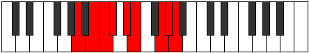

# Mode Saryllic

## Links

- [Documentation](README.md)
- [Scales Index](Scales.md)
- [Modes Index](Modes.md)
- [Chords Index](Chords.md)

## Parent Scale

[Lonyllic](ScaleLonyllic.md)

## Number

[3293](https://ianring.com/musictheory/scales/3293)

## Luminosity

8

## Transposition

2, 1, 1, 2, 1, 3, 1, 1

## Chord Pattern

i⁰, iii, iv, Vb5, VI

## Perfection

- 5 Perfect notes
- 3 Perfect notes

## Perfection Profile

true, false, true, true, false, true, false, true

## Permutations

| Tonic | Notes | Signature | Illustration | Audio |
|-------|-------|-----------|--------------|-------|
| [C](ModeCNaturalSaryllic.md) | C, **D**, D#, E, **F#**, G, **A#**, B, C | C |  | [midi](https://github.com/edipermadi/music/blob/main/docs/ModeCNaturalSaryllic.mid?raw=true) |
| [C#](ModeCSharpSaryllic.md) | C#, **D#**, E, F, **G**, G#, **B**, C, C# | C |  | [midi](https://github.com/edipermadi/music/blob/main/docs/ModeCSharpSaryllic.mid?raw=true) |
| [Db](ModeDFlatSaryllic.md) | Db, **Eb**, E, F, **G**, Ab, **B**, C, Db | C |  | [midi](https://github.com/edipermadi/music/blob/main/docs/ModeDFlatSaryllic.mid?raw=true) |
| [D](ModeDNaturalSaryllic.md) | D, **E**, F, F#, **G#**, A, **C**, C#, D | C |  | [midi](https://github.com/edipermadi/music/blob/main/docs/ModeDNaturalSaryllic.mid?raw=true) |
| [D#](ModeDSharpSaryllic.md) | D#, **F**, F#, G, **A**, A#, **C#**, D, D# | C |  | [midi](https://github.com/edipermadi/music/blob/main/docs/ModeDSharpSaryllic.mid?raw=true) |
| [Eb](ModeEFlatSaryllic.md) | Eb, **F**, Gb, G, **A**, Bb, **Db**, D, Eb | C |  | [midi](https://github.com/edipermadi/music/blob/main/docs/ModeEFlatSaryllic.mid?raw=true) |
| [E](ModeENaturalSaryllic.md) | E, **F#**, G, G#, **A#**, B, **D**, D#, E | C |  | [midi](https://github.com/edipermadi/music/blob/main/docs/ModeENaturalSaryllic.mid?raw=true) |
| [F](ModeFNaturalSaryllic.md) | F, **G**, G#, A, **B**, C, **D#**, E, F | C |  | [midi](https://github.com/edipermadi/music/blob/main/docs/ModeFNaturalSaryllic.mid?raw=true) |
| [F#](ModeFSharpSaryllic.md) | F#, **G#**, A, A#, **C**, C#, **E**, F, F# | C |  | [midi](https://github.com/edipermadi/music/blob/main/docs/ModeFSharpSaryllic.mid?raw=true) |
| [Gb](ModeGFlatSaryllic.md) | Gb, **Ab**, A, Bb, **C**, Db, **E**, F, Gb | C |  | [midi](https://github.com/edipermadi/music/blob/main/docs/ModeGFlatSaryllic.mid?raw=true) |
| [G](ModeGNaturalSaryllic.md) | G, **A**, A#, B, **C#**, D, **F**, F#, G | C |  | [midi](https://github.com/edipermadi/music/blob/main/docs/ModeGNaturalSaryllic.mid?raw=true) |
| [G#](ModeGSharpSaryllic.md) | G#, **A#**, B, C, **D**, D#, **F#**, G, G# | C |  | [midi](https://github.com/edipermadi/music/blob/main/docs/ModeGSharpSaryllic.mid?raw=true) |
| [Ab](ModeAFlatSaryllic.md) | Ab, **Bb**, B, C, **D**, Eb, **Gb**, G, Ab | C |  | [midi](https://github.com/edipermadi/music/blob/main/docs/ModeAFlatSaryllic.mid?raw=true) |
| [A](ModeANaturalSaryllic.md) | A, **B**, C, C#, **D#**, E, **G**, G#, A | C |  | [midi](https://github.com/edipermadi/music/blob/main/docs/ModeANaturalSaryllic.mid?raw=true) |
| [A#](ModeASharpSaryllic.md) | A#, **C**, C#, D, **E**, F, **G#**, A, A# | C |  | [midi](https://github.com/edipermadi/music/blob/main/docs/ModeASharpSaryllic.mid?raw=true) |
| [Bb](ModeBFlatSaryllic.md) | Bb, **C**, Db, D, **E**, F, **Ab**, A, Bb | C |  | [midi](https://github.com/edipermadi/music/blob/main/docs/ModeBFlatSaryllic.mid?raw=true) |
| [B](ModeBNaturalSaryllic.md) | B, **C#**, D, D#, **F**, F#, **A**, A#, B | C |  | [midi](https://github.com/edipermadi/music/blob/main/docs/ModeBNaturalSaryllic.mid?raw=true) |
