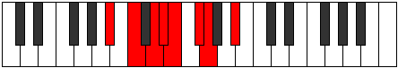
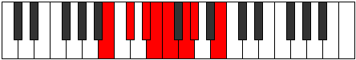

# Mode Sathian

## Links

- [Documentation](index.md)
- [Scales Index](Scales.md)
- [Modes Index](Modes.md)
- [Chords Index](Chords.md)

## Parent Scale

[Epacrian](ScaleEpacrian.md)

## Number

[885](https://ianring.com/musictheory/scales/885)

## Perfection

- 3 Perfect notes
- 4 Perfect notes

## Perfection Profile

[false true false true false false true]

## Permutations

| Tonic | Notes | Signature | Illustration | Audio |
|-------|-------|-----------|--------------|-------|
| [C](ModeCNaturalSathian.md) | **C**, D, **E**, F, **Gb**, **Ab**, Bbb, **C** | C |  | [midi](https://github.com/edipermadi/music/blob/main/docs/ModeCNaturalSathian.mid?raw=true) |
| [C#](ModeCSharpSathian.md) | **C#**, D#, **E#**, F#, **G**, **A**, Bb, **C#** | C |  | [midi](https://github.com/edipermadi/music/blob/main/docs/ModeCSharpSathian.mid?raw=true) |
| [Db](ModeDFlatSathian.md) | **Db**, Eb, **F**, Gb, **Abb**, **Bbb**, Cbb, **Db** | C |  | [midi](https://github.com/edipermadi/music/blob/main/docs/ModeDFlatSathian.mid?raw=true) |
| [D](ModeDNaturalSathian.md) | **D**, E, **F#**, G, **Ab**, **Bb**, Cb, **D** | C |  | [midi](https://github.com/edipermadi/music/blob/main/docs/ModeDNaturalSathian.mid?raw=true) |
| [D#](ModeDSharpSathian.md) | **D#**, E#, **F##**, G#, **A**, **B**, C, **D#** | C |  | [midi](https://github.com/edipermadi/music/blob/main/docs/ModeDSharpSathian.mid?raw=true) |
| [Eb](ModeEFlatSathian.md) | **Eb**, F, **G**, Ab, **Bbb**, **Cb**, Dbb, **Eb** | C |  | [midi](https://github.com/edipermadi/music/blob/main/docs/ModeEFlatSathian.mid?raw=true) |
| [E](ModeENaturalSathian.md) | **E**, F#, **G#**, A, **Bb**, **C**, Db, **E** | C |  | [midi](https://github.com/edipermadi/music/blob/main/docs/ModeENaturalSathian.mid?raw=true) |
| [F](ModeFNaturalSathian.md) | **F**, G, **A**, Bb, **Cb**, **Db**, Ebb, **F** | C |  | [midi](https://github.com/edipermadi/music/blob/main/docs/ModeFNaturalSathian.mid?raw=true) |
| [F#](ModeFSharpSathian.md) | **F#**, G#, **A#**, B, **C**, **D**, Eb, **F#** | C |  | [midi](https://github.com/edipermadi/music/blob/main/docs/ModeFSharpSathian.mid?raw=true) |
| [Gb](ModeGFlatSathian.md) | **Gb**, Ab, **Bb**, Cb, **Dbb**, **Ebb**, Fbb, **Gb** | C |  | [midi](https://github.com/edipermadi/music/blob/main/docs/ModeGFlatSathian.mid?raw=true) |
| [G](ModeGNaturalSathian.md) | **G**, A, **B**, C, **Db**, **Eb**, Fb, **G** | C |  | [midi](https://github.com/edipermadi/music/blob/main/docs/ModeGNaturalSathian.mid?raw=true) |
| [G#](ModeGSharpSathian.md) | **G#**, A#, **B#**, C#, **D**, **E**, F, **G#** | C |  | [midi](https://github.com/edipermadi/music/blob/main/docs/ModeGSharpSathian.mid?raw=true) |
| [Ab](ModeAFlatSathian.md) | **Ab**, Bb, **C**, Db, **Ebb**, **Fb**, Gbb, **Ab** | C |  | [midi](https://github.com/edipermadi/music/blob/main/docs/ModeAFlatSathian.mid?raw=true) |
| [A](ModeANaturalSathian.md) | **A**, B, **C#**, D, **Eb**, **F**, Gb, **A** | C |  | [midi](https://github.com/edipermadi/music/blob/main/docs/ModeANaturalSathian.mid?raw=true) |
| [A#](ModeASharpSathian.md) | **A#**, B#, **C##**, D#, **E**, **F#**, G, **A#** | C |  | [midi](https://github.com/edipermadi/music/blob/main/docs/ModeASharpSathian.mid?raw=true) |
| [Bb](ModeBFlatSathian.md) | **Bb**, C, **D**, Eb, **Fb**, **Gb**, Abb, **Bb** | C |  | [midi](https://github.com/edipermadi/music/blob/main/docs/ModeBFlatSathian.mid?raw=true) |
| [B](ModeBNaturalSathian.md) | **B**, C#, **D#**, E, **F**, **G**, Ab, **B** | C |  | [midi](https://github.com/edipermadi/music/blob/main/docs/ModeBNaturalSathian.mid?raw=true) |
