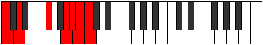
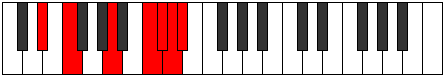
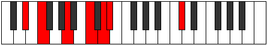
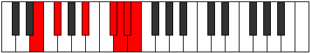
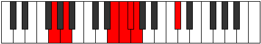
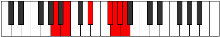
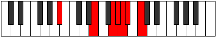
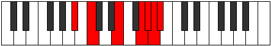

# Mode Sathimic

## Links

- [Documentation](README.md)
- [Scales Index](Scales.md)
- [Modes Index](Modes.md)
- [Chords Index](Chords.md)

## Parent Scale

[Galimic](ScaleGalimic.md)

## Number

[3653](https://ianring.com/musictheory/scales/3653)

## Interval Pattern

2, 4, 3, 1, 1, 1

## Chord Pattern

## Perfection

- 2 Perfect notes
- 4 Perfect notes

## Perfection Profile

[false true false false false true]

## Permutations

| Tonic | Notes | Signature | Illustration | Audio |
|-------|-------|-----------|--------------|-------|
| [C](ModeCNaturalSathimic.md) | **C**, D, **E##**, **Cbbb**, **Cbb**, Dbbb, **C** | C |  | [midi](https://github.com/edipermadi/music/blob/main/docs/ModeCNaturalSathimic.mid?raw=true) |
| [C#](ModeCSharpSathimic.md) | **C#**, D#, **E###**, **Cbb**, **Dbbb**, Dbb, **C#** | C |  | [midi](https://github.com/edipermadi/music/blob/main/docs/ModeCSharpSathimic.mid?raw=true) |
| [Db](ModeDFlatSathimic.md) | **Db**, Eb, **F##**, **G###**, **A##**, B#, **Db** | C |  | [midi](https://github.com/edipermadi/music/blob/main/docs/ModeDFlatSathimic.mid?raw=true) |
| [D](ModeDNaturalSathimic.md) | **D**, E, **F###**, **Cb**, **Dbb**, Ebbb, **D** | C |  | [midi](https://github.com/edipermadi/music/blob/main/docs/ModeDNaturalSathimic.mid?raw=true) |
| [D#](ModeDSharpSathimic.md) | **D#**, E#, **Cbbb**, **Dbb**, **Ebbb**, Fbbb, **D#** | C |  | [midi](https://github.com/edipermadi/music/blob/main/docs/ModeDSharpSathimic.mid?raw=true) |
| [Eb](ModeEFlatSathimic.md) | **Eb**, F, **G##**, **A###**, **B##**, C##, **Eb** | C |  | [midi](https://github.com/edipermadi/music/blob/main/docs/ModeEFlatSathimic.mid?raw=true) |
| [E](ModeENaturalSathimic.md) | **E**, F#, **G###**, **Db**, **Ebb**, Fbb, **E** | C |  | [midi](https://github.com/edipermadi/music/blob/main/docs/ModeENaturalSathimic.mid?raw=true) |
| [F](ModeFNaturalSathimic.md) | **F**, G, **A##**, **B###**, **C###**, D##, **F** | C |  | [midi](https://github.com/edipermadi/music/blob/main/docs/ModeFNaturalSathimic.mid?raw=true) |
| [F#](ModeFSharpSathimic.md) | **F#**, G#, **A###**, **C###**, **D##**, E#, **F#** | C |  | [midi](https://github.com/edipermadi/music/blob/main/docs/ModeFSharpSathimic.mid?raw=true) |
| [Gb](ModeGFlatSathimic.md) | **Gb**, Ab, **B#**, **C###**, **D##**, E#, **Gb** | C |  | [midi](https://github.com/edipermadi/music/blob/main/docs/ModeGFlatSathimic.mid?raw=true) |
| [G](ModeGNaturalSathimic.md) | **G**, A, **B##**, **D##**, **E#**, F#, **G** | C |  | [midi](https://github.com/edipermadi/music/blob/main/docs/ModeGNaturalSathimic.mid?raw=true) |
| [G#](ModeGSharpSathimic.md) | **G#**, A#, **B###**, **D###**, **E##**, F##, **G#** | C |  | [midi](https://github.com/edipermadi/music/blob/main/docs/ModeGSharpSathimic.mid?raw=true) |
| [Ab](ModeAFlatSathimic.md) | **Ab**, Bb, **C##**, **D###**, **E##**, F##, **Ab** | C |  | [midi](https://github.com/edipermadi/music/blob/main/docs/ModeAFlatSathimic.mid?raw=true) |
| [A](ModeANaturalSathimic.md) | **A**, B, **C###**, **E##**, **F##**, G#, **A** | C |  | [midi](https://github.com/edipermadi/music/blob/main/docs/ModeANaturalSathimic.mid?raw=true) |
| [A#](ModeASharpSathimic.md) | **A#**, B#, **D##**, **E###**, **F###**, G##, **A#** | C |  | [midi](https://github.com/edipermadi/music/blob/main/docs/ModeASharpSathimic.mid?raw=true) |
| [Bb](ModeBFlatSathimic.md) | **Bb**, C, **D##**, **E###**, **F###**, G##, **Bb** | C |  | [midi](https://github.com/edipermadi/music/blob/main/docs/ModeBFlatSathimic.mid?raw=true) |
| [B](ModeBNaturalSathimic.md) | **B**, C#, **D###**, **F###**, **G##**, A#, **B** | C |  | [midi](https://github.com/edipermadi/music/blob/main/docs/ModeBNaturalSathimic.mid?raw=true) |
