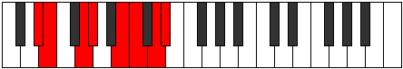
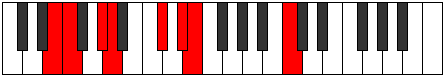

# Mode Socrian

## Links

- [Documentation](README.md)
- [Scales Index](Scales.md)
- [Modes Index](Modes.md)
- [Chords Index](Chords.md)

## Parent Scale

[Katathian](ScaleKatathian.md)

## Number

[2867](https://ianring.com/musictheory/scales/2867)

## Interval Pattern

1, 3, 1, 3, 1, 2, 1

## Chord Pattern

I⁺, II⁺, III, IV, vi

## Perfection

- 4 Perfect notes
- 3 Perfect notes

## Perfection Profile

[false true true true false true false]

## Permutations

| Tonic | Notes | Signature | Illustration | Audio |
|-------|-------|-----------|--------------|-------|
| [C](ModeCNaturalSocrian.md) | **C**, Db, E, F, **G#**, A, **B**, **C** | C |  | [midi](https://github.com/edipermadi/music/blob/main/docs/ModeCNaturalSocrian.mid?raw=true) |
| [C#](ModeCSharpSocrian.md) | **C#**, D, E#, F#, **G##**, A#, **B#**, **C#** | C |  | [midi](https://github.com/edipermadi/music/blob/main/docs/ModeCSharpSocrian.mid?raw=true) |
| [Db](ModeDFlatSocrian.md) | **Db**, Ebb, F, Gb, **A**, Bb, **C**, **Db** | C |  | [midi](https://github.com/edipermadi/music/blob/main/docs/ModeDFlatSocrian.mid?raw=true) |
| [D](ModeDNaturalSocrian.md) | **D**, Eb, F#, G, **A#**, B, **C#**, **D** | C |  | [midi](https://github.com/edipermadi/music/blob/main/docs/ModeDNaturalSocrian.mid?raw=true) |
| [D#](ModeDSharpSocrian.md) | **D#**, E, F##, G#, **A##**, B#, **C##**, **D#** | C |  | [midi](https://github.com/edipermadi/music/blob/main/docs/ModeDSharpSocrian.mid?raw=true) |
| [Eb](ModeEFlatSocrian.md) | **Eb**, Fb, G, Ab, **B**, C, **D**, **Eb** | C |  | [midi](https://github.com/edipermadi/music/blob/main/docs/ModeEFlatSocrian.mid?raw=true) |
| [E](ModeENaturalSocrian.md) | **E**, F, G#, A, **B#**, C#, **D#**, **E** | C |  | [midi](https://github.com/edipermadi/music/blob/main/docs/ModeENaturalSocrian.mid?raw=true) |
| [F](ModeFNaturalSocrian.md) | **F**, Gb, A, Bb, **C#**, D, **E**, **F** | C |  | [midi](https://github.com/edipermadi/music/blob/main/docs/ModeFNaturalSocrian.mid?raw=true) |
| [F#](ModeFSharpSocrian.md) | **F#**, G, A#, B, **C##**, D#, **E#**, **F#** | C |  | [midi](https://github.com/edipermadi/music/blob/main/docs/ModeFSharpSocrian.mid?raw=true) |
| [Gb](ModeGFlatSocrian.md) | **Gb**, Abb, Bb, Cb, **D**, Eb, **F**, **Gb** | C |  | [midi](https://github.com/edipermadi/music/blob/main/docs/ModeGFlatSocrian.mid?raw=true) |
| [G](ModeGNaturalSocrian.md) | **G**, Ab, B, C, **D#**, E, **F#**, **G** | C |  | [midi](https://github.com/edipermadi/music/blob/main/docs/ModeGNaturalSocrian.mid?raw=true) |
| [G#](ModeGSharpSocrian.md) | **G#**, A, B#, C#, **D##**, E#, **F##**, **G#** | C |  | [midi](https://github.com/edipermadi/music/blob/main/docs/ModeGSharpSocrian.mid?raw=true) |
| [Ab](ModeAFlatSocrian.md) | **Ab**, Bbb, C, Db, **E**, F, **G**, **Ab** | C |  | [midi](https://github.com/edipermadi/music/blob/main/docs/ModeAFlatSocrian.mid?raw=true) |
| [A](ModeANaturalSocrian.md) | **A**, Bb, C#, D, **E#**, F#, **G#**, **A** | C |  | [midi](https://github.com/edipermadi/music/blob/main/docs/ModeANaturalSocrian.mid?raw=true) |
| [A#](ModeASharpSocrian.md) | **A#**, B, C##, D#, **E##**, F##, **G##**, **A#** | C |  | [midi](https://github.com/edipermadi/music/blob/main/docs/ModeASharpSocrian.mid?raw=true) |
| [Bb](ModeBFlatSocrian.md) | **Bb**, Cb, D, Eb, **F#**, G, **A**, **Bb** | C |  | [midi](https://github.com/edipermadi/music/blob/main/docs/ModeBFlatSocrian.mid?raw=true) |
| [B](ModeBNaturalSocrian.md) | **B**, C, D#, E, **F##**, G#, **A#**, **B** | C |  | [midi](https://github.com/edipermadi/music/blob/main/docs/ModeBNaturalSocrian.mid?raw=true) |
