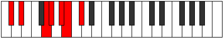
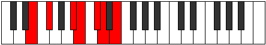
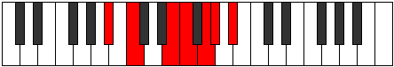
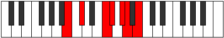

# Mode Socrimic

## Links

- [Documentation](index.md)
- [Scales Index](Scales.md)
- [Modes Index](Modes.md)
- [Chords Index](Chords.md)

## Parent Scale

[Modimic](ScaleModimic.md)

## Number

[1733](https://ianring.com/musictheory/scales/1733)

## Perfection

- 3 Perfect notes
- 3 Perfect notes

## Perfection Profile

[true true false true false false]

## Permutations

| Tonic | Notes | Signature | Illustration | Audio |
|-------|-------|-----------|--------------|-------|
| [C](ModeCNaturalSocrimic.md) | C, D, **E##**, F##, **G##**, **A#**, C | C |  | [midi](https://github.com/edipermadi/music/blob/main/docs/ModeCNaturalSocrimic.mid?raw=true) |
| [C#](ModeCSharpSocrimic.md) | C#, D#, **E###**, F###, **G###**, **A##**, C# | C |  | [midi](https://github.com/edipermadi/music/blob/main/docs/ModeCSharpSocrimic.mid?raw=true) |
| [Db](ModeDFlatSocrimic.md) | Db, Eb, **F##**, G#, **A#**, **B**, Db | C |  | [midi](https://github.com/edipermadi/music/blob/main/docs/ModeDFlatSocrimic.mid?raw=true) |
| [D](ModeDNaturalSocrimic.md) | D, E, **F###**, G##, **A##**, **B#**, D | C |  | [midi](https://github.com/edipermadi/music/blob/main/docs/ModeDNaturalSocrimic.mid?raw=true) |
| [D#](ModeDSharpSocrimic.md) | D#, E#, **Cbbb**, Cbb, **Dbb**, **Ebbb**, D# | C |  | [midi](https://github.com/edipermadi/music/blob/main/docs/ModeDSharpSocrimic.mid?raw=true) |
| [Eb](ModeEFlatSocrimic.md) | Eb, F, **G##**, A#, **B#**, **C#**, Eb | C |  | [midi](https://github.com/edipermadi/music/blob/main/docs/ModeEFlatSocrimic.mid?raw=true) |
| [E](ModeENaturalSocrimic.md) | E, F#, **G###**, A##, **B##**, **C##**, E | C |  | [midi](https://github.com/edipermadi/music/blob/main/docs/ModeENaturalSocrimic.mid?raw=true) |
| [F](ModeFNaturalSocrimic.md) | F, G, **A##**, B#, **C##**, **D#**, F | C |  | [midi](https://github.com/edipermadi/music/blob/main/docs/ModeFNaturalSocrimic.mid?raw=true) |
| [F#](ModeFSharpSocrimic.md) | F#, G#, **A###**, B##, **C###**, **D##**, F# | C |  | [midi](https://github.com/edipermadi/music/blob/main/docs/ModeFSharpSocrimic.mid?raw=true) |
| [Gb](ModeGFlatSocrimic.md) | Gb, Ab, **B#**, C#, **D#**, **E**, Gb | C |  | [midi](https://github.com/edipermadi/music/blob/main/docs/ModeGFlatSocrimic.mid?raw=true) |
| [G](ModeGNaturalSocrimic.md) | G, A, **B##**, C##, **D##**, **E#**, G | C |  | [midi](https://github.com/edipermadi/music/blob/main/docs/ModeGNaturalSocrimic.mid?raw=true) |
| [G#](ModeGSharpSocrimic.md) | G#, A#, **B###**, C###, **D###**, **E##**, G# | C |  | [midi](https://github.com/edipermadi/music/blob/main/docs/ModeGSharpSocrimic.mid?raw=true) |
| [Ab](ModeAFlatSocrimic.md) | Ab, Bb, **C##**, D#, **E#**, **F#**, Ab | C |  | [midi](https://github.com/edipermadi/music/blob/main/docs/ModeAFlatSocrimic.mid?raw=true) |
| [A](ModeANaturalSocrimic.md) | A, B, **C###**, D##, **E##**, **F##**, A | C |  | [midi](https://github.com/edipermadi/music/blob/main/docs/ModeANaturalSocrimic.mid?raw=true) |
| [A#](ModeASharpSocrimic.md) | A#, B#, **D##**, E#, **F##**, **G#**, A# | C |  | [midi](https://github.com/edipermadi/music/blob/main/docs/ModeASharpSocrimic.mid?raw=true) |
| [Bb](ModeBFlatSocrimic.md) | Bb, C, **D##**, E#, **F##**, **G#**, Bb | C |  | [midi](https://github.com/edipermadi/music/blob/main/docs/ModeBFlatSocrimic.mid?raw=true) |
| [B](ModeBNaturalSocrimic.md) | B, C#, **D###**, E##, **F###**, **G##**, B | C |  | [midi](https://github.com/edipermadi/music/blob/main/docs/ModeBNaturalSocrimic.mid?raw=true) |
