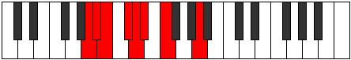

# Mode Sodian

## Links

- [Documentation](README.md)
- [Scales Index](Scales.md)
- [Modes Index](Modes.md)
- [Chords Index](Chords.md)

## Parent Scale

[Katacrian](ScaleKatacrian.md)

## Number

[375](https://ianring.com/musictheory/scales/375)

## Transposition

1, 1, 2, 1, 1, 2, 4

## Chord Pattern

iii⁰

## Perfection

- 3 Perfect notes
- 4 Perfect notes

## Perfection Profile

[false true false false true true false]

## Permutations

| Tonic | Notes | Signature | Illustration | Audio |
|-------|-------|-----------|--------------|-------|
| [C](ModeCNaturalSodian.md) | **C**, Db, **Ebb**, **Fb**, Gbb, Abbb, **Bbbb**, **C** | C |  | [midi](https://github.com/edipermadi/music/blob/main/docs/ModeCNaturalSodian.mid?raw=true) |
| [C#](ModeCSharpSodian.md) | **C#**, D, **Eb**, **F**, Gb, Abb, **Bbb**, **C#** | C |  | [midi](https://github.com/edipermadi/music/blob/main/docs/ModeCSharpSodian.mid?raw=true) |
| [Db](ModeDFlatSodian.md) | **Db**, Ebb, **Fbb**, **Gbb**, Abbb, E###, **Cbbb**, **Db** | C |  | [midi](https://github.com/edipermadi/music/blob/main/docs/ModeDFlatSodian.mid?raw=true) |
| [D](ModeDNaturalSodian.md) | **D**, Eb, **Fb**, **Gb**, Abb, Bbbb, **Cbb**, **D** | C |  | [midi](https://github.com/edipermadi/music/blob/main/docs/ModeDNaturalSodian.mid?raw=true) |
| [D#](ModeDSharpSodian.md) | **D#**, E, **F**, **G**, Ab, Bbb, **Cb**, **D#** | C |  | [midi](https://github.com/edipermadi/music/blob/main/docs/ModeDSharpSodian.mid?raw=true) |
| [Eb](ModeEFlatSodian.md) | **Eb**, Fb, **Gbb**, **Abb**, Bbbb, Cbbb, **Dbbb**, **Eb** | C |  | [midi](https://github.com/edipermadi/music/blob/main/docs/ModeEFlatSodian.mid?raw=true) |
| [E](ModeENaturalSodian.md) | **E**, F, **Gb**, **Ab**, Bbb, Cbb, **Dbb**, **E** | C |  | [midi](https://github.com/edipermadi/music/blob/main/docs/ModeENaturalSodian.mid?raw=true) |
| [F](ModeFNaturalSodian.md) | **F**, Gb, **Abb**, **Bbb**, Cbb, Dbbb, **Ebbb**, **F** | C |  | [midi](https://github.com/edipermadi/music/blob/main/docs/ModeFNaturalSodian.mid?raw=true) |
| [F#](ModeFSharpSodian.md) | **F#**, G, **Ab**, **Bb**, Cb, Dbb, **Ebb**, **F#** | C |  | [midi](https://github.com/edipermadi/music/blob/main/docs/ModeFSharpSodian.mid?raw=true) |
| [Gb](ModeGFlatSodian.md) | **Gb**, Abb, **Bbbb**, **Cbb**, Dbbb, Dbb, **Ebb**, **Gb** | C |  | [midi](https://github.com/edipermadi/music/blob/main/docs/ModeGFlatSodian.mid?raw=true) |
| [G](ModeGNaturalSodian.md) | **G**, Ab, **Bbb**, **Cb**, Dbb, Ebbb, **Fbb**, **G** | C |  | [midi](https://github.com/edipermadi/music/blob/main/docs/ModeGNaturalSodian.mid?raw=true) |
| [G#](ModeGSharpSodian.md) | **G#**, A, **Bb**, **C**, Db, Ebb, **Fb**, **G#** | C |  | [midi](https://github.com/edipermadi/music/blob/main/docs/ModeGSharpSodian.mid?raw=true) |
| [Ab](ModeAFlatSodian.md) | **Ab**, Bbb, **Cbb**, **Dbb**, Ebbb, Fbbb, **Gbbb**, **Ab** | C |  | [midi](https://github.com/edipermadi/music/blob/main/docs/ModeAFlatSodian.mid?raw=true) |
| [A](ModeANaturalSodian.md) | **A**, Bb, **Cb**, **Db**, Ebb, Fbb, **Gbb**, **A** | C |  | [midi](https://github.com/edipermadi/music/blob/main/docs/ModeANaturalSodian.mid?raw=true) |
| [A#](ModeASharpSodian.md) | **A#**, B, **C**, **D**, Eb, Fb, **Gb**, **A#** | C |  | [midi](https://github.com/edipermadi/music/blob/main/docs/ModeASharpSodian.mid?raw=true) |
| [Bb](ModeBFlatSodian.md) | **Bb**, Cb, **Dbb**, **Ebb**, Fbb, Gbbb, **Abbb**, **Bb** | C |  | [midi](https://github.com/edipermadi/music/blob/main/docs/ModeBFlatSodian.mid?raw=true) |
| [B](ModeBNaturalSodian.md) | **B**, C, **Db**, **Eb**, Fb, Gbb, **Abb**, **B** | C |  | [midi](https://github.com/edipermadi/music/blob/main/docs/ModeBNaturalSodian.mid?raw=true) |
