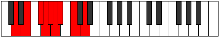

# Mode Sodyllic

## Links

- [Documentation](index.md)
- [Scales Index](Scales.md)
- [Modes Index](Modes.md)
- [Chords Index](Chords.md)

## Parent Scale

[Thyryllic](ScaleThyryllic.md)

## Number

[1525](https://ianring.com/musictheory/scales/1525)

## Perfection

- 4 Perfect notes
- 4 Perfect notes

## Perfection Profile

[true false false true false true false true]

## Permutations

| Tonic | Notes | Signature | Illustration | Audio |
|-------|-------|-----------|--------------|-------|
| [C](ModeCNaturalSodyllic.md) | C, **D**, **E**, F, **F#**, G, **G#**, A#, C | C |  | [midi](ModeCNaturalSodyllic.mid) [ogg](ModeCNaturalSodyllic.ogg) |
| [C#](ModeCSharpSodyllic.md) | C#, **D#**, **F**, F#, **G**, G#, **A**, B, C# | C |  | [midi](ModeCSharpSodyllic.mid) [ogg](ModeCSharpSodyllic.ogg) |
| [Db](ModeDFlatSodyllic.md) | Db, **Eb**, **F**, Gb, **G**, Ab, **A**, B, Db | C |  | [midi](ModeDFlatSodyllic.mid) [ogg](ModeDFlatSodyllic.ogg) |
| [D](ModeDNaturalSodyllic.md) | D, **E**, **F#**, G, **G#**, A, **A#**, C, D | C |  | [midi](ModeDNaturalSodyllic.mid) [ogg](ModeDNaturalSodyllic.ogg) |
| [D#](ModeDSharpSodyllic.md) | D#, **F**, **G**, G#, **A**, A#, **B**, C#, D# | C |  | [midi](ModeDSharpSodyllic.mid) [ogg](ModeDSharpSodyllic.ogg) |
| [Eb](ModeEFlatSodyllic.md) | Eb, **F**, **G**, Ab, **A**, Bb, **B**, Db, Eb | C |  | [midi](ModeEFlatSodyllic.mid) [ogg](ModeEFlatSodyllic.ogg) |
| [E](ModeENaturalSodyllic.md) | E, **F#**, **G#**, A, **A#**, B, **C**, D, E | C |  | [midi](ModeENaturalSodyllic.mid) [ogg](ModeENaturalSodyllic.ogg) |
| [F](ModeFNaturalSodyllic.md) | F, **G**, **A**, A#, **B**, C, **C#**, D#, F | C |  | [midi](ModeFNaturalSodyllic.mid) [ogg](ModeFNaturalSodyllic.ogg) |
| [F#](ModeFSharpSodyllic.md) | F#, **G#**, **A#**, B, **C**, C#, **D**, E, F# | C |  | [midi](ModeFSharpSodyllic.mid) [ogg](ModeFSharpSodyllic.ogg) |
| [Gb](ModeGFlatSodyllic.md) | Gb, **Ab**, **Bb**, B, **C**, Db, **D**, E, Gb | C |  | [midi](ModeGFlatSodyllic.mid) [ogg](ModeGFlatSodyllic.ogg) |
| [G](ModeGNaturalSodyllic.md) | G, **A**, **B**, C, **C#**, D, **D#**, F, G | C |  | [midi](ModeGNaturalSodyllic.mid) [ogg](ModeGNaturalSodyllic.ogg) |
| [G#](ModeGSharpSodyllic.md) | G#, **A#**, **C**, C#, **D**, D#, **E**, F#, G# | C |  | [midi](ModeGSharpSodyllic.mid) [ogg](ModeGSharpSodyllic.ogg) |
| [Ab](ModeAFlatSodyllic.md) | Ab, **Bb**, **C**, Db, **D**, Eb, **E**, Gb, Ab | C |  | [midi](ModeAFlatSodyllic.mid) [ogg](ModeAFlatSodyllic.ogg) |
| [A](ModeANaturalSodyllic.md) | A, **B**, **C#**, D, **D#**, E, **F**, G, A | C |  | [midi](ModeANaturalSodyllic.mid) [ogg](ModeANaturalSodyllic.ogg) |
| [A#](ModeASharpSodyllic.md) | A#, **C**, **D**, D#, **E**, F, **F#**, G#, A# | C |  | [midi](ModeASharpSodyllic.mid) [ogg](ModeASharpSodyllic.ogg) |
| [Bb](ModeBFlatSodyllic.md) | Bb, **C**, **D**, Eb, **E**, F, **Gb**, Ab, Bb | C |  | [midi](ModeBFlatSodyllic.mid) [ogg](ModeBFlatSodyllic.ogg) |
| [B](ModeBNaturalSodyllic.md) | B, **C#**, **D#**, E, **F**, F#, **G**, A, B | C |  | [midi](ModeBNaturalSodyllic.mid) [ogg](ModeBNaturalSodyllic.ogg) |
