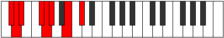
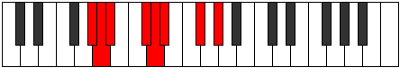

# Mode Sogian

## Links

- [Documentation](index.md)
- [Scales Index](Scales.md)
- [Modes Index](Modes.md)
- [Chords Index](Chords.md)

## Parent Scale

[Epathian](ScaleEpathian.md)

## Number

[1255](https://ianring.com/musictheory/scales/1255)

## Perfection

- 5 Perfect notes
- 2 Perfect notes

## Interval Pattern

1, 1, 3, 1, 1, 3, 2

## Perfection Profile

[true false false true true true true]

## Permutations

| Tonic | Notes | Signature | Illustration | Audio |
|-------|-------|-----------|--------------|-------|
| [C](ModeCNaturalSogian.md) | C, **Db**, **Ebb**, F, Gb, Abb, Bb, C | C |  | [midi](https://github.com/edipermadi/music/blob/main/docs/ModeCNaturalSogian.mid?raw=true) |
| [C#](ModeCSharpSogian.md) | C#, **D**, **Eb**, F#, G, Ab, B, C# | C |  | [midi](https://github.com/edipermadi/music/blob/main/docs/ModeCSharpSogian.mid?raw=true) |
| [Db](ModeDFlatSogian.md) | Db, **Ebb**, **Fbb**, Gb, Abb, Bbbb, Cb, Db | C |  | [midi](https://github.com/edipermadi/music/blob/main/docs/ModeDFlatSogian.mid?raw=true) |
| [D](ModeDNaturalSogian.md) | D, **Eb**, **Fb**, G, Ab, Bbb, C, D | C |  | [midi](https://github.com/edipermadi/music/blob/main/docs/ModeDNaturalSogian.mid?raw=true) |
| [D#](ModeDSharpSogian.md) | D#, **E**, **F**, G#, A, Bb, C#, D# | C |  | [midi](https://github.com/edipermadi/music/blob/main/docs/ModeDSharpSogian.mid?raw=true) |
| [Eb](ModeEFlatSogian.md) | Eb, **Fb**, **Gbb**, Ab, Bbb, Cbb, Db, Eb | C |  | [midi](https://github.com/edipermadi/music/blob/main/docs/ModeEFlatSogian.mid?raw=true) |
| [E](ModeENaturalSogian.md) | E, **F**, **Gb**, A, Bb, Cb, D, E | C |  | [midi](https://github.com/edipermadi/music/blob/main/docs/ModeENaturalSogian.mid?raw=true) |
| [F](ModeFNaturalSogian.md) | F, **Gb**, **Abb**, Bb, Cb, Dbb, Eb, F | C |  | [midi](https://github.com/edipermadi/music/blob/main/docs/ModeFNaturalSogian.mid?raw=true) |
| [F#](ModeFSharpSogian.md) | F#, **G**, **Ab**, B, C, Db, E, F# | C |  | [midi](https://github.com/edipermadi/music/blob/main/docs/ModeFSharpSogian.mid?raw=true) |
| [Gb](ModeGFlatSogian.md) | Gb, **Abb**, **Bbbb**, Cb, Dbb, Ebbb, Fb, Gb | C |  | [midi](https://github.com/edipermadi/music/blob/main/docs/ModeGFlatSogian.mid?raw=true) |
| [G](ModeGNaturalSogian.md) | G, **Ab**, **Bbb**, C, Db, Ebb, F, G | C |  | [midi](https://github.com/edipermadi/music/blob/main/docs/ModeGNaturalSogian.mid?raw=true) |
| [G#](ModeGSharpSogian.md) | G#, **A**, **Bb**, C#, D, Eb, F#, G# | C |  | [midi](https://github.com/edipermadi/music/blob/main/docs/ModeGSharpSogian.mid?raw=true) |
| [Ab](ModeAFlatSogian.md) | Ab, **Bbb**, **Cbb**, Db, Ebb, Fbb, Gb, Ab | C |  | [midi](https://github.com/edipermadi/music/blob/main/docs/ModeAFlatSogian.mid?raw=true) |
| [A](ModeANaturalSogian.md) | A, **Bb**, **Cb**, D, Eb, Fb, G, A | C |  | [midi](https://github.com/edipermadi/music/blob/main/docs/ModeANaturalSogian.mid?raw=true) |
| [A#](ModeASharpSogian.md) | A#, **B**, **C**, D#, E, F, G#, A# | C |  | [midi](https://github.com/edipermadi/music/blob/main/docs/ModeASharpSogian.mid?raw=true) |
| [Bb](ModeBFlatSogian.md) | Bb, **Cb**, **Dbb**, Eb, Fb, Gbb, Ab, Bb | C |  | [midi](https://github.com/edipermadi/music/blob/main/docs/ModeBFlatSogian.mid?raw=true) |
| [B](ModeBNaturalSogian.md) | B, **C**, **Db**, E, F, Gb, A, B | C |  | [midi](https://github.com/edipermadi/music/blob/main/docs/ModeBNaturalSogian.mid?raw=true) |
