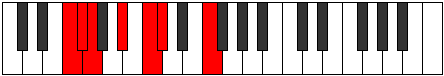

# Mode Sogimic

## Links

- [Documentation](index.md)
- [Scales Index](Scales.md)
- [Modes Index](Modes.md)
- [Chords Index](Chords.md)

## Parent Scale

[Mythimic](ScaleMythimic.md)

## Number

[423](https://ianring.com/musictheory/scales/423)

## Interval Pattern

1, 1, 3, 2, 1, 4

## Chord Pattern

II

## Perfection

- 4 Perfect notes
- 2 Perfect notes

## Perfection Profile

[true true false true true false]

## Permutations

| Tonic | Notes | Signature | Illustration | Audio |
|-------|-------|-----------|--------------|-------|
| [C](ModeCNaturalSogimic.md) | C, Db, **Ebb**, F, G, **Ab**, C | C |  | [midi](https://github.com/edipermadi/music/blob/main/docs/ModeCNaturalSogimic.mid?raw=true) |
| [C#](ModeCSharpSogimic.md) | C#, D, **Eb**, F#, G#, **A**, C# | C |  | [midi](https://github.com/edipermadi/music/blob/main/docs/ModeCSharpSogimic.mid?raw=true) |
| [Db](ModeDFlatSogimic.md) | Db, Ebb, **Fbb**, Gb, Ab, **Bbb**, Db | C |  | [midi](https://github.com/edipermadi/music/blob/main/docs/ModeDFlatSogimic.mid?raw=true) |
| [D](ModeDNaturalSogimic.md) | D, Eb, **Fb**, G, A, **Bb**, D | C |  | [midi](https://github.com/edipermadi/music/blob/main/docs/ModeDNaturalSogimic.mid?raw=true) |
| [D#](ModeDSharpSogimic.md) | D#, E, **F**, G#, A#, **B**, D# | C |  | [midi](https://github.com/edipermadi/music/blob/main/docs/ModeDSharpSogimic.mid?raw=true) |
| [Eb](ModeEFlatSogimic.md) | Eb, Fb, **Gbb**, Ab, Bb, **Cb**, Eb | C |  | [midi](https://github.com/edipermadi/music/blob/main/docs/ModeEFlatSogimic.mid?raw=true) |
| [E](ModeENaturalSogimic.md) | E, F, **Gb**, A, B, **C**, E | C |  | [midi](https://github.com/edipermadi/music/blob/main/docs/ModeENaturalSogimic.mid?raw=true) |
| [F](ModeFNaturalSogimic.md) | F, Gb, **Abb**, Bb, C, **Db**, F | C |  | [midi](https://github.com/edipermadi/music/blob/main/docs/ModeFNaturalSogimic.mid?raw=true) |
| [F#](ModeFSharpSogimic.md) | F#, G, **Ab**, B, C#, **D**, F# | C |  | [midi](https://github.com/edipermadi/music/blob/main/docs/ModeFSharpSogimic.mid?raw=true) |
| [Gb](ModeGFlatSogimic.md) | Gb, Abb, **Bbbb**, Cb, Db, **Ebb**, Gb | C |  | [midi](https://github.com/edipermadi/music/blob/main/docs/ModeGFlatSogimic.mid?raw=true) |
| [G](ModeGNaturalSogimic.md) | G, Ab, **Bbb**, C, D, **Eb**, G | C |  | [midi](https://github.com/edipermadi/music/blob/main/docs/ModeGNaturalSogimic.mid?raw=true) |
| [G#](ModeGSharpSogimic.md) | G#, A, **Bb**, C#, D#, **E**, G# | C |  | [midi](https://github.com/edipermadi/music/blob/main/docs/ModeGSharpSogimic.mid?raw=true) |
| [Ab](ModeAFlatSogimic.md) | Ab, Bbb, **Cbb**, Db, Eb, **Fb**, Ab | C |  | [midi](https://github.com/edipermadi/music/blob/main/docs/ModeAFlatSogimic.mid?raw=true) |
| [A](ModeANaturalSogimic.md) | A, Bb, **Cb**, D, E, **F**, A | C |  | [midi](https://github.com/edipermadi/music/blob/main/docs/ModeANaturalSogimic.mid?raw=true) |
| [A#](ModeASharpSogimic.md) | A#, B, **C**, D#, E#, **F#**, A# | C |  | [midi](https://github.com/edipermadi/music/blob/main/docs/ModeASharpSogimic.mid?raw=true) |
| [Bb](ModeBFlatSogimic.md) | Bb, Cb, **Dbb**, Eb, F, **Gb**, Bb | C |  | [midi](https://github.com/edipermadi/music/blob/main/docs/ModeBFlatSogimic.mid?raw=true) |
| [B](ModeBNaturalSogimic.md) | B, C, **Db**, E, F#, **G**, B | C |  | [midi](https://github.com/edipermadi/music/blob/main/docs/ModeBNaturalSogimic.mid?raw=true) |
