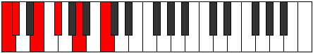
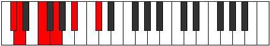
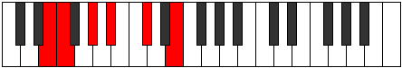

# Mode Sogitonic

## Links

- [Documentation](README.md)
- [Scales Index](Scales.md)
- [Modes Index](Modes.md)
- [Chords Index](Chords.md)

## Parent Scale

[Lyditonic](ScaleLyditonic.md)

## Number

[595](https://ianring.com/musictheory/scales/595)

## Interval Pattern

1, 3, 2, 3, 3

## Chord Pattern

## Perfection

- 2 Perfect notes
- 3 Perfect notes

## Perfection Profile

[false false false true true]

## Permutations

| Tonic | Notes | Signature | Illustration | Audio |
|-------|-------|-----------|--------------|-------|
| [C](ModeCNaturalSogitonic.md) | **C**, **C#**, **E**, F#, A, **C** | C |  | [midi](https://github.com/edipermadi/music/blob/main/docs/ModeCNaturalSogitonic.mid?raw=true) |
| [C#](ModeCSharpSogitonic.md) | **C#**, **D**, **F**, G, A#, **C#** | C |  | [midi](https://github.com/edipermadi/music/blob/main/docs/ModeCSharpSogitonic.mid?raw=true) |
| [Db](ModeDFlatSogitonic.md) | **Db**, **D**, **F**, G, Bb, **Db** | C |  | [midi](https://github.com/edipermadi/music/blob/main/docs/ModeDFlatSogitonic.mid?raw=true) |
| [D](ModeDNaturalSogitonic.md) | **D**, **D#**, **F#**, G#, B, **D** | C |  | [midi](https://github.com/edipermadi/music/blob/main/docs/ModeDNaturalSogitonic.mid?raw=true) |
| [D#](ModeDSharpSogitonic.md) | **D#**, **E**, **G**, A, C, **D#** | C |  | [midi](https://github.com/edipermadi/music/blob/main/docs/ModeDSharpSogitonic.mid?raw=true) |
| [Eb](ModeEFlatSogitonic.md) | **Eb**, **E**, **G**, A, C, **Eb** | C |  | [midi](https://github.com/edipermadi/music/blob/main/docs/ModeEFlatSogitonic.mid?raw=true) |
| [E](ModeENaturalSogitonic.md) | **E**, **F**, **G#**, A#, C#, **E** | C |  | [midi](https://github.com/edipermadi/music/blob/main/docs/ModeENaturalSogitonic.mid?raw=true) |
| [F](ModeFNaturalSogitonic.md) | **F**, **F#**, **A**, B, D, **F** | C |  | [midi](https://github.com/edipermadi/music/blob/main/docs/ModeFNaturalSogitonic.mid?raw=true) |
| [F#](ModeFSharpSogitonic.md) | **F#**, **G**, **A#**, C, D#, **F#** | C |  | [midi](https://github.com/edipermadi/music/blob/main/docs/ModeFSharpSogitonic.mid?raw=true) |
| [Gb](ModeGFlatSogitonic.md) | **Gb**, **G**, **Bb**, C, Eb, **Gb** | C |  | [midi](https://github.com/edipermadi/music/blob/main/docs/ModeGFlatSogitonic.mid?raw=true) |
| [G](ModeGNaturalSogitonic.md) | **G**, **G#**, **B**, C#, E, **G** | C |  | [midi](https://github.com/edipermadi/music/blob/main/docs/ModeGNaturalSogitonic.mid?raw=true) |
| [G#](ModeGSharpSogitonic.md) | **G#**, **A**, **C**, D, F, **G#** | C |  | [midi](https://github.com/edipermadi/music/blob/main/docs/ModeGSharpSogitonic.mid?raw=true) |
| [Ab](ModeAFlatSogitonic.md) | **Ab**, **A**, **C**, D, F, **Ab** | C |  | [midi](https://github.com/edipermadi/music/blob/main/docs/ModeAFlatSogitonic.mid?raw=true) |
| [A](ModeANaturalSogitonic.md) | **A**, **A#**, **C#**, D#, F#, **A** | C |  | [midi](https://github.com/edipermadi/music/blob/main/docs/ModeANaturalSogitonic.mid?raw=true) |
| [A#](ModeASharpSogitonic.md) | **A#**, **B**, **D**, E, G, **A#** | C |  | [midi](https://github.com/edipermadi/music/blob/main/docs/ModeASharpSogitonic.mid?raw=true) |
| [Bb](ModeBFlatSogitonic.md) | **Bb**, **B**, **D**, E, G, **Bb** | C |  | [midi](https://github.com/edipermadi/music/blob/main/docs/ModeBFlatSogitonic.mid?raw=true) |
| [B](ModeBNaturalSogitonic.md) | **B**, **C**, **D#**, F, G#, **B** | C |  | [midi](https://github.com/edipermadi/music/blob/main/docs/ModeBNaturalSogitonic.mid?raw=true) |
