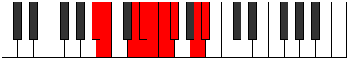

# Mode Sogyllic

## Links

- [Documentation](index.md)
- [Scales Index](Scales.md)
- [Modes Index](Modes.md)
- [Chords Index](Chords.md)

## Parent Scale

[Locryllic](ScaleLocryllic.md)

## Number

[2547](https://ianring.com/musictheory/scales/2547)

## Perfection

- 6 Perfect notes
- 2 Perfect notes

## Perfection Profile

[true true true true true false false true]

## Permutations

| Tonic | Notes | Signature | Illustration | Audio |
|-------|-------|-----------|--------------|-------|
| [C](ModeCNaturalSogyllic.md) | C, C#, E, F, F#, **G**, **G#**, B, C | C |  | [midi](ModeCNaturalSogyllic.mid) [ogg](ModeCNaturalSogyllic.ogg) |
| [C#](ModeCSharpSogyllic.md) | C#, D, F, F#, G, **G#**, **A**, C, C# | C |  | [midi](ModeCSharpSogyllic.mid) [ogg](ModeCSharpSogyllic.ogg) |
| [Db](ModeDFlatSogyllic.md) | Db, D, F, Gb, G, **Ab**, **A**, C, Db | C |  | [midi](ModeDFlatSogyllic.mid) [ogg](ModeDFlatSogyllic.ogg) |
| [D](ModeDNaturalSogyllic.md) | D, D#, F#, G, G#, **A**, **A#**, C#, D | C |  | [midi](ModeDNaturalSogyllic.mid) [ogg](ModeDNaturalSogyllic.ogg) |
| [D#](ModeDSharpSogyllic.md) | D#, E, G, G#, A, **A#**, **B**, D, D# | C |  | [midi](ModeDSharpSogyllic.mid) [ogg](ModeDSharpSogyllic.ogg) |
| [Eb](ModeEFlatSogyllic.md) | Eb, E, G, Ab, A, **Bb**, **B**, D, Eb | C |  | [midi](ModeEFlatSogyllic.mid) [ogg](ModeEFlatSogyllic.ogg) |
| [E](ModeENaturalSogyllic.md) | E, F, G#, A, A#, **B**, **C**, D#, E | C |  | [midi](ModeENaturalSogyllic.mid) [ogg](ModeENaturalSogyllic.ogg) |
| [F](ModeFNaturalSogyllic.md) | F, F#, A, A#, B, **C**, **C#**, E, F | C |  | [midi](ModeFNaturalSogyllic.mid) [ogg](ModeFNaturalSogyllic.ogg) |
| [F#](ModeFSharpSogyllic.md) | F#, G, A#, B, C, **C#**, **D**, F, F# | C |  | [midi](ModeFSharpSogyllic.mid) [ogg](ModeFSharpSogyllic.ogg) |
| [Gb](ModeGFlatSogyllic.md) | Gb, G, Bb, B, C, **Db**, **D**, F, Gb | C |  | [midi](ModeGFlatSogyllic.mid) [ogg](ModeGFlatSogyllic.ogg) |
| [G](ModeGNaturalSogyllic.md) | G, G#, B, C, C#, **D**, **D#**, F#, G | C |  | [midi](ModeGNaturalSogyllic.mid) [ogg](ModeGNaturalSogyllic.ogg) |
| [G#](ModeGSharpSogyllic.md) | G#, A, C, C#, D, **D#**, **E**, G, G# | C |  | [midi](ModeGSharpSogyllic.mid) [ogg](ModeGSharpSogyllic.ogg) |
| [Ab](ModeAFlatSogyllic.md) | Ab, A, C, Db, D, **Eb**, **E**, G, Ab | C |  | [midi](ModeAFlatSogyllic.mid) [ogg](ModeAFlatSogyllic.ogg) |
| [A](ModeANaturalSogyllic.md) | A, A#, C#, D, D#, **E**, **F**, G#, A | C |  | [midi](ModeANaturalSogyllic.mid) [ogg](ModeANaturalSogyllic.ogg) |
| [A#](ModeASharpSogyllic.md) | A#, B, D, D#, E, **F**, **F#**, A, A# | C |  | [midi](ModeASharpSogyllic.mid) [ogg](ModeASharpSogyllic.ogg) |
| [Bb](ModeBFlatSogyllic.md) | Bb, B, D, Eb, E, **F**, **Gb**, A, Bb | C |  | [midi](ModeBFlatSogyllic.mid) [ogg](ModeBFlatSogyllic.ogg) |
| [B](ModeBNaturalSogyllic.md) | B, C, D#, E, F, **F#**, **G**, A#, B | C |  | [midi](ModeBNaturalSogyllic.mid) [ogg](ModeBNaturalSogyllic.ogg) |
