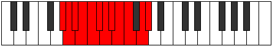

# Mode Solatic

## Links

- [Documentation](index.md)
- [Scales Index](Scales.md)
- [Modes Index](Modes.md)
- [Chords Index](Chords.md)

## Parent Scale

[Aerycratic](ScaleAerycratic.md)

## Number

[3071](https://ianring.com/musictheory/scales/3071)

## Perfection

- 10 Perfect notes
- 1 Perfect notes

## Perfection Profile

[true true true false true true true true true true true]

## Permutations

| Tonic | Notes | Signature | Illustration | Audio |
|-------|-------|-----------|--------------|-------|
| [C](ModeCNaturalSolatic.md) | C, C#, D, **D#**, E, F, F#, G, G#, A, B, C | C |  | [midi](ModeCNaturalSolatic.mid) [ogg](ModeCNaturalSolatic.ogg) |
| [C#](ModeCSharpSolatic.md) | C#, D, D#, **E**, F, F#, G, G#, A, A#, C, C# | C |  | [midi](ModeCSharpSolatic.mid) [ogg](ModeCSharpSolatic.ogg) |
| [Db](ModeDFlatSolatic.md) | Db, D, Eb, **E**, F, Gb, G, Ab, A, Bb, C, Db | C |  | [midi](ModeDFlatSolatic.mid) [ogg](ModeDFlatSolatic.ogg) |
| [D](ModeDNaturalSolatic.md) | D, D#, E, **F**, F#, G, G#, A, A#, B, C#, D | C |  | [midi](ModeDNaturalSolatic.mid) [ogg](ModeDNaturalSolatic.ogg) |
| [D#](ModeDSharpSolatic.md) | D#, E, F, **F#**, G, G#, A, A#, B, C, D, D# | C |  | [midi](ModeDSharpSolatic.mid) [ogg](ModeDSharpSolatic.ogg) |
| [Eb](ModeEFlatSolatic.md) | Eb, E, F, **Gb**, G, Ab, A, Bb, B, C, D, Eb | C |  | [midi](ModeEFlatSolatic.mid) [ogg](ModeEFlatSolatic.ogg) |
| [E](ModeENaturalSolatic.md) | E, F, F#, **G**, G#, A, A#, B, C, C#, D#, E | C |  | [midi](ModeENaturalSolatic.mid) [ogg](ModeENaturalSolatic.ogg) |
| [F](ModeFNaturalSolatic.md) | F, F#, G, **G#**, A, A#, B, C, C#, D, E, F | C |  | [midi](ModeFNaturalSolatic.mid) [ogg](ModeFNaturalSolatic.ogg) |
| [F#](ModeFSharpSolatic.md) | F#, G, G#, **A**, A#, B, C, C#, D, D#, F, F# | C |  | [midi](ModeFSharpSolatic.mid) [ogg](ModeFSharpSolatic.ogg) |
| [Gb](ModeGFlatSolatic.md) | Gb, G, Ab, **A**, Bb, B, C, Db, D, Eb, F, Gb | C |  | [midi](ModeGFlatSolatic.mid) [ogg](ModeGFlatSolatic.ogg) |
| [G](ModeGNaturalSolatic.md) | G, G#, A, **A#**, B, C, C#, D, D#, E, F#, G | C |  | [midi](ModeGNaturalSolatic.mid) [ogg](ModeGNaturalSolatic.ogg) |
| [G#](ModeGSharpSolatic.md) | G#, A, A#, **B**, C, C#, D, D#, E, F, G, G# | C |  | [midi](ModeGSharpSolatic.mid) [ogg](ModeGSharpSolatic.ogg) |
| [Ab](ModeAFlatSolatic.md) | Ab, A, Bb, **B**, C, Db, D, Eb, E, F, G, Ab | C |  | [midi](ModeAFlatSolatic.mid) [ogg](ModeAFlatSolatic.ogg) |
| [A](ModeANaturalSolatic.md) | A, A#, B, **C**, C#, D, D#, E, F, F#, G#, A | C |  | [midi](ModeANaturalSolatic.mid) [ogg](ModeANaturalSolatic.ogg) |
| [A#](ModeASharpSolatic.md) | A#, B, C, **C#**, D, D#, E, F, F#, G, A, A# | C |  | [midi](ModeASharpSolatic.mid) [ogg](ModeASharpSolatic.ogg) |
| [Bb](ModeBFlatSolatic.md) | Bb, B, C, **Db**, D, Eb, E, F, Gb, G, A, Bb | C |  | [midi](ModeBFlatSolatic.mid) [ogg](ModeBFlatSolatic.ogg) |
| [B](ModeBNaturalSolatic.md) | B, C, C#, **D**, D#, E, F, F#, G, G#, A#, B | C |  | [midi](ModeBNaturalSolatic.mid) [ogg](ModeBNaturalSolatic.ogg) |
