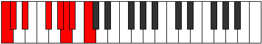
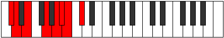
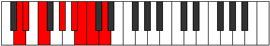
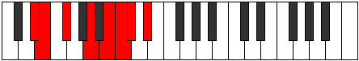
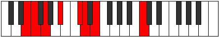
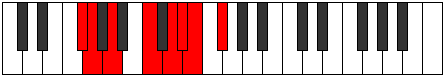
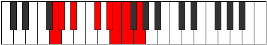

# Mode Solian

## Links

- [Documentation](index.md)
- [Scales Index](Scales.md)
- [Modes Index](Modes.md)
- [Chords Index](Chords.md)

## Parent Scale

[Rythian](ScaleRythian.md)

## Number

[1867](https://ianring.com/musictheory/scales/1867)

## Interval Pattern

1, 2, 3, 2, 1, 1, 2

## Chord Pattern

iv⁰, vi⁰

## Perfection

- 4 Perfect notes
- 3 Perfect notes

## Perfection Profile

[false true true true true false false]

## Permutations

| Tonic | Notes | Signature | Illustration | Audio |
|-------|-------|-----------|--------------|-------|
| [C](ModeCNaturalSolian.md) | **C**, Db, Eb, F#, G#, **A**, **Bb**, **C** | C |  | [midi](https://github.com/edipermadi/music/blob/main/docs/ModeCNaturalSolian.mid?raw=true) |
| [C#](ModeCSharpSolian.md) | **C#**, D, E, F##, G##, **A#**, **B**, **C#** | C |  | [midi](https://github.com/edipermadi/music/blob/main/docs/ModeCSharpSolian.mid?raw=true) |
| [Db](ModeDFlatSolian.md) | **Db**, Ebb, Fb, G, A, **Bb**, **Cb**, **Db** | C |  | [midi](https://github.com/edipermadi/music/blob/main/docs/ModeDFlatSolian.mid?raw=true) |
| [D](ModeDNaturalSolian.md) | **D**, Eb, F, G#, A#, **B**, **C**, **D** | C |  | [midi](https://github.com/edipermadi/music/blob/main/docs/ModeDNaturalSolian.mid?raw=true) |
| [D#](ModeDSharpSolian.md) | **D#**, E, F#, G##, A##, **B#**, **C#**, **D#** | C |  | [midi](https://github.com/edipermadi/music/blob/main/docs/ModeDSharpSolian.mid?raw=true) |
| [Eb](ModeEFlatSolian.md) | **Eb**, Fb, Gb, A, B, **C**, **Db**, **Eb** | C |  | [midi](https://github.com/edipermadi/music/blob/main/docs/ModeEFlatSolian.mid?raw=true) |
| [E](ModeENaturalSolian.md) | **E**, F, G, A#, B#, **C#**, **D**, **E** | C |  | [midi](https://github.com/edipermadi/music/blob/main/docs/ModeENaturalSolian.mid?raw=true) |
| [F](ModeFNaturalSolian.md) | **F**, Gb, Ab, B, C#, **D**, **Eb**, **F** | C |  | [midi](https://github.com/edipermadi/music/blob/main/docs/ModeFNaturalSolian.mid?raw=true) |
| [F#](ModeFSharpSolian.md) | **F#**, G, A, B#, C##, **D#**, **E**, **F#** | C |  | [midi](https://github.com/edipermadi/music/blob/main/docs/ModeFSharpSolian.mid?raw=true) |
| [Gb](ModeGFlatSolian.md) | **Gb**, Abb, Bbb, C, D, **Eb**, **Fb**, **Gb** | C |  | [midi](https://github.com/edipermadi/music/blob/main/docs/ModeGFlatSolian.mid?raw=true) |
| [G](ModeGNaturalSolian.md) | **G**, Ab, Bb, C#, D#, **E**, **F**, **G** | C |  | [midi](https://github.com/edipermadi/music/blob/main/docs/ModeGNaturalSolian.mid?raw=true) |
| [G#](ModeGSharpSolian.md) | **G#**, A, B, C##, D##, **E#**, **F#**, **G#** | C |  | [midi](https://github.com/edipermadi/music/blob/main/docs/ModeGSharpSolian.mid?raw=true) |
| [Ab](ModeAFlatSolian.md) | **Ab**, Bbb, Cb, D, E, **F**, **Gb**, **Ab** | C |  | [midi](https://github.com/edipermadi/music/blob/main/docs/ModeAFlatSolian.mid?raw=true) |
| [A](ModeANaturalSolian.md) | **A**, Bb, C, D#, E#, **F#**, **G**, **A** | C |  | [midi](https://github.com/edipermadi/music/blob/main/docs/ModeANaturalSolian.mid?raw=true) |
| [A#](ModeASharpSolian.md) | **A#**, B, C#, D##, E##, **F##**, **G#**, **A#** | C |  | [midi](https://github.com/edipermadi/music/blob/main/docs/ModeASharpSolian.mid?raw=true) |
| [Bb](ModeBFlatSolian.md) | **Bb**, Cb, Db, E, F#, **G**, **Ab**, **Bb** | C |  | [midi](https://github.com/edipermadi/music/blob/main/docs/ModeBFlatSolian.mid?raw=true) |
| [B](ModeBNaturalSolian.md) | **B**, C, D, E#, F##, **G#**, **A**, **B** | C |  | [midi](https://github.com/edipermadi/music/blob/main/docs/ModeBNaturalSolian.mid?raw=true) |
