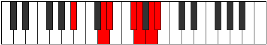

# Mode Solimic

## Links

- [Documentation](index.md)
- [Scales Index](Scales.md)
- [Modes Index](Modes.md)
- [Chords Index](Chords.md)

## Parent Scale

[Solimic](ScaleSolimic.md)

## Number

[2865](https://ianring.com/musictheory/scales/2865)

## Perfection

- 3 Perfect notes
- 3 Perfect notes

## Perfection Profile

[false true true false true false]

## Permutations

| Tonic | Notes | Signature | Illustration | Audio |
|-------|-------|-----------|--------------|-------|
| [C](ModeCNaturalSolimic.md) | **C**, D##, E#, **F###**, G##, **A##**, **C** | C |  | [midi](ModeCNaturalSolimic.mid) [ogg](ModeCNaturalSolimic.ogg) |
| [C#](ModeCSharpSolimic.md) | **C#**, D###, E##, **Cbbb**, Cbb, **Dbb**, **C#** | C |  | [midi](ModeCSharpSolimic.mid) [ogg](ModeCSharpSolimic.ogg) |
| [Db](ModeDFlatSolimic.md) | **Db**, E#, F#, **G##**, A#, **B#**, **Db** | C |  | [midi](ModeDFlatSolimic.mid) [ogg](ModeDFlatSolimic.ogg) |
| [D](ModeDNaturalSolimic.md) | **D**, E##, F##, **G###**, A##, **B##**, **D** | C |  | [midi](ModeDNaturalSolimic.mid) [ogg](ModeDNaturalSolimic.ogg) |
| [D#](ModeDSharpSolimic.md) | **D#**, E###, F###, **Cb**, Dbb, **Ebb**, **D#** | C |  | [midi](ModeDSharpSolimic.mid) [ogg](ModeDSharpSolimic.ogg) |
| [Eb](ModeEFlatSolimic.md) | **Eb**, F##, G#, **A##**, B#, **C##**, **Eb** | C |  | [midi](ModeEFlatSolimic.mid) [ogg](ModeEFlatSolimic.ogg) |
| [E](ModeENaturalSolimic.md) | **E**, F###, G##, **A###**, B##, **C###**, **E** | C |  | [midi](ModeENaturalSolimic.mid) [ogg](ModeENaturalSolimic.ogg) |
| [F](ModeFNaturalSolimic.md) | **F**, G##, A#, **B##**, C##, **D##**, **F** | C |  | [midi](ModeFNaturalSolimic.mid) [ogg](ModeFNaturalSolimic.ogg) |
| [F#](ModeFSharpSolimic.md) | **F#**, G###, A##, **B###**, C###, **D###**, **F#** | C |  | [midi](ModeFSharpSolimic.mid) [ogg](ModeFSharpSolimic.ogg) |
| [Gb](ModeGFlatSolimic.md) | **Gb**, A#, B, **C##**, D#, **E#**, **Gb** | C |  | [midi](ModeGFlatSolimic.mid) [ogg](ModeGFlatSolimic.ogg) |
| [G](ModeGNaturalSolimic.md) | **G**, A##, B#, **C###**, D##, **E##**, **G** | C |  | [midi](ModeGNaturalSolimic.mid) [ogg](ModeGNaturalSolimic.ogg) |
| [G#](ModeGSharpSolimic.md) | **G#**, A###, B##, **D##**, E#, **F##**, **G#** | C |  | [midi](ModeGSharpSolimic.mid) [ogg](ModeGSharpSolimic.ogg) |
| [Ab](ModeAFlatSolimic.md) | **Ab**, B#, C#, **D##**, E#, **F##**, **Ab** | C |  | [midi](ModeAFlatSolimic.mid) [ogg](ModeAFlatSolimic.ogg) |
| [A](ModeANaturalSolimic.md) | **A**, B##, C##, **D###**, E##, **F###**, **A** | C |  | [midi](ModeANaturalSolimic.mid) [ogg](ModeANaturalSolimic.ogg) |
| [A#](ModeASharpSolimic.md) | **A#**, B###, C###, **E##**, F##, **G##**, **A#** | C |  | [midi](ModeASharpSolimic.mid) [ogg](ModeASharpSolimic.ogg) |
| [Bb](ModeBFlatSolimic.md) | **Bb**, C##, D#, **E##**, F##, **G##**, **Bb** | C |  | [midi](ModeBFlatSolimic.mid) [ogg](ModeBFlatSolimic.ogg) |
| [B](ModeBNaturalSolimic.md) | **B**, C###, D##, **E###**, F###, **G###**, **B** | C |  | [midi](ModeBNaturalSolimic.mid) [ogg](ModeBNaturalSolimic.ogg) |
