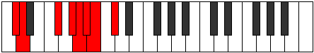
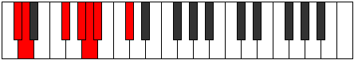
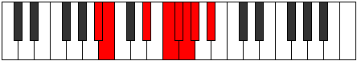
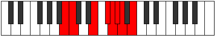

# Mode Sonian

## Links

- [Documentation](index.md)
- [Scales Index](Scales.md)
- [Modes Index](Modes.md)
- [Chords Index](Chords.md)

## Parent Scale

[Epycrian](ScaleEpycrian.md)

## Number

[1955](https://ianring.com/musictheory/scales/1955)

## Perfection

- 4 Perfect notes
- 3 Perfect notes

## Perfection Profile

[true true true false false false true]

## Permutations

| Tonic | Notes | Signature | Illustration | Audio |
|-------|-------|-----------|--------------|-------|
| [C](ModeCNaturalSonian.md) | C, Db, E#, **F##**, **G#**, **A**, Bb, C | C |  | [midi](ModeCNaturalSonian.mid) [ogg](ModeCNaturalSonian.ogg) |
| [C#](ModeCSharpSonian.md) | C#, D, E##, **F###**, **G##**, **A#**, B, C# | C |  | [midi](ModeCSharpSonian.mid) [ogg](ModeCSharpSonian.ogg) |
| [Db](ModeDFlatSonian.md) | Db, Ebb, F#, **G#**, **A**, **Bb**, Cb, Db | C |  | [midi](ModeDFlatSonian.mid) [ogg](ModeDFlatSonian.ogg) |
| [D](ModeDNaturalSonian.md) | D, Eb, F##, **G##**, **A#**, **B**, C, D | C |  | [midi](ModeDNaturalSonian.mid) [ogg](ModeDNaturalSonian.ogg) |
| [D#](ModeDSharpSonian.md) | D#, E, F###, **G###**, **A##**, **B#**, C#, D# | C |  | [midi](ModeDSharpSonian.mid) [ogg](ModeDSharpSonian.ogg) |
| [Eb](ModeEFlatSonian.md) | Eb, Fb, G#, **A#**, **B**, **C**, Db, Eb | C |  | [midi](ModeEFlatSonian.mid) [ogg](ModeEFlatSonian.ogg) |
| [E](ModeENaturalSonian.md) | E, F, G##, **A##**, **B#**, **C#**, D, E | C |  | [midi](ModeENaturalSonian.mid) [ogg](ModeENaturalSonian.ogg) |
| [F](ModeFNaturalSonian.md) | F, Gb, A#, **B#**, **C#**, **D**, Eb, F | C |  | [midi](ModeFNaturalSonian.mid) [ogg](ModeFNaturalSonian.ogg) |
| [F#](ModeFSharpSonian.md) | F#, G, A##, **B##**, **C##**, **D#**, E, F# | C |  | [midi](ModeFSharpSonian.mid) [ogg](ModeFSharpSonian.ogg) |
| [Gb](ModeGFlatSonian.md) | Gb, Abb, B, **C#**, **D**, **Eb**, Fb, Gb | C |  | [midi](ModeGFlatSonian.mid) [ogg](ModeGFlatSonian.ogg) |
| [G](ModeGNaturalSonian.md) | G, Ab, B#, **C##**, **D#**, **E**, F, G | C |  | [midi](ModeGNaturalSonian.mid) [ogg](ModeGNaturalSonian.ogg) |
| [G#](ModeGSharpSonian.md) | G#, A, B##, **C###**, **D##**, **E#**, F#, G# | C |  | [midi](ModeGSharpSonian.mid) [ogg](ModeGSharpSonian.ogg) |
| [Ab](ModeAFlatSonian.md) | Ab, Bbb, C#, **D#**, **E**, **F**, Gb, Ab | C |  | [midi](ModeAFlatSonian.mid) [ogg](ModeAFlatSonian.ogg) |
| [A](ModeANaturalSonian.md) | A, Bb, C##, **D##**, **E#**, **F#**, G, A | C |  | [midi](ModeANaturalSonian.mid) [ogg](ModeANaturalSonian.ogg) |
| [A#](ModeASharpSonian.md) | A#, B, C###, **D###**, **E##**, **F##**, G#, A# | C |  | [midi](ModeASharpSonian.mid) [ogg](ModeASharpSonian.ogg) |
| [Bb](ModeBFlatSonian.md) | Bb, Cb, D#, **E#**, **F#**, **G**, Ab, Bb | C |  | [midi](ModeBFlatSonian.mid) [ogg](ModeBFlatSonian.ogg) |
| [B](ModeBNaturalSonian.md) | B, C, D##, **E##**, **F##**, **G#**, A, B | C |  | [midi](ModeBNaturalSonian.mid) [ogg](ModeBNaturalSonian.ogg) |
