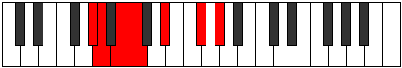
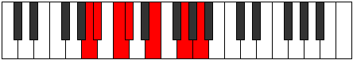

# Mode Sonimic

## Links

- [Documentation](README.md)
- [Scales Index](Scales.md)
- [Modes Index](Modes.md)
- [Chords Index](Chords.md)

## Parent Scale

[Thoptimic](ScaleThoptimic.md)

## Number

[1179](https://ianring.com/musictheory/scales/1179)

## Transposition

1, 2, 1, 3, 3, 2

## Chord Pattern

i, vi⁰

## Perfection

- 2 Perfect notes
- 4 Perfect notes

## Perfection Profile

true, false, true, false, false, false

## Permutations

| Tonic | Notes | Signature | Illustration | Audio |
|-------|-------|-----------|--------------|-------|
| [C](ModeCNaturalSonimic.md) | C, **Db**, Eb, **Fb**, **G**, **A#**, C | C |  | [midi](https://github.com/edipermadi/music/blob/main/docs/ModeCNaturalSonimic.mid?raw=true) |
| [C#](ModeCSharpSonimic.md) | C#, **D**, E, **F**, **G#**, **A##**, C# | C |  | [midi](https://github.com/edipermadi/music/blob/main/docs/ModeCSharpSonimic.mid?raw=true) |
| [Db](ModeDFlatSonimic.md) | Db, **Ebb**, Fb, **Gbb**, **Ab**, **B**, Db | C |  | [midi](https://github.com/edipermadi/music/blob/main/docs/ModeDFlatSonimic.mid?raw=true) |
| [D](ModeDNaturalSonimic.md) | D, **Eb**, F, **Gb**, **A**, **B#**, D | C |  | [midi](https://github.com/edipermadi/music/blob/main/docs/ModeDNaturalSonimic.mid?raw=true) |
| [D#](ModeDSharpSonimic.md) | D#, **E**, F#, **G**, **A#**, **B##**, D# | C |  | [midi](https://github.com/edipermadi/music/blob/main/docs/ModeDSharpSonimic.mid?raw=true) |
| [Eb](ModeEFlatSonimic.md) | Eb, **Fb**, Gb, **Abb**, **Bb**, **C#**, Eb | C |  | [midi](https://github.com/edipermadi/music/blob/main/docs/ModeEFlatSonimic.mid?raw=true) |
| [E](ModeENaturalSonimic.md) | E, **F**, G, **Ab**, **B**, **C##**, E | C |  | [midi](https://github.com/edipermadi/music/blob/main/docs/ModeENaturalSonimic.mid?raw=true) |
| [F](ModeFNaturalSonimic.md) | F, **Gb**, Ab, **Bbb**, **C**, **D#**, F | C |  | [midi](https://github.com/edipermadi/music/blob/main/docs/ModeFNaturalSonimic.mid?raw=true) |
| [F#](ModeFSharpSonimic.md) | F#, **G**, A, **Bb**, **C#**, **D##**, F# | C |  | [midi](https://github.com/edipermadi/music/blob/main/docs/ModeFSharpSonimic.mid?raw=true) |
| [Gb](ModeGFlatSonimic.md) | Gb, **Abb**, Bbb, **Cbb**, **Db**, **E**, Gb | C |  | [midi](https://github.com/edipermadi/music/blob/main/docs/ModeGFlatSonimic.mid?raw=true) |
| [G](ModeGNaturalSonimic.md) | G, **Ab**, Bb, **Cb**, **D**, **E#**, G | C |  | [midi](https://github.com/edipermadi/music/blob/main/docs/ModeGNaturalSonimic.mid?raw=true) |
| [G#](ModeGSharpSonimic.md) | G#, **A**, B, **C**, **D#**, **E##**, G# | C |  | [midi](https://github.com/edipermadi/music/blob/main/docs/ModeGSharpSonimic.mid?raw=true) |
| [Ab](ModeAFlatSonimic.md) | Ab, **Bbb**, Cb, **Dbb**, **Eb**, **F#**, Ab | C |  | [midi](https://github.com/edipermadi/music/blob/main/docs/ModeAFlatSonimic.mid?raw=true) |
| [A](ModeANaturalSonimic.md) | A, **Bb**, C, **Db**, **E**, **F##**, A | C |  | [midi](https://github.com/edipermadi/music/blob/main/docs/ModeANaturalSonimic.mid?raw=true) |
| [A#](ModeASharpSonimic.md) | A#, **B**, C#, **D**, **E#**, **F###**, A# | C |  | [midi](https://github.com/edipermadi/music/blob/main/docs/ModeASharpSonimic.mid?raw=true) |
| [Bb](ModeBFlatSonimic.md) | Bb, **Cb**, Db, **Ebb**, **F**, **G#**, Bb | C |  | [midi](https://github.com/edipermadi/music/blob/main/docs/ModeBFlatSonimic.mid?raw=true) |
| [B](ModeBNaturalSonimic.md) | B, **C**, D, **Eb**, **F#**, **G##**, B | C |  | [midi](https://github.com/edipermadi/music/blob/main/docs/ModeBNaturalSonimic.mid?raw=true) |
