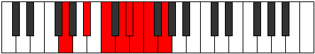

# Mode Soptian

## Links

- [Documentation](index.md)
- [Scales Index](Scales.md)
- [Modes Index](Modes.md)
- [Chords Index](Chords.md)

## Parent Scale

[Soptian](ScaleSoptian.md)

## Number

[1961](https://ianring.com/musictheory/scales/1961)

## Perfection

- 5 Perfect notes
- 2 Perfect notes

## Perfection Profile

[true true true false true false true]

## Permutations

| Tonic | Notes | Signature | Illustration | Audio |
|-------|-------|-----------|--------------|-------|
| [C](ModeCNaturalSoptian.md) | C, D#, E#, **F##**, G#, **A**, Bb, C | C |  | [midi](ModeCNaturalSoptian.mid) [ogg](ModeCNaturalSoptian.ogg) |
| [C#](ModeCSharpSoptian.md) | C#, D##, E##, **F###**, G##, **A#**, B, C# | C |  | [midi](ModeCSharpSoptian.mid) [ogg](ModeCSharpSoptian.ogg) |
| [Db](ModeDFlatSoptian.md) | Db, E, F#, **G#**, A, **Bb**, Cb, Db | C |  | [midi](ModeDFlatSoptian.mid) [ogg](ModeDFlatSoptian.ogg) |
| [D](ModeDNaturalSoptian.md) | D, E#, F##, **G##**, A#, **B**, C, D | C |  | [midi](ModeDNaturalSoptian.mid) [ogg](ModeDNaturalSoptian.ogg) |
| [D#](ModeDSharpSoptian.md) | D#, E##, F###, **G###**, A##, **B#**, C#, D# | C |  | [midi](ModeDSharpSoptian.mid) [ogg](ModeDSharpSoptian.ogg) |
| [Eb](ModeEFlatSoptian.md) | Eb, F#, G#, **A#**, B, **C**, Db, Eb | C |  | [midi](ModeEFlatSoptian.mid) [ogg](ModeEFlatSoptian.ogg) |
| [E](ModeENaturalSoptian.md) | E, F##, G##, **A##**, B#, **C#**, D, E | C |  | [midi](ModeENaturalSoptian.mid) [ogg](ModeENaturalSoptian.ogg) |
| [F](ModeFNaturalSoptian.md) | F, G#, A#, **B#**, C#, **D**, Eb, F | C |  | [midi](ModeFNaturalSoptian.mid) [ogg](ModeFNaturalSoptian.ogg) |
| [F#](ModeFSharpSoptian.md) | F#, G##, A##, **B##**, C##, **D#**, E, F# | C |  | [midi](ModeFSharpSoptian.mid) [ogg](ModeFSharpSoptian.ogg) |
| [Gb](ModeGFlatSoptian.md) | Gb, A, B, **C#**, D, **Eb**, Fb, Gb | C |  | [midi](ModeGFlatSoptian.mid) [ogg](ModeGFlatSoptian.ogg) |
| [G](ModeGNaturalSoptian.md) | G, A#, B#, **C##**, D#, **E**, F, G | C |  | [midi](ModeGNaturalSoptian.mid) [ogg](ModeGNaturalSoptian.ogg) |
| [G#](ModeGSharpSoptian.md) | G#, A##, B##, **C###**, D##, **E#**, F#, G# | C |  | [midi](ModeGSharpSoptian.mid) [ogg](ModeGSharpSoptian.ogg) |
| [Ab](ModeAFlatSoptian.md) | Ab, B, C#, **D#**, E, **F**, Gb, Ab | C |  | [midi](ModeAFlatSoptian.mid) [ogg](ModeAFlatSoptian.ogg) |
| [A](ModeANaturalSoptian.md) | A, B#, C##, **D##**, E#, **F#**, G, A | C |  | [midi](ModeANaturalSoptian.mid) [ogg](ModeANaturalSoptian.ogg) |
| [A#](ModeASharpSoptian.md) | A#, B##, C###, **D###**, E##, **F##**, G#, A# | C |  | [midi](ModeASharpSoptian.mid) [ogg](ModeASharpSoptian.ogg) |
| [Bb](ModeBFlatSoptian.md) | Bb, C#, D#, **E#**, F#, **G**, Ab, Bb | C |  | [midi](ModeBFlatSoptian.mid) [ogg](ModeBFlatSoptian.ogg) |
| [B](ModeBNaturalSoptian.md) | B, C##, D##, **E##**, F##, **G#**, A, B | C |  | [midi](ModeBNaturalSoptian.mid) [ogg](ModeBNaturalSoptian.ogg) |
