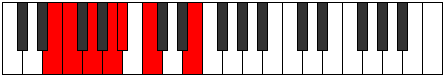

# Mode Soptimic

## Links

- [Documentation](README.md)
- [Scales Index](Scales.md)
- [Modes Index](Modes.md)
- [Chords Index](Chords.md)

## Parent Scale

[Garimic](ScaleGarimic.md)

## Number

[363](https://ianring.com/musictheory/scales/363)

## Transposition

1, 2, 2, 1, 2, 4

## Chord Pattern

i⁰, II, II

## Perfection

- 4 Perfect notes
- 2 Perfect notes

## Perfection Profile

[false true false true true true]

## Permutations

| Tonic | Notes | Signature | Illustration | Audio |
|-------|-------|-----------|--------------|-------|
| [C](ModeCNaturalSoptimic.md) | **C**, Db, **Eb**, F, Gb, Ab, **C** | C |  | [midi](https://github.com/edipermadi/music/blob/main/docs/ModeCNaturalSoptimic.mid?raw=true) |
| [C#](ModeCSharpSoptimic.md) | **C#**, D, **E**, F#, G, A, **C#** | C |  | [midi](https://github.com/edipermadi/music/blob/main/docs/ModeCSharpSoptimic.mid?raw=true) |
| [Db](ModeDFlatSoptimic.md) | **Db**, Ebb, **Fb**, Gb, Abb, Bbb, **Db** | C |  | [midi](https://github.com/edipermadi/music/blob/main/docs/ModeDFlatSoptimic.mid?raw=true) |
| [D](ModeDNaturalSoptimic.md) | **D**, Eb, **F**, G, Ab, Bb, **D** | C |  | [midi](https://github.com/edipermadi/music/blob/main/docs/ModeDNaturalSoptimic.mid?raw=true) |
| [D#](ModeDSharpSoptimic.md) | **D#**, E, **F#**, G#, A, B, **D#** | C |  | [midi](https://github.com/edipermadi/music/blob/main/docs/ModeDSharpSoptimic.mid?raw=true) |
| [Eb](ModeEFlatSoptimic.md) | **Eb**, Fb, **Gb**, Ab, Bbb, Cb, **Eb** | C |  | [midi](https://github.com/edipermadi/music/blob/main/docs/ModeEFlatSoptimic.mid?raw=true) |
| [E](ModeENaturalSoptimic.md) | **E**, F, **G**, A, Bb, C, **E** | C |  | [midi](https://github.com/edipermadi/music/blob/main/docs/ModeENaturalSoptimic.mid?raw=true) |
| [F](ModeFNaturalSoptimic.md) | **F**, Gb, **Ab**, Bb, Cb, Db, **F** | C |  | [midi](https://github.com/edipermadi/music/blob/main/docs/ModeFNaturalSoptimic.mid?raw=true) |
| [F#](ModeFSharpSoptimic.md) | **F#**, G, **A**, B, C, D, **F#** | C |  | [midi](https://github.com/edipermadi/music/blob/main/docs/ModeFSharpSoptimic.mid?raw=true) |
| [Gb](ModeGFlatSoptimic.md) | **Gb**, Abb, **Bbb**, Cb, Dbb, Ebb, **Gb** | C |  | [midi](https://github.com/edipermadi/music/blob/main/docs/ModeGFlatSoptimic.mid?raw=true) |
| [G](ModeGNaturalSoptimic.md) | **G**, Ab, **Bb**, C, Db, Eb, **G** | C |  | [midi](https://github.com/edipermadi/music/blob/main/docs/ModeGNaturalSoptimic.mid?raw=true) |
| [G#](ModeGSharpSoptimic.md) | **G#**, A, **B**, C#, D, E, **G#** | C |  | [midi](https://github.com/edipermadi/music/blob/main/docs/ModeGSharpSoptimic.mid?raw=true) |
| [Ab](ModeAFlatSoptimic.md) | **Ab**, Bbb, **Cb**, Db, Ebb, Fb, **Ab** | C |  | [midi](https://github.com/edipermadi/music/blob/main/docs/ModeAFlatSoptimic.mid?raw=true) |
| [A](ModeANaturalSoptimic.md) | **A**, Bb, **C**, D, Eb, F, **A** | C |  | [midi](https://github.com/edipermadi/music/blob/main/docs/ModeANaturalSoptimic.mid?raw=true) |
| [A#](ModeASharpSoptimic.md) | **A#**, B, **C#**, D#, E, F#, **A#** | C |  | [midi](https://github.com/edipermadi/music/blob/main/docs/ModeASharpSoptimic.mid?raw=true) |
| [Bb](ModeBFlatSoptimic.md) | **Bb**, Cb, **Db**, Eb, Fb, Gb, **Bb** | C |  | [midi](https://github.com/edipermadi/music/blob/main/docs/ModeBFlatSoptimic.mid?raw=true) |
| [B](ModeBNaturalSoptimic.md) | **B**, C, **D**, E, F, G, **B** | C |  | [midi](https://github.com/edipermadi/music/blob/main/docs/ModeBNaturalSoptimic.mid?raw=true) |
