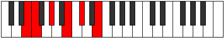
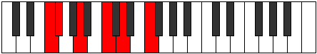

# Mode Soptitonic

## Links

- [Documentation](index.md)
- [Scales Index](Scales.md)
- [Modes Index](Modes.md)
- [Chords Index](Chords.md)

## Parent Scale

[Thoditonic](ScaleThoditonic.md)

## Number

[659](https://ianring.com/musictheory/scales/659)

## Perfection

- 2 Perfect notes
- 3 Perfect notes

## Perfection Profile

[true false false false true]

## Permutations

| Tonic | Notes | Signature | Illustration | Audio |
|-------|-------|-----------|--------------|-------|
| [C](ModeCNaturalSoptitonic.md) | C, **C#**, **E**, **G**, A, C | C |  | [midi](ModeCNaturalSoptitonic.mid) [ogg](ModeCNaturalSoptitonic.ogg) |
| [C#](ModeCSharpSoptitonic.md) | C#, **D**, **F**, **G#**, A#, C# | C |  | [midi](ModeCSharpSoptitonic.mid) [ogg](ModeCSharpSoptitonic.ogg) |
| [Db](ModeDFlatSoptitonic.md) | Db, **D**, **F**, **Ab**, Bb, Db | C |  | [midi](ModeDFlatSoptitonic.mid) [ogg](ModeDFlatSoptitonic.ogg) |
| [D](ModeDNaturalSoptitonic.md) | D, **D#**, **F#**, **A**, B, D | C |  | [midi](ModeDNaturalSoptitonic.mid) [ogg](ModeDNaturalSoptitonic.ogg) |
| [D#](ModeDSharpSoptitonic.md) | D#, **E**, **G**, **A#**, C, D# | C |  | [midi](ModeDSharpSoptitonic.mid) [ogg](ModeDSharpSoptitonic.ogg) |
| [Eb](ModeEFlatSoptitonic.md) | Eb, **E**, **G**, **Bb**, C, Eb | C |  | [midi](ModeEFlatSoptitonic.mid) [ogg](ModeEFlatSoptitonic.ogg) |
| [E](ModeENaturalSoptitonic.md) | E, **F**, **G#**, **B**, C#, E | C |  | [midi](ModeENaturalSoptitonic.mid) [ogg](ModeENaturalSoptitonic.ogg) |
| [F](ModeFNaturalSoptitonic.md) | F, **F#**, **A**, **C**, D, F | C |  | [midi](ModeFNaturalSoptitonic.mid) [ogg](ModeFNaturalSoptitonic.ogg) |
| [F#](ModeFSharpSoptitonic.md) | F#, **G**, **A#**, **C#**, D#, F# | C |  | [midi](ModeFSharpSoptitonic.mid) [ogg](ModeFSharpSoptitonic.ogg) |
| [Gb](ModeGFlatSoptitonic.md) | Gb, **G**, **Bb**, **Db**, Eb, Gb | C |  | [midi](ModeGFlatSoptitonic.mid) [ogg](ModeGFlatSoptitonic.ogg) |
| [G](ModeGNaturalSoptitonic.md) | G, **G#**, **B**, **D**, E, G | C |  | [midi](ModeGNaturalSoptitonic.mid) [ogg](ModeGNaturalSoptitonic.ogg) |
| [G#](ModeGSharpSoptitonic.md) | G#, **A**, **C**, **D#**, F, G# | C |  | [midi](ModeGSharpSoptitonic.mid) [ogg](ModeGSharpSoptitonic.ogg) |
| [Ab](ModeAFlatSoptitonic.md) | Ab, **A**, **C**, **Eb**, F, Ab | C |  | [midi](ModeAFlatSoptitonic.mid) [ogg](ModeAFlatSoptitonic.ogg) |
| [A](ModeANaturalSoptitonic.md) | A, **A#**, **C#**, **E**, F#, A | C |  | [midi](ModeANaturalSoptitonic.mid) [ogg](ModeANaturalSoptitonic.ogg) |
| [A#](ModeASharpSoptitonic.md) | A#, **B**, **D**, **F**, G, A# | C |  | [midi](ModeASharpSoptitonic.mid) [ogg](ModeASharpSoptitonic.ogg) |
| [Bb](ModeBFlatSoptitonic.md) | Bb, **B**, **D**, **F**, G, Bb | C |  | [midi](ModeBFlatSoptitonic.mid) [ogg](ModeBFlatSoptitonic.ogg) |
| [B](ModeBNaturalSoptitonic.md) | B, **C**, **D#**, **F#**, G#, B | C |  | [midi](ModeBNaturalSoptitonic.mid) [ogg](ModeBNaturalSoptitonic.ogg) |
