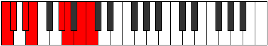

# Mode Sorian

## Links

- [Documentation](README.md)
- [Scales Index](Scales.md)
- [Modes Index](Modes.md)
- [Chords Index](Chords.md)

## Parent Scale

[Stythian](ScaleStythian.md)

## Number

[2843](https://ianring.com/musictheory/scales/2843)

## Interval Pattern

1, 2, 1, 4, 1, 2, 1

## Chord Pattern

vi⁰

## Perfection

- 4 Perfect notes
- 3 Perfect notes

## Perfection Profile

[false true false true true true false]

## Permutations

| Tonic | Notes | Signature | Illustration | Audio |
|-------|-------|-----------|--------------|-------|
| [C](ModeCNaturalSorian.md) | **C**, Db, **Eb**, Fb, G#, A, **B**, **C** | C |  | [midi](https://github.com/edipermadi/music/blob/main/docs/ModeCNaturalSorian.mid?raw=true) |
| [C#](ModeCSharpSorian.md) | **C#**, D, **E**, F, G##, A#, **B#**, **C#** | C |  | [midi](https://github.com/edipermadi/music/blob/main/docs/ModeCSharpSorian.mid?raw=true) |
| [Db](ModeDFlatSorian.md) | **Db**, Ebb, **Fb**, Gbb, A, Bb, **C**, **Db** | C |  | [midi](https://github.com/edipermadi/music/blob/main/docs/ModeDFlatSorian.mid?raw=true) |
| [D](ModeDNaturalSorian.md) | **D**, Eb, **F**, Gb, A#, B, **C#**, **D** | C |  | [midi](https://github.com/edipermadi/music/blob/main/docs/ModeDNaturalSorian.mid?raw=true) |
| [D#](ModeDSharpSorian.md) | **D#**, E, **F#**, G, A##, B#, **C##**, **D#** | C |  | [midi](https://github.com/edipermadi/music/blob/main/docs/ModeDSharpSorian.mid?raw=true) |
| [Eb](ModeEFlatSorian.md) | **Eb**, Fb, **Gb**, Abb, B, C, **D**, **Eb** | C |  | [midi](https://github.com/edipermadi/music/blob/main/docs/ModeEFlatSorian.mid?raw=true) |
| [E](ModeENaturalSorian.md) | **E**, F, **G**, Ab, B#, C#, **D#**, **E** | C |  | [midi](https://github.com/edipermadi/music/blob/main/docs/ModeENaturalSorian.mid?raw=true) |
| [F](ModeFNaturalSorian.md) | **F**, Gb, **Ab**, Bbb, C#, D, **E**, **F** | C |  | [midi](https://github.com/edipermadi/music/blob/main/docs/ModeFNaturalSorian.mid?raw=true) |
| [F#](ModeFSharpSorian.md) | **F#**, G, **A**, Bb, C##, D#, **E#**, **F#** | C |  | [midi](https://github.com/edipermadi/music/blob/main/docs/ModeFSharpSorian.mid?raw=true) |
| [Gb](ModeGFlatSorian.md) | **Gb**, Abb, **Bbb**, Cbb, D, Eb, **F**, **Gb** | C |  | [midi](https://github.com/edipermadi/music/blob/main/docs/ModeGFlatSorian.mid?raw=true) |
| [G](ModeGNaturalSorian.md) | **G**, Ab, **Bb**, Cb, D#, E, **F#**, **G** | C |  | [midi](https://github.com/edipermadi/music/blob/main/docs/ModeGNaturalSorian.mid?raw=true) |
| [G#](ModeGSharpSorian.md) | **G#**, A, **B**, C, D##, E#, **F##**, **G#** | C |  | [midi](https://github.com/edipermadi/music/blob/main/docs/ModeGSharpSorian.mid?raw=true) |
| [Ab](ModeAFlatSorian.md) | **Ab**, Bbb, **Cb**, Dbb, E, F, **G**, **Ab** | C |  | [midi](https://github.com/edipermadi/music/blob/main/docs/ModeAFlatSorian.mid?raw=true) |
| [A](ModeANaturalSorian.md) | **A**, Bb, **C**, Db, E#, F#, **G#**, **A** | C |  | [midi](https://github.com/edipermadi/music/blob/main/docs/ModeANaturalSorian.mid?raw=true) |
| [A#](ModeASharpSorian.md) | **A#**, B, **C#**, D, E##, F##, **G##**, **A#** | C |  | [midi](https://github.com/edipermadi/music/blob/main/docs/ModeASharpSorian.mid?raw=true) |
| [Bb](ModeBFlatSorian.md) | **Bb**, Cb, **Db**, Ebb, F#, G, **A**, **Bb** | C |  | [midi](https://github.com/edipermadi/music/blob/main/docs/ModeBFlatSorian.mid?raw=true) |
| [B](ModeBNaturalSorian.md) | **B**, C, **D**, Eb, F##, G#, **A#**, **B** | C |  | [midi](https://github.com/edipermadi/music/blob/main/docs/ModeBNaturalSorian.mid?raw=true) |
