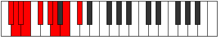
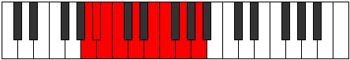

# Mode Soryllic

## Links

- [Documentation](README.md)
- [Scales Index](Scales.md)
- [Modes Index](Modes.md)
- [Chords Index](Chords.md)

## Parent Scale

[Aerycryllic](ScaleAerycryllic.md)

## Number

[1455](https://ianring.com/musictheory/scales/1455)

## Luminosity

3

## Transposition

1, 1, 1, 2, 2, 1, 2, 2

## Chord Pattern

ii⁰b3, iii⁰, IV, v, vi⁰, VIIb5

## Perfection

- 7 Perfect notes
- 1 Perfect notes

## Perfection Profile

true, true, false, true, true, true, true, true

## Permutations

| Tonic | Notes | Signature | Illustration | Audio |
|-------|-------|-----------|--------------|-------|
| [C](ModeCNaturalSoryllic.md) | C, C#, **D**, D#, F, G, G#, A#, C | C |  | [midi](https://github.com/edipermadi/music/blob/main/docs/ModeCNaturalSoryllic.mid?raw=true) |
| [C#](ModeCSharpSoryllic.md) | C#, D, **D#**, E, F#, G#, A, B, C# | C |  | [midi](https://github.com/edipermadi/music/blob/main/docs/ModeCSharpSoryllic.mid?raw=true) |
| [Db](ModeDFlatSoryllic.md) | Db, D, **Eb**, E, Gb, Ab, A, B, Db | C |  | [midi](https://github.com/edipermadi/music/blob/main/docs/ModeDFlatSoryllic.mid?raw=true) |
| [D](ModeDNaturalSoryllic.md) | D, D#, **E**, F, G, A, A#, C, D | C |  | [midi](https://github.com/edipermadi/music/blob/main/docs/ModeDNaturalSoryllic.mid?raw=true) |
| [D#](ModeDSharpSoryllic.md) | D#, E, **F**, F#, G#, A#, B, C#, D# | C |  | [midi](https://github.com/edipermadi/music/blob/main/docs/ModeDSharpSoryllic.mid?raw=true) |
| [Eb](ModeEFlatSoryllic.md) | Eb, E, **F**, Gb, Ab, Bb, B, Db, Eb | C |  | [midi](https://github.com/edipermadi/music/blob/main/docs/ModeEFlatSoryllic.mid?raw=true) |
| [E](ModeENaturalSoryllic.md) | E, F, **F#**, G, A, B, C, D, E | C |  | [midi](https://github.com/edipermadi/music/blob/main/docs/ModeENaturalSoryllic.mid?raw=true) |
| [F](ModeFNaturalSoryllic.md) | F, F#, **G**, G#, A#, C, C#, D#, F | C |  | [midi](https://github.com/edipermadi/music/blob/main/docs/ModeFNaturalSoryllic.mid?raw=true) |
| [F#](ModeFSharpSoryllic.md) | F#, G, **G#**, A, B, C#, D, E, F# | C |  | [midi](https://github.com/edipermadi/music/blob/main/docs/ModeFSharpSoryllic.mid?raw=true) |
| [Gb](ModeGFlatSoryllic.md) | Gb, G, **Ab**, A, B, Db, D, E, Gb | C |  | [midi](https://github.com/edipermadi/music/blob/main/docs/ModeGFlatSoryllic.mid?raw=true) |
| [G](ModeGNaturalSoryllic.md) | G, G#, **A**, A#, C, D, D#, F, G | C |  | [midi](https://github.com/edipermadi/music/blob/main/docs/ModeGNaturalSoryllic.mid?raw=true) |
| [G#](ModeGSharpSoryllic.md) | G#, A, **A#**, B, C#, D#, E, F#, G# | C |  | [midi](https://github.com/edipermadi/music/blob/main/docs/ModeGSharpSoryllic.mid?raw=true) |
| [Ab](ModeAFlatSoryllic.md) | Ab, A, **Bb**, B, Db, Eb, E, Gb, Ab | C |  | [midi](https://github.com/edipermadi/music/blob/main/docs/ModeAFlatSoryllic.mid?raw=true) |
| [A](ModeANaturalSoryllic.md) | A, A#, **B**, C, D, E, F, G, A | C |  | [midi](https://github.com/edipermadi/music/blob/main/docs/ModeANaturalSoryllic.mid?raw=true) |
| [A#](ModeASharpSoryllic.md) | A#, B, **C**, C#, D#, F, F#, G#, A# | C |  | [midi](https://github.com/edipermadi/music/blob/main/docs/ModeASharpSoryllic.mid?raw=true) |
| [Bb](ModeBFlatSoryllic.md) | Bb, B, **C**, Db, Eb, F, Gb, Ab, Bb | C |  | [midi](https://github.com/edipermadi/music/blob/main/docs/ModeBFlatSoryllic.mid?raw=true) |
| [B](ModeBNaturalSoryllic.md) | B, C, **C#**, D, E, F#, G, A, B | C |  | [midi](https://github.com/edipermadi/music/blob/main/docs/ModeBNaturalSoryllic.mid?raw=true) |
