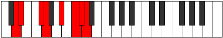

# Mode Sothian

## Links

- [Documentation](index.md)
- [Scales Index](Scales.md)
- [Modes Index](Modes.md)
- [Chords Index](Chords.md)

## Parent Scale

[Laptian](ScaleLaptian.md)

## Number

[3379](https://ianring.com/musictheory/scales/3379)

## Perfection

- 4 Perfect notes
- 3 Perfect notes

## Perfection Profile

[false true true true false true false]

## Permutations

| Tonic | Notes | Signature | Illustration | Audio |
|-------|-------|-----------|--------------|-------|
| [C](ModeCNaturalSothian.md) | **C**, Db, E, F, **G#**, A#, **B**, **C** | C |  | [midi](ModeCNaturalSothian.mid) [ogg](ModeCNaturalSothian.ogg) |
| [C#](ModeCSharpSothian.md) | **C#**, D, E#, F#, **G##**, A##, **B#**, **C#** | C |  | [midi](ModeCSharpSothian.mid) [ogg](ModeCSharpSothian.ogg) |
| [Db](ModeDFlatSothian.md) | **Db**, Ebb, F, Gb, **A**, B, **C**, **Db** | C |  | [midi](ModeDFlatSothian.mid) [ogg](ModeDFlatSothian.ogg) |
| [D](ModeDNaturalSothian.md) | **D**, Eb, F#, G, **A#**, B#, **C#**, **D** | C |  | [midi](ModeDNaturalSothian.mid) [ogg](ModeDNaturalSothian.ogg) |
| [D#](ModeDSharpSothian.md) | **D#**, E, F##, G#, **A##**, B##, **C##**, **D#** | C |  | [midi](ModeDSharpSothian.mid) [ogg](ModeDSharpSothian.ogg) |
| [Eb](ModeEFlatSothian.md) | **Eb**, Fb, G, Ab, **B**, C#, **D**, **Eb** | C |  | [midi](ModeEFlatSothian.mid) [ogg](ModeEFlatSothian.ogg) |
| [E](ModeENaturalSothian.md) | **E**, F, G#, A, **B#**, C##, **D#**, **E** | C |  | [midi](ModeENaturalSothian.mid) [ogg](ModeENaturalSothian.ogg) |
| [F](ModeFNaturalSothian.md) | **F**, Gb, A, Bb, **C#**, D#, **E**, **F** | C |  | [midi](ModeFNaturalSothian.mid) [ogg](ModeFNaturalSothian.ogg) |
| [F#](ModeFSharpSothian.md) | **F#**, G, A#, B, **C##**, D##, **E#**, **F#** | C |  | [midi](ModeFSharpSothian.mid) [ogg](ModeFSharpSothian.ogg) |
| [Gb](ModeGFlatSothian.md) | **Gb**, Abb, Bb, Cb, **D**, E, **F**, **Gb** | C |  | [midi](ModeGFlatSothian.mid) [ogg](ModeGFlatSothian.ogg) |
| [G](ModeGNaturalSothian.md) | **G**, Ab, B, C, **D#**, E#, **F#**, **G** | C |  | [midi](ModeGNaturalSothian.mid) [ogg](ModeGNaturalSothian.ogg) |
| [G#](ModeGSharpSothian.md) | **G#**, A, B#, C#, **D##**, E##, **F##**, **G#** | C |  | [midi](ModeGSharpSothian.mid) [ogg](ModeGSharpSothian.ogg) |
| [Ab](ModeAFlatSothian.md) | **Ab**, Bbb, C, Db, **E**, F#, **G**, **Ab** | C |  | [midi](ModeAFlatSothian.mid) [ogg](ModeAFlatSothian.ogg) |
| [A](ModeANaturalSothian.md) | **A**, Bb, C#, D, **E#**, F##, **G#**, **A** | C |  | [midi](ModeANaturalSothian.mid) [ogg](ModeANaturalSothian.ogg) |
| [A#](ModeASharpSothian.md) | **A#**, B, C##, D#, **E##**, F###, **G##**, **A#** | C |  | [midi](ModeASharpSothian.mid) [ogg](ModeASharpSothian.ogg) |
| [Bb](ModeBFlatSothian.md) | **Bb**, Cb, D, Eb, **F#**, G#, **A**, **Bb** | C |  | [midi](ModeBFlatSothian.mid) [ogg](ModeBFlatSothian.ogg) |
| [B](ModeBNaturalSothian.md) | **B**, C, D#, E, **F##**, G##, **A#**, **B** | C |  | [midi](ModeBNaturalSothian.mid) [ogg](ModeBNaturalSothian.ogg) |
