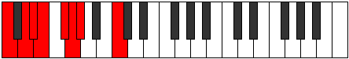
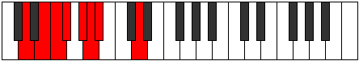

# Mode Stacrian

## Links

- [Documentation](index.md)
- [Scales Index](Scales.md)
- [Modes Index](Modes.md)
- [Chords Index](Chords.md)

## Parent Scale

[Katogian](ScaleKatogian.md)

## Number

[477](https://ianring.com/musictheory/scales/477)

## Perfection

- 3 Perfect notes
- 4 Perfect notes

## Perfection Profile

[true false false false false true true]

## Permutations

| Tonic | Notes | Signature | Illustration | Audio |
|-------|-------|-----------|--------------|-------|
| [C](ModeCNaturalStacrian.md) | C, **D**, **Eb**, **Fb**, **Gb**, Abb, Bbbb, C | C |  | [midi](ModeCNaturalStacrian.mid) [ogg](ModeCNaturalStacrian.ogg) |
| [C#](ModeCSharpStacrian.md) | C#, **D#**, **E**, **F**, **G**, Ab, Bbb, C# | C |  | [midi](ModeCSharpStacrian.mid) [ogg](ModeCSharpStacrian.ogg) |
| [Db](ModeDFlatStacrian.md) | Db, **Eb**, **Fb**, **Gbb**, **Abb**, Bbbb, Cbbb, Db | C |  | [midi](ModeDFlatStacrian.mid) [ogg](ModeDFlatStacrian.ogg) |
| [D](ModeDNaturalStacrian.md) | D, **E**, **F**, **Gb**, **Ab**, Bbb, Cbb, D | C |  | [midi](ModeDNaturalStacrian.mid) [ogg](ModeDNaturalStacrian.ogg) |
| [D#](ModeDSharpStacrian.md) | D#, **E#**, **F#**, **G**, **A**, Bb, Cb, D# | C |  | [midi](ModeDSharpStacrian.mid) [ogg](ModeDSharpStacrian.ogg) |
| [Eb](ModeEFlatStacrian.md) | Eb, **F**, **Gb**, **Abb**, **Bbb**, Cbb, Dbbb, Eb | C |  | [midi](ModeEFlatStacrian.mid) [ogg](ModeEFlatStacrian.ogg) |
| [E](ModeENaturalStacrian.md) | E, **F#**, **G**, **Ab**, **Bb**, Cb, Dbb, E | C |  | [midi](ModeENaturalStacrian.mid) [ogg](ModeENaturalStacrian.ogg) |
| [F](ModeFNaturalStacrian.md) | F, **G**, **Ab**, **Bbb**, **Cb**, Dbb, Ebbb, F | C |  | [midi](ModeFNaturalStacrian.mid) [ogg](ModeFNaturalStacrian.ogg) |
| [F#](ModeFSharpStacrian.md) | F#, **G#**, **A**, **Bb**, **C**, Db, Ebb, F# | C |  | [midi](ModeFSharpStacrian.mid) [ogg](ModeFSharpStacrian.ogg) |
| [Gb](ModeGFlatStacrian.md) | Gb, **Ab**, **Bbb**, **Cbb**, **Dbb**, Ebbb, Fbbb, Gb | C |  | [midi](ModeGFlatStacrian.mid) [ogg](ModeGFlatStacrian.ogg) |
| [G](ModeGNaturalStacrian.md) | G, **A**, **Bb**, **Cb**, **Db**, Ebb, Fbb, G | C |  | [midi](ModeGNaturalStacrian.mid) [ogg](ModeGNaturalStacrian.ogg) |
| [G#](ModeGSharpStacrian.md) | G#, **A#**, **B**, **C**, **D**, Eb, Fb, G# | C |  | [midi](ModeGSharpStacrian.mid) [ogg](ModeGSharpStacrian.ogg) |
| [Ab](ModeAFlatStacrian.md) | Ab, **Bb**, **Cb**, **Dbb**, **Ebb**, Fbb, Gbbb, Ab | C |  | [midi](ModeAFlatStacrian.mid) [ogg](ModeAFlatStacrian.ogg) |
| [A](ModeANaturalStacrian.md) | A, **B**, **C**, **Db**, **Eb**, Fb, Gbb, A | C |  | [midi](ModeANaturalStacrian.mid) [ogg](ModeANaturalStacrian.ogg) |
| [A#](ModeASharpStacrian.md) | A#, **B#**, **C#**, **D**, **E**, F, Gb, A# | C |  | [midi](ModeASharpStacrian.mid) [ogg](ModeASharpStacrian.ogg) |
| [Bb](ModeBFlatStacrian.md) | Bb, **C**, **Db**, **Ebb**, **Fb**, Gbb, Abbb, Bb | C |  | [midi](ModeBFlatStacrian.mid) [ogg](ModeBFlatStacrian.ogg) |
| [B](ModeBNaturalStacrian.md) | B, **C#**, **D**, **Eb**, **F**, Gb, Abb, B | C |  | [midi](ModeBNaturalStacrian.mid) [ogg](ModeBNaturalStacrian.ogg) |
