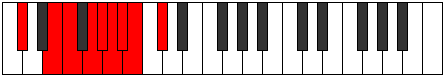
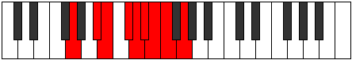

# Mode Stacryllic

## Links

- [Documentation](index.md)
- [Scales Index](Scales.md)
- [Modes Index](Modes.md)
- [Chords Index](Chords.md)

## Parent Scale

[Stacryllic](ScaleStacryllic.md)

## Number

[2009](https://ianring.com/musictheory/scales/2009)

## Perfection

- 4 Perfect notes
- 4 Perfect notes

## Perfection Profile

[true true false false false true true false]

## Permutations

| Tonic | Notes | Signature | Illustration | Audio |
|-------|-------|-----------|--------------|-------|
| [C](ModeCNaturalStacryllic.md) | C, D#, **E**, **F#**, **G**, G#, A, **A#**, C | C |  | [midi](ModeCNaturalStacryllic.mid) [ogg](ModeCNaturalStacryllic.ogg) |
| [C#](ModeCSharpStacryllic.md) | C#, E, **F**, **G**, **G#**, A, A#, **B**, C# | C |  | [midi](ModeCSharpStacryllic.mid) [ogg](ModeCSharpStacryllic.ogg) |
| [Db](ModeDFlatStacryllic.md) | Db, E, **F**, **G**, **Ab**, A, Bb, **B**, Db | C |  | [midi](ModeDFlatStacryllic.mid) [ogg](ModeDFlatStacryllic.ogg) |
| [D](ModeDNaturalStacryllic.md) | D, F, **F#**, **G#**, **A**, A#, B, **C**, D | C |  | [midi](ModeDNaturalStacryllic.mid) [ogg](ModeDNaturalStacryllic.ogg) |
| [D#](ModeDSharpStacryllic.md) | D#, F#, **G**, **A**, **A#**, B, C, **C#**, D# | C |  | [midi](ModeDSharpStacryllic.mid) [ogg](ModeDSharpStacryllic.ogg) |
| [Eb](ModeEFlatStacryllic.md) | Eb, Gb, **G**, **A**, **Bb**, B, C, **Db**, Eb | C |  | [midi](ModeEFlatStacryllic.mid) [ogg](ModeEFlatStacryllic.ogg) |
| [E](ModeENaturalStacryllic.md) | E, G, **G#**, **A#**, **B**, C, C#, **D**, E | C |  | [midi](ModeENaturalStacryllic.mid) [ogg](ModeENaturalStacryllic.ogg) |
| [F](ModeFNaturalStacryllic.md) | F, G#, **A**, **B**, **C**, C#, D, **D#**, F | C |  | [midi](ModeFNaturalStacryllic.mid) [ogg](ModeFNaturalStacryllic.ogg) |
| [F#](ModeFSharpStacryllic.md) | F#, A, **A#**, **C**, **C#**, D, D#, **E**, F# | C |  | [midi](ModeFSharpStacryllic.mid) [ogg](ModeFSharpStacryllic.ogg) |
| [Gb](ModeGFlatStacryllic.md) | Gb, A, **Bb**, **C**, **Db**, D, Eb, **E**, Gb | C |  | [midi](ModeGFlatStacryllic.mid) [ogg](ModeGFlatStacryllic.ogg) |
| [G](ModeGNaturalStacryllic.md) | G, A#, **B**, **C#**, **D**, D#, E, **F**, G | C |  | [midi](ModeGNaturalStacryllic.mid) [ogg](ModeGNaturalStacryllic.ogg) |
| [G#](ModeGSharpStacryllic.md) | G#, B, **C**, **D**, **D#**, E, F, **F#**, G# | C |  | [midi](ModeGSharpStacryllic.mid) [ogg](ModeGSharpStacryllic.ogg) |
| [Ab](ModeAFlatStacryllic.md) | Ab, B, **C**, **D**, **Eb**, E, F, **Gb**, Ab | C |  | [midi](ModeAFlatStacryllic.mid) [ogg](ModeAFlatStacryllic.ogg) |
| [A](ModeANaturalStacryllic.md) | A, C, **C#**, **D#**, **E**, F, F#, **G**, A | C |  | [midi](ModeANaturalStacryllic.mid) [ogg](ModeANaturalStacryllic.ogg) |
| [A#](ModeASharpStacryllic.md) | A#, C#, **D**, **E**, **F**, F#, G, **G#**, A# | C |  | [midi](ModeASharpStacryllic.mid) [ogg](ModeASharpStacryllic.ogg) |
| [Bb](ModeBFlatStacryllic.md) | Bb, Db, **D**, **E**, **F**, Gb, G, **Ab**, Bb | C |  | [midi](ModeBFlatStacryllic.mid) [ogg](ModeBFlatStacryllic.ogg) |
| [B](ModeBNaturalStacryllic.md) | B, D, **D#**, **F**, **F#**, G, G#, **A**, B | C |  | [midi](ModeBNaturalStacryllic.mid) [ogg](ModeBNaturalStacryllic.ogg) |
