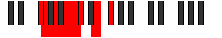

# Mode Stadian

## Links

- [Documentation](README.md)
- [Scales Index](Scales.md)
- [Modes Index](Modes.md)
- [Chords Index](Chords.md)

## Parent Scale

[Thonian](ScaleThonian.md)

## Number

[1259](https://ianring.com/musictheory/scales/1259)

## Transposition

1, 2, 2, 1, 1, 3, 2

## Chord Pattern

i⁰, IIb5, iii, V, vii

## Perfection

- 5 Perfect notes
- 2 Perfect notes

## Perfection Profile

true, false, true, true, true, false, true

## Permutations

| Tonic | Notes | Signature | Illustration | Audio |
|-------|-------|-----------|--------------|-------|
| [C](ModeCNaturalStadian.md) | C, **Db**, Eb, F, Gb, **Abb**, Bb, C | C |  | [midi](https://github.com/edipermadi/music/blob/main/docs/ModeCNaturalStadian.mid?raw=true) |
| [C#](ModeCSharpStadian.md) | C#, **D**, E, F#, G, **Ab**, B, C# | C |  | [midi](https://github.com/edipermadi/music/blob/main/docs/ModeCSharpStadian.mid?raw=true) |
| [Db](ModeDFlatStadian.md) | Db, **Ebb**, Fb, Gb, Abb, **Bbbb**, Cb, Db | C |  | [midi](https://github.com/edipermadi/music/blob/main/docs/ModeDFlatStadian.mid?raw=true) |
| [D](ModeDNaturalStadian.md) | D, **Eb**, F, G, Ab, **Bbb**, C, D | C |  | [midi](https://github.com/edipermadi/music/blob/main/docs/ModeDNaturalStadian.mid?raw=true) |
| [D#](ModeDSharpStadian.md) | D#, **E**, F#, G#, A, **Bb**, C#, D# | C |  | [midi](https://github.com/edipermadi/music/blob/main/docs/ModeDSharpStadian.mid?raw=true) |
| [Eb](ModeEFlatStadian.md) | Eb, **Fb**, Gb, Ab, Bbb, **Cbb**, Db, Eb | C |  | [midi](https://github.com/edipermadi/music/blob/main/docs/ModeEFlatStadian.mid?raw=true) |
| [E](ModeENaturalStadian.md) | E, **F**, G, A, Bb, **Cb**, D, E | C |  | [midi](https://github.com/edipermadi/music/blob/main/docs/ModeENaturalStadian.mid?raw=true) |
| [F](ModeFNaturalStadian.md) | F, **Gb**, Ab, Bb, Cb, **Dbb**, Eb, F | C |  | [midi](https://github.com/edipermadi/music/blob/main/docs/ModeFNaturalStadian.mid?raw=true) |
| [F#](ModeFSharpStadian.md) | F#, **G**, A, B, C, **Db**, E, F# | C |  | [midi](https://github.com/edipermadi/music/blob/main/docs/ModeFSharpStadian.mid?raw=true) |
| [Gb](ModeGFlatStadian.md) | Gb, **Abb**, Bbb, Cb, Dbb, **Ebbb**, Fb, Gb | C |  | [midi](https://github.com/edipermadi/music/blob/main/docs/ModeGFlatStadian.mid?raw=true) |
| [G](ModeGNaturalStadian.md) | G, **Ab**, Bb, C, Db, **Ebb**, F, G | C |  | [midi](https://github.com/edipermadi/music/blob/main/docs/ModeGNaturalStadian.mid?raw=true) |
| [G#](ModeGSharpStadian.md) | G#, **A**, B, C#, D, **Eb**, F#, G# | C |  | [midi](https://github.com/edipermadi/music/blob/main/docs/ModeGSharpStadian.mid?raw=true) |
| [Ab](ModeAFlatStadian.md) | Ab, **Bbb**, Cb, Db, Ebb, **Fbb**, Gb, Ab | C |  | [midi](https://github.com/edipermadi/music/blob/main/docs/ModeAFlatStadian.mid?raw=true) |
| [A](ModeANaturalStadian.md) | A, **Bb**, C, D, Eb, **Fb**, G, A | C |  | [midi](https://github.com/edipermadi/music/blob/main/docs/ModeANaturalStadian.mid?raw=true) |
| [A#](ModeASharpStadian.md) | A#, **B**, C#, D#, E, **F**, G#, A# | C |  | [midi](https://github.com/edipermadi/music/blob/main/docs/ModeASharpStadian.mid?raw=true) |
| [Bb](ModeBFlatStadian.md) | Bb, **Cb**, Db, Eb, Fb, **Gbb**, Ab, Bb | C |  | [midi](https://github.com/edipermadi/music/blob/main/docs/ModeBFlatStadian.mid?raw=true) |
| [B](ModeBNaturalStadian.md) | B, **C**, D, E, F, **Gb**, A, B | C |  | [midi](https://github.com/edipermadi/music/blob/main/docs/ModeBNaturalStadian.mid?raw=true) |
