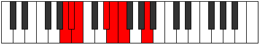

# Mode Stadimic

## Links

- [Documentation](index.md)
- [Scales Index](Scales.md)
- [Modes Index](Modes.md)
- [Chords Index](Chords.md)

## Parent Scale

[Thonimic](ScaleThonimic.md)

## Number

[455](https://ianring.com/musictheory/scales/455)

## Perfection

- 4 Perfect notes
- 2 Perfect notes

## Perfection Profile

[true true false true true false]

## Permutations

| Tonic | Notes | Signature | Illustration | Audio |
|-------|-------|-----------|--------------|-------|
| [C](ModeCNaturalStadimic.md) | C, Db, **Ebb**, F#, G, **Ab**, C | C |  | [midi](ModeCNaturalStadimic.mid) [ogg](ModeCNaturalStadimic.ogg) |
| [C#](ModeCSharpStadimic.md) | C#, D, **Eb**, F##, G#, **A**, C# | C |  | [midi](ModeCSharpStadimic.mid) [ogg](ModeCSharpStadimic.ogg) |
| [Db](ModeDFlatStadimic.md) | Db, Ebb, **Fbb**, G, Ab, **Bbb**, Db | C |  | [midi](ModeDFlatStadimic.mid) [ogg](ModeDFlatStadimic.ogg) |
| [D](ModeDNaturalStadimic.md) | D, Eb, **Fb**, G#, A, **Bb**, D | C |  | [midi](ModeDNaturalStadimic.mid) [ogg](ModeDNaturalStadimic.ogg) |
| [D#](ModeDSharpStadimic.md) | D#, E, **F**, G##, A#, **B**, D# | C |  | [midi](ModeDSharpStadimic.mid) [ogg](ModeDSharpStadimic.ogg) |
| [Eb](ModeEFlatStadimic.md) | Eb, Fb, **Gbb**, A, Bb, **Cb**, Eb | C |  | [midi](ModeEFlatStadimic.mid) [ogg](ModeEFlatStadimic.ogg) |
| [E](ModeENaturalStadimic.md) | E, F, **Gb**, A#, B, **C**, E | C |  | [midi](ModeENaturalStadimic.mid) [ogg](ModeENaturalStadimic.ogg) |
| [F](ModeFNaturalStadimic.md) | F, Gb, **Abb**, B, C, **Db**, F | C |  | [midi](ModeFNaturalStadimic.mid) [ogg](ModeFNaturalStadimic.ogg) |
| [F#](ModeFSharpStadimic.md) | F#, G, **Ab**, B#, C#, **D**, F# | C |  | [midi](ModeFSharpStadimic.mid) [ogg](ModeFSharpStadimic.ogg) |
| [Gb](ModeGFlatStadimic.md) | Gb, Abb, **Bbbb**, C, Db, **Ebb**, Gb | C |  | [midi](ModeGFlatStadimic.mid) [ogg](ModeGFlatStadimic.ogg) |
| [G](ModeGNaturalStadimic.md) | G, Ab, **Bbb**, C#, D, **Eb**, G | C |  | [midi](ModeGNaturalStadimic.mid) [ogg](ModeGNaturalStadimic.ogg) |
| [G#](ModeGSharpStadimic.md) | G#, A, **Bb**, C##, D#, **E**, G# | C |  | [midi](ModeGSharpStadimic.mid) [ogg](ModeGSharpStadimic.ogg) |
| [Ab](ModeAFlatStadimic.md) | Ab, Bbb, **Cbb**, D, Eb, **Fb**, Ab | C |  | [midi](ModeAFlatStadimic.mid) [ogg](ModeAFlatStadimic.ogg) |
| [A](ModeANaturalStadimic.md) | A, Bb, **Cb**, D#, E, **F**, A | C |  | [midi](ModeANaturalStadimic.mid) [ogg](ModeANaturalStadimic.ogg) |
| [A#](ModeASharpStadimic.md) | A#, B, **C**, D##, E#, **F#**, A# | C |  | [midi](ModeASharpStadimic.mid) [ogg](ModeASharpStadimic.ogg) |
| [Bb](ModeBFlatStadimic.md) | Bb, Cb, **Dbb**, E, F, **Gb**, Bb | C |  | [midi](ModeBFlatStadimic.mid) [ogg](ModeBFlatStadimic.ogg) |
| [B](ModeBNaturalStadimic.md) | B, C, **Db**, E#, F#, **G**, B | C |  | [midi](ModeBNaturalStadimic.mid) [ogg](ModeBNaturalStadimic.ogg) |
