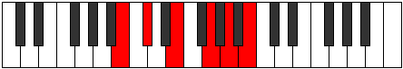

# Mode Staditonic

## Links

- [Documentation](index.md)
- [Scales Index](Scales.md)
- [Modes Index](Modes.md)
- [Chords Index](Chords.md)

## Parent Scale

[Kataritonic](ScaleKataritonic.md)

## Number

[1317](https://ianring.com/musictheory/scales/1317)

## Interval Pattern

2, 3, 3, 2, 2

## Chord Pattern

## Perfection

- 2 Perfect notes
- 3 Perfect notes

## Perfection Profile

[false false true false true]

## Permutations

| Tonic | Notes | Signature | Illustration | Audio |
|-------|-------|-----------|--------------|-------|
| [C](ModeCNaturalStaditonic.md) | **C**, **D**, F, **G#**, A#, **C** | C |  | [midi](https://github.com/edipermadi/music/blob/main/docs/ModeCNaturalStaditonic.mid?raw=true) |
| [C#](ModeCSharpStaditonic.md) | **C#**, **D#**, F#, **A**, B, **C#** | C |  | [midi](https://github.com/edipermadi/music/blob/main/docs/ModeCSharpStaditonic.mid?raw=true) |
| [Db](ModeDFlatStaditonic.md) | **Db**, **Eb**, Gb, **A**, B, **Db** | C |  | [midi](https://github.com/edipermadi/music/blob/main/docs/ModeDFlatStaditonic.mid?raw=true) |
| [D](ModeDNaturalStaditonic.md) | **D**, **E**, G, **A#**, C, **D** | C |  | [midi](https://github.com/edipermadi/music/blob/main/docs/ModeDNaturalStaditonic.mid?raw=true) |
| [D#](ModeDSharpStaditonic.md) | **D#**, **F**, G#, **B**, C#, **D#** | C |  | [midi](https://github.com/edipermadi/music/blob/main/docs/ModeDSharpStaditonic.mid?raw=true) |
| [Eb](ModeEFlatStaditonic.md) | **Eb**, **F**, Ab, **B**, Db, **Eb** | C |  | [midi](https://github.com/edipermadi/music/blob/main/docs/ModeEFlatStaditonic.mid?raw=true) |
| [E](ModeENaturalStaditonic.md) | **E**, **F#**, A, **C**, D, **E** | C |  | [midi](https://github.com/edipermadi/music/blob/main/docs/ModeENaturalStaditonic.mid?raw=true) |
| [F](ModeFNaturalStaditonic.md) | **F**, **G**, A#, **C#**, D#, **F** | C |  | [midi](https://github.com/edipermadi/music/blob/main/docs/ModeFNaturalStaditonic.mid?raw=true) |
| [F#](ModeFSharpStaditonic.md) | **F#**, **G#**, B, **D**, E, **F#** | C |  | [midi](https://github.com/edipermadi/music/blob/main/docs/ModeFSharpStaditonic.mid?raw=true) |
| [Gb](ModeGFlatStaditonic.md) | **Gb**, **Ab**, B, **D**, E, **Gb** | C |  | [midi](https://github.com/edipermadi/music/blob/main/docs/ModeGFlatStaditonic.mid?raw=true) |
| [G](ModeGNaturalStaditonic.md) | **G**, **A**, C, **D#**, F, **G** | C |  | [midi](https://github.com/edipermadi/music/blob/main/docs/ModeGNaturalStaditonic.mid?raw=true) |
| [G#](ModeGSharpStaditonic.md) | **G#**, **A#**, C#, **E**, F#, **G#** | C |  | [midi](https://github.com/edipermadi/music/blob/main/docs/ModeGSharpStaditonic.mid?raw=true) |
| [Ab](ModeAFlatStaditonic.md) | **Ab**, **Bb**, Db, **E**, Gb, **Ab** | C |  | [midi](https://github.com/edipermadi/music/blob/main/docs/ModeAFlatStaditonic.mid?raw=true) |
| [A](ModeANaturalStaditonic.md) | **A**, **B**, D, **F**, G, **A** | C |  | [midi](https://github.com/edipermadi/music/blob/main/docs/ModeANaturalStaditonic.mid?raw=true) |
| [A#](ModeASharpStaditonic.md) | **A#**, **C**, D#, **F#**, G#, **A#** | C |  | [midi](https://github.com/edipermadi/music/blob/main/docs/ModeASharpStaditonic.mid?raw=true) |
| [Bb](ModeBFlatStaditonic.md) | **Bb**, **C**, Eb, **Gb**, Ab, **Bb** | C |  | [midi](https://github.com/edipermadi/music/blob/main/docs/ModeBFlatStaditonic.mid?raw=true) |
| [B](ModeBNaturalStaditonic.md) | **B**, **C#**, E, **G**, A, **B** | C |  | [midi](https://github.com/edipermadi/music/blob/main/docs/ModeBNaturalStaditonic.mid?raw=true) |
