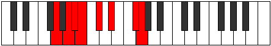

# Mode Stagian

## Links

- [Documentation](README.md)
- [Scales Index](Scales.md)
- [Modes Index](Modes.md)
- [Chords Index](Chords.md)

## Parent Scale

[Ionanian](ScaleIonanian.md)

## Number

[2397](https://ianring.com/musictheory/scales/2397)

## Interval Pattern

2, 1, 1, 2, 2, 3, 1

## Chord Pattern

i⁰, ii⁰b3, IV⁺, VI

## Perfection

- 3 Perfect notes
- 4 Perfect notes

## Perfection Profile

[false false false true false true true]

## Permutations

| Tonic | Notes | Signature | Illustration | Audio |
|-------|-------|-----------|--------------|-------|
| [C](ModeCNaturalStagian.md) | **C**, **D**, **Eb**, Fb, **Gb**, Ab, B, **C** | C |  | [midi](https://github.com/edipermadi/music/blob/main/docs/ModeCNaturalStagian.mid?raw=true) |
| [C#](ModeCSharpStagian.md) | **C#**, **D#**, **E**, F, **G**, A, B#, **C#** | C |  | [midi](https://github.com/edipermadi/music/blob/main/docs/ModeCSharpStagian.mid?raw=true) |
| [Db](ModeDFlatStagian.md) | **Db**, **Eb**, **Fb**, Gbb, **Abb**, Bbb, C, **Db** | C |  | [midi](https://github.com/edipermadi/music/blob/main/docs/ModeDFlatStagian.mid?raw=true) |
| [D](ModeDNaturalStagian.md) | **D**, **E**, **F**, Gb, **Ab**, Bb, C#, **D** | C |  | [midi](https://github.com/edipermadi/music/blob/main/docs/ModeDNaturalStagian.mid?raw=true) |
| [D#](ModeDSharpStagian.md) | **D#**, **E#**, **F#**, G, **A**, B, C##, **D#** | C |  | [midi](https://github.com/edipermadi/music/blob/main/docs/ModeDSharpStagian.mid?raw=true) |
| [Eb](ModeEFlatStagian.md) | **Eb**, **F**, **Gb**, Abb, **Bbb**, Cb, D, **Eb** | C |  | [midi](https://github.com/edipermadi/music/blob/main/docs/ModeEFlatStagian.mid?raw=true) |
| [E](ModeENaturalStagian.md) | **E**, **F#**, **G**, Ab, **Bb**, C, D#, **E** | C |  | [midi](https://github.com/edipermadi/music/blob/main/docs/ModeENaturalStagian.mid?raw=true) |
| [F](ModeFNaturalStagian.md) | **F**, **G**, **Ab**, Bbb, **Cb**, Db, E, **F** | C |  | [midi](https://github.com/edipermadi/music/blob/main/docs/ModeFNaturalStagian.mid?raw=true) |
| [F#](ModeFSharpStagian.md) | **F#**, **G#**, **A**, Bb, **C**, D, E#, **F#** | C |  | [midi](https://github.com/edipermadi/music/blob/main/docs/ModeFSharpStagian.mid?raw=true) |
| [Gb](ModeGFlatStagian.md) | **Gb**, **Ab**, **Bbb**, Cbb, **Dbb**, Ebb, F, **Gb** | C |  | [midi](https://github.com/edipermadi/music/blob/main/docs/ModeGFlatStagian.mid?raw=true) |
| [G](ModeGNaturalStagian.md) | **G**, **A**, **Bb**, Cb, **Db**, Eb, F#, **G** | C |  | [midi](https://github.com/edipermadi/music/blob/main/docs/ModeGNaturalStagian.mid?raw=true) |
| [G#](ModeGSharpStagian.md) | **G#**, **A#**, **B**, C, **D**, E, F##, **G#** | C |  | [midi](https://github.com/edipermadi/music/blob/main/docs/ModeGSharpStagian.mid?raw=true) |
| [Ab](ModeAFlatStagian.md) | **Ab**, **Bb**, **Cb**, Dbb, **Ebb**, Fb, G, **Ab** | C |  | [midi](https://github.com/edipermadi/music/blob/main/docs/ModeAFlatStagian.mid?raw=true) |
| [A](ModeANaturalStagian.md) | **A**, **B**, **C**, Db, **Eb**, F, G#, **A** | C |  | [midi](https://github.com/edipermadi/music/blob/main/docs/ModeANaturalStagian.mid?raw=true) |
| [A#](ModeASharpStagian.md) | **A#**, **B#**, **C#**, D, **E**, F#, G##, **A#** | C |  | [midi](https://github.com/edipermadi/music/blob/main/docs/ModeASharpStagian.mid?raw=true) |
| [Bb](ModeBFlatStagian.md) | **Bb**, **C**, **Db**, Ebb, **Fb**, Gb, A, **Bb** | C |  | [midi](https://github.com/edipermadi/music/blob/main/docs/ModeBFlatStagian.mid?raw=true) |
| [B](ModeBNaturalStagian.md) | **B**, **C#**, **D**, Eb, **F**, G, A#, **B** | C |  | [midi](https://github.com/edipermadi/music/blob/main/docs/ModeBNaturalStagian.mid?raw=true) |
