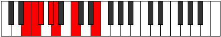

# Mode Stagimic

## Links

- [Documentation](index.md)
- [Scales Index](Scales.md)
- [Modes Index](Modes.md)
- [Chords Index](Chords.md)

## Parent Scale

[Aerothimic](ScaleAerothimic.md)

## Number

[311](https://ianring.com/musictheory/scales/311)

## Perfection

- 2 Perfect notes
- 4 Perfect notes

## Perfection Profile

[false true false false true false]

## Permutations

| Tonic | Notes | Signature | Illustration | Audio |
|-------|-------|-----------|--------------|-------|
| [C](ModeCNaturalStagimic.md) | **C**, Db, **Ebb**, **Fb**, Gbb, **Ab**, **C** | C |  | [midi](ModeCNaturalStagimic.mid) [ogg](ModeCNaturalStagimic.ogg) |
| [C#](ModeCSharpStagimic.md) | **C#**, D, **Eb**, **F**, Gb, **A**, **C#** | C |  | [midi](ModeCSharpStagimic.mid) [ogg](ModeCSharpStagimic.ogg) |
| [Db](ModeDFlatStagimic.md) | **Db**, Ebb, **Fbb**, **Gbb**, Abbb, **Bbb**, **Db** | C |  | [midi](ModeDFlatStagimic.mid) [ogg](ModeDFlatStagimic.ogg) |
| [D](ModeDNaturalStagimic.md) | **D**, Eb, **Fb**, **Gb**, Abb, **Bb**, **D** | C |  | [midi](ModeDNaturalStagimic.mid) [ogg](ModeDNaturalStagimic.ogg) |
| [D#](ModeDSharpStagimic.md) | **D#**, E, **F**, **G**, Ab, **B**, **D#** | C |  | [midi](ModeDSharpStagimic.mid) [ogg](ModeDSharpStagimic.ogg) |
| [Eb](ModeEFlatStagimic.md) | **Eb**, Fb, **Gbb**, **Abb**, Bbbb, **Cb**, **Eb** | C |  | [midi](ModeEFlatStagimic.mid) [ogg](ModeEFlatStagimic.ogg) |
| [E](ModeENaturalStagimic.md) | **E**, F, **Gb**, **Ab**, Bbb, **C**, **E** | C |  | [midi](ModeENaturalStagimic.mid) [ogg](ModeENaturalStagimic.ogg) |
| [F](ModeFNaturalStagimic.md) | **F**, Gb, **Abb**, **Bbb**, Cbb, **Db**, **F** | C |  | [midi](ModeFNaturalStagimic.mid) [ogg](ModeFNaturalStagimic.ogg) |
| [F#](ModeFSharpStagimic.md) | **F#**, G, **Ab**, **Bb**, Cb, **D**, **F#** | C |  | [midi](ModeFSharpStagimic.mid) [ogg](ModeFSharpStagimic.ogg) |
| [Gb](ModeGFlatStagimic.md) | **Gb**, Abb, **Bbbb**, **Cbb**, Dbbb, **Ebb**, **Gb** | C |  | [midi](ModeGFlatStagimic.mid) [ogg](ModeGFlatStagimic.ogg) |
| [G](ModeGNaturalStagimic.md) | **G**, Ab, **Bbb**, **Cb**, Dbb, **Eb**, **G** | C |  | [midi](ModeGNaturalStagimic.mid) [ogg](ModeGNaturalStagimic.ogg) |
| [G#](ModeGSharpStagimic.md) | **G#**, A, **Bb**, **C**, Db, **E**, **G#** | C |  | [midi](ModeGSharpStagimic.mid) [ogg](ModeGSharpStagimic.ogg) |
| [Ab](ModeAFlatStagimic.md) | **Ab**, Bbb, **Cbb**, **Dbb**, Ebbb, **Fb**, **Ab** | C |  | [midi](ModeAFlatStagimic.mid) [ogg](ModeAFlatStagimic.ogg) |
| [A](ModeANaturalStagimic.md) | **A**, Bb, **Cb**, **Db**, Ebb, **F**, **A** | C |  | [midi](ModeANaturalStagimic.mid) [ogg](ModeANaturalStagimic.ogg) |
| [A#](ModeASharpStagimic.md) | **A#**, B, **C**, **D**, Eb, **F#**, **A#** | C |  | [midi](ModeASharpStagimic.mid) [ogg](ModeASharpStagimic.ogg) |
| [Bb](ModeBFlatStagimic.md) | **Bb**, Cb, **Dbb**, **Ebb**, Fbb, **Gb**, **Bb** | C |  | [midi](ModeBFlatStagimic.mid) [ogg](ModeBFlatStagimic.ogg) |
| [B](ModeBNaturalStagimic.md) | **B**, C, **Db**, **Eb**, Fb, **G**, **B** | C |  | [midi](ModeBNaturalStagimic.mid) [ogg](ModeBNaturalStagimic.ogg) |
