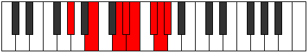

# Mode Stalian

## Links

- [Documentation](index.md)
- [Scales Index](Scales.md)
- [Modes Index](Modes.md)
- [Chords Index](Chords.md)

## Parent Scale

[Stalian](ScaleStalian.md)

## Number

[3529](https://ianring.com/musictheory/scales/3529)

## Perfection

- 4 Perfect notes
- 3 Perfect notes

## Perfection Profile

[true true false false true false true]

## Permutations

| Tonic | Notes | Signature | Illustration | Audio |
|-------|-------|-----------|--------------|-------|
| [C](ModeCNaturalStalian.md) | C, D#, **E##**, **F##**, G#, **A#**, B, C | C |  | [midi](ModeCNaturalStalian.mid) [ogg](ModeCNaturalStalian.ogg) |
| [C#](ModeCSharpStalian.md) | C#, D##, **E###**, **F###**, G##, **A##**, B#, C# | C |  | [midi](ModeCSharpStalian.mid) [ogg](ModeCSharpStalian.ogg) |
| [Db](ModeDFlatStalian.md) | Db, E, **F##**, **G#**, A, **B**, C, Db | C |  | [midi](ModeDFlatStalian.mid) [ogg](ModeDFlatStalian.ogg) |
| [D](ModeDNaturalStalian.md) | D, E#, **F###**, **G##**, A#, **B#**, C#, D | C |  | [midi](ModeDNaturalStalian.mid) [ogg](ModeDNaturalStalian.ogg) |
| [D#](ModeDSharpStalian.md) | D#, E##, **Cbbb**, **Cbb**, Dbbb, **Ebbb**, Fbbb, D# | C |  | [midi](ModeDSharpStalian.mid) [ogg](ModeDSharpStalian.ogg) |
| [Eb](ModeEFlatStalian.md) | Eb, F#, **G##**, **A#**, B, **C#**, D, Eb | C |  | [midi](ModeEFlatStalian.mid) [ogg](ModeEFlatStalian.ogg) |
| [E](ModeENaturalStalian.md) | E, F##, **G###**, **A##**, B#, **C##**, D#, E | C |  | [midi](ModeENaturalStalian.mid) [ogg](ModeENaturalStalian.ogg) |
| [F](ModeFNaturalStalian.md) | F, G#, **A##**, **B#**, C#, **D#**, E, F | C |  | [midi](ModeFNaturalStalian.mid) [ogg](ModeFNaturalStalian.ogg) |
| [F#](ModeFSharpStalian.md) | F#, G##, **A###**, **B##**, C##, **D##**, E#, F# | C |  | [midi](ModeFSharpStalian.mid) [ogg](ModeFSharpStalian.ogg) |
| [Gb](ModeGFlatStalian.md) | Gb, A, **B#**, **C#**, D, **E**, F, Gb | C |  | [midi](ModeGFlatStalian.mid) [ogg](ModeGFlatStalian.ogg) |
| [G](ModeGNaturalStalian.md) | G, A#, **B##**, **C##**, D#, **E#**, F#, G | C |  | [midi](ModeGNaturalStalian.mid) [ogg](ModeGNaturalStalian.ogg) |
| [G#](ModeGSharpStalian.md) | G#, A##, **B###**, **C###**, D##, **E##**, F##, G# | C |  | [midi](ModeGSharpStalian.mid) [ogg](ModeGSharpStalian.ogg) |
| [Ab](ModeAFlatStalian.md) | Ab, B, **C##**, **D#**, E, **F#**, G, Ab | C |  | [midi](ModeAFlatStalian.mid) [ogg](ModeAFlatStalian.ogg) |
| [A](ModeANaturalStalian.md) | A, B#, **C###**, **D##**, E#, **F##**, G#, A | C |  | [midi](ModeANaturalStalian.mid) [ogg](ModeANaturalStalian.ogg) |
| [A#](ModeASharpStalian.md) | A#, B##, **D##**, **E#**, F#, **G#**, A, A# | C |  | [midi](ModeASharpStalian.mid) [ogg](ModeASharpStalian.ogg) |
| [Bb](ModeBFlatStalian.md) | Bb, C#, **D##**, **E#**, F#, **G#**, A, Bb | C |  | [midi](ModeBFlatStalian.mid) [ogg](ModeBFlatStalian.ogg) |
| [B](ModeBNaturalStalian.md) | B, C##, **D###**, **E##**, F##, **G##**, A#, B | C |  | [midi](ModeBNaturalStalian.mid) [ogg](ModeBNaturalStalian.ogg) |
