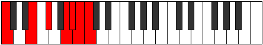

# Mode Stalimic

## Links

- [Documentation](index.md)
- [Scales Index](Scales.md)
- [Modes Index](Modes.md)
- [Chords Index](Chords.md)

## Parent Scale

[Stalimic](ScaleStalimic.md)

## Number

[3665](https://ianring.com/musictheory/scales/3665)

## Perfection

- 3 Perfect notes
- 3 Perfect notes

## Perfection Profile

[false true false true false true]

## Permutations

| Tonic | Notes | Signature | Illustration | Audio |
|-------|-------|-----------|--------------|-------|
| [C](ModeCNaturalStalimic.md) | **C**, D##, **E##**, Cbbb, **Cbb**, Dbbb, **C** | C |  | [midi](ModeCNaturalStalimic.mid) [ogg](ModeCNaturalStalimic.ogg) |
| [C#](ModeCSharpStalimic.md) | **C#**, D###, **E###**, Cbb, **Dbbb**, Dbb, **C#** | C |  | [midi](ModeCSharpStalimic.mid) [ogg](ModeCSharpStalimic.ogg) |
| [Db](ModeDFlatStalimic.md) | **Db**, E#, **F##**, G###, **A##**, B#, **Db** | C |  | [midi](ModeDFlatStalimic.mid) [ogg](ModeDFlatStalimic.ogg) |
| [D](ModeDNaturalStalimic.md) | **D**, E##, **F###**, Cb, **Dbb**, Ebbb, **D** | C |  | [midi](ModeDNaturalStalimic.mid) [ogg](ModeDNaturalStalimic.ogg) |
| [D#](ModeDSharpStalimic.md) | **D#**, E###, **Cbbb**, Dbb, **Ebbb**, Fbbb, **D#** | C |  | [midi](ModeDSharpStalimic.mid) [ogg](ModeDSharpStalimic.ogg) |
| [Eb](ModeEFlatStalimic.md) | **Eb**, F##, **G##**, A###, **B##**, C##, **Eb** | C |  | [midi](ModeEFlatStalimic.mid) [ogg](ModeEFlatStalimic.ogg) |
| [E](ModeENaturalStalimic.md) | **E**, F###, **G###**, Db, **Ebb**, Fbb, **E** | C |  | [midi](ModeENaturalStalimic.mid) [ogg](ModeENaturalStalimic.ogg) |
| [F](ModeFNaturalStalimic.md) | **F**, G##, **A##**, B###, **C###**, D##, **F** | C |  | [midi](ModeFNaturalStalimic.mid) [ogg](ModeFNaturalStalimic.ogg) |
| [F#](ModeFSharpStalimic.md) | **F#**, G###, **A###**, C###, **D##**, E#, **F#** | C |  | [midi](ModeFSharpStalimic.mid) [ogg](ModeFSharpStalimic.ogg) |
| [Gb](ModeGFlatStalimic.md) | **Gb**, A#, **B#**, C###, **D##**, E#, **Gb** | C |  | [midi](ModeGFlatStalimic.mid) [ogg](ModeGFlatStalimic.ogg) |
| [G](ModeGNaturalStalimic.md) | **G**, A##, **B##**, D##, **E#**, F#, **G** | C |  | [midi](ModeGNaturalStalimic.mid) [ogg](ModeGNaturalStalimic.ogg) |
| [G#](ModeGSharpStalimic.md) | **G#**, A###, **B###**, D###, **E##**, F##, **G#** | C |  | [midi](ModeGSharpStalimic.mid) [ogg](ModeGSharpStalimic.ogg) |
| [Ab](ModeAFlatStalimic.md) | **Ab**, B#, **C##**, D###, **E##**, F##, **Ab** | C |  | [midi](ModeAFlatStalimic.mid) [ogg](ModeAFlatStalimic.ogg) |
| [A](ModeANaturalStalimic.md) | **A**, B##, **C###**, E##, **F##**, G#, **A** | C |  | [midi](ModeANaturalStalimic.mid) [ogg](ModeANaturalStalimic.ogg) |
| [A#](ModeASharpStalimic.md) | **A#**, B###, **D##**, E###, **F###**, G##, **A#** | C |  | [midi](ModeASharpStalimic.mid) [ogg](ModeASharpStalimic.ogg) |
| [Bb](ModeBFlatStalimic.md) | **Bb**, C##, **D##**, E###, **F###**, G##, **Bb** | C |  | [midi](ModeBFlatStalimic.mid) [ogg](ModeBFlatStalimic.ogg) |
| [B](ModeBNaturalStalimic.md) | **B**, C###, **D###**, F###, **G##**, A#, **B** | C |  | [midi](ModeBNaturalStalimic.mid) [ogg](ModeBNaturalStalimic.ogg) |
