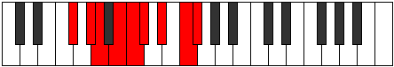
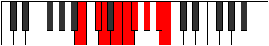

# Mode Stalyllic

## Links

- [Documentation](index.md)
- [Scales Index](Scales.md)
- [Modes Index](Modes.md)
- [Chords Index](Chords.md)

## Parent Scale

[Stogyllic](ScaleStogyllic.md)

## Number

[2797](https://ianring.com/musictheory/scales/2797)

## Perfection

- 5 Perfect notes
- 3 Perfect notes

## Perfection Profile

[true true false true false true false true]

## Permutations

| Tonic | Notes | Signature | Illustration | Audio |
|-------|-------|-----------|--------------|-------|
| [C](ModeCNaturalStalyllic.md) | C, D, **D#**, F, **F#**, G, **A**, B, C | C |  | [midi](ModeCNaturalStalyllic.mid) [ogg](ModeCNaturalStalyllic.ogg) |
| [C#](ModeCSharpStalyllic.md) | C#, D#, **E**, F#, **G**, G#, **A#**, C, C# | C |  | [midi](ModeCSharpStalyllic.mid) [ogg](ModeCSharpStalyllic.ogg) |
| [Db](ModeDFlatStalyllic.md) | Db, Eb, **E**, Gb, **G**, Ab, **Bb**, C, Db | C |  | [midi](ModeDFlatStalyllic.mid) [ogg](ModeDFlatStalyllic.ogg) |
| [D](ModeDNaturalStalyllic.md) | D, E, **F**, G, **G#**, A, **B**, C#, D | C |  | [midi](ModeDNaturalStalyllic.mid) [ogg](ModeDNaturalStalyllic.ogg) |
| [D#](ModeDSharpStalyllic.md) | D#, F, **F#**, G#, **A**, A#, **C**, D, D# | C |  | [midi](ModeDSharpStalyllic.mid) [ogg](ModeDSharpStalyllic.ogg) |
| [Eb](ModeEFlatStalyllic.md) | Eb, F, **Gb**, Ab, **A**, Bb, **C**, D, Eb | C |  | [midi](ModeEFlatStalyllic.mid) [ogg](ModeEFlatStalyllic.ogg) |
| [E](ModeENaturalStalyllic.md) | E, F#, **G**, A, **A#**, B, **C#**, D#, E | C |  | [midi](ModeENaturalStalyllic.mid) [ogg](ModeENaturalStalyllic.ogg) |
| [F](ModeFNaturalStalyllic.md) | F, G, **G#**, A#, **B**, C, **D**, E, F | C |  | [midi](ModeFNaturalStalyllic.mid) [ogg](ModeFNaturalStalyllic.ogg) |
| [F#](ModeFSharpStalyllic.md) | F#, G#, **A**, B, **C**, C#, **D#**, F, F# | C |  | [midi](ModeFSharpStalyllic.mid) [ogg](ModeFSharpStalyllic.ogg) |
| [Gb](ModeGFlatStalyllic.md) | Gb, Ab, **A**, B, **C**, Db, **Eb**, F, Gb | C |  | [midi](ModeGFlatStalyllic.mid) [ogg](ModeGFlatStalyllic.ogg) |
| [G](ModeGNaturalStalyllic.md) | G, A, **A#**, C, **C#**, D, **E**, F#, G | C |  | [midi](ModeGNaturalStalyllic.mid) [ogg](ModeGNaturalStalyllic.ogg) |
| [G#](ModeGSharpStalyllic.md) | G#, A#, **B**, C#, **D**, D#, **F**, G, G# | C |  | [midi](ModeGSharpStalyllic.mid) [ogg](ModeGSharpStalyllic.ogg) |
| [Ab](ModeAFlatStalyllic.md) | Ab, Bb, **B**, Db, **D**, Eb, **F**, G, Ab | C |  | [midi](ModeAFlatStalyllic.mid) [ogg](ModeAFlatStalyllic.ogg) |
| [A](ModeANaturalStalyllic.md) | A, B, **C**, D, **D#**, E, **F#**, G#, A | C |  | [midi](ModeANaturalStalyllic.mid) [ogg](ModeANaturalStalyllic.ogg) |
| [A#](ModeASharpStalyllic.md) | A#, C, **C#**, D#, **E**, F, **G**, A, A# | C |  | [midi](ModeASharpStalyllic.mid) [ogg](ModeASharpStalyllic.ogg) |
| [Bb](ModeBFlatStalyllic.md) | Bb, C, **Db**, Eb, **E**, F, **G**, A, Bb | C |  | [midi](ModeBFlatStalyllic.mid) [ogg](ModeBFlatStalyllic.ogg) |
| [B](ModeBNaturalStalyllic.md) | B, C#, **D**, E, **F**, F#, **G#**, A#, B | C |  | [midi](ModeBNaturalStalyllic.mid) [ogg](ModeBNaturalStalyllic.ogg) |
