# Mode Stanian

## Links

- [Documentation](README.md)
- [Scales Index](Scales.md)
- [Modes Index](Modes.md)
- [Chords Index](Chords.md)

## Parent Scale

[Stanian](ScaleStanian.md)

## Number

[1521](https://ianring.com/musictheory/scales/1521)

## Transposition

4, 1, 1, 1, 1, 2, 2

## Chord Pattern

iv⁰b3, iv⁰b3

## Perfection

- 3 Perfect notes
- 4 Perfect notes

## Perfection Profile

[true false true false false false true]

## Permutations

| Tonic | Notes | Signature | Illustration | Audio |
|-------|-------|-----------|--------------|-------|
| [C](ModeCNaturalStanian.md) | C, **D##**, E#, **F#**, **G**, **Ab**, Bb, C | C | 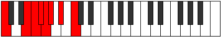 | [midi](https://github.com/edipermadi/music/blob/main/docs/ModeCNaturalStanian.mid?raw=true) |
| [C#](ModeCSharpStanian.md) | C#, **D###**, E##, **F##**, **G#**, **A**, B, C# | C | 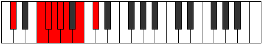 | [midi](https://github.com/edipermadi/music/blob/main/docs/ModeCSharpStanian.mid?raw=true) |
| [Db](ModeDFlatStanian.md) | Db, **E#**, F#, **G**, **Ab**, **Bbb**, Cb, Db | C |  | [midi](https://github.com/edipermadi/music/blob/main/docs/ModeDFlatStanian.mid?raw=true) |
| [D](ModeDNaturalStanian.md) | D, **E##**, F##, **G#**, **A**, **Bb**, C, D | C | 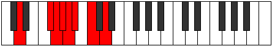 | [midi](https://github.com/edipermadi/music/blob/main/docs/ModeDNaturalStanian.mid?raw=true) |
| [D#](ModeDSharpStanian.md) | D#, **E###**, F###, **G##**, **A#**, **B**, C#, D# | C |  | [midi](https://github.com/edipermadi/music/blob/main/docs/ModeDSharpStanian.mid?raw=true) |
| [Eb](ModeEFlatStanian.md) | Eb, **F##**, G#, **A**, **Bb**, **Cb**, Db, Eb | C |  | [midi](https://github.com/edipermadi/music/blob/main/docs/ModeEFlatStanian.mid?raw=true) |
| [E](ModeENaturalStanian.md) | E, **F###**, G##, **A#**, **B**, **C**, D, E | C | 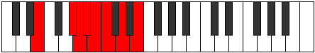 | [midi](https://github.com/edipermadi/music/blob/main/docs/ModeENaturalStanian.mid?raw=true) |
| [F](ModeFNaturalStanian.md) | F, **G##**, A#, **B**, **C**, **Db**, Eb, F | C | 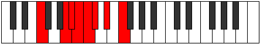 | [midi](https://github.com/edipermadi/music/blob/main/docs/ModeFNaturalStanian.mid?raw=true) |
| [F#](ModeFSharpStanian.md) | F#, **G###**, A##, **B#**, **C#**, **D**, E, F# | C | 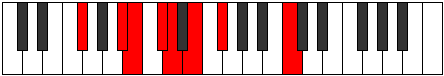 | [midi](https://github.com/edipermadi/music/blob/main/docs/ModeFSharpStanian.mid?raw=true) |
| [Gb](ModeGFlatStanian.md) | Gb, **A#**, B, **C**, **Db**, **Ebb**, Fb, Gb | C | 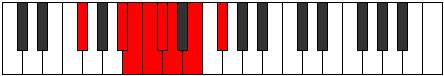 | [midi](https://github.com/edipermadi/music/blob/main/docs/ModeGFlatStanian.mid?raw=true) |
| [G](ModeGNaturalStanian.md) | G, **A##**, B#, **C#**, **D**, **Eb**, F, G | C | 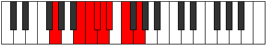 | [midi](https://github.com/edipermadi/music/blob/main/docs/ModeGNaturalStanian.mid?raw=true) |
| [G#](ModeGSharpStanian.md) | G#, **A###**, B##, **C##**, **D#**, **E**, F#, G# | C | 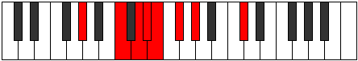 | [midi](https://github.com/edipermadi/music/blob/main/docs/ModeGSharpStanian.mid?raw=true) |
| [Ab](ModeAFlatStanian.md) | Ab, **B#**, C#, **D**, **Eb**, **Fb**, Gb, Ab | C | 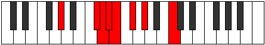 | [midi](https://github.com/edipermadi/music/blob/main/docs/ModeAFlatStanian.mid?raw=true) |
| [A](ModeANaturalStanian.md) | A, **B##**, C##, **D#**, **E**, **F**, G, A | C | 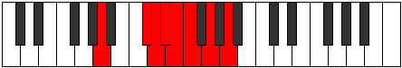 | [midi](https://github.com/edipermadi/music/blob/main/docs/ModeANaturalStanian.mid?raw=true) |
| [A#](ModeASharpStanian.md) | A#, **B###**, C###, **D##**, **E#**, **F#**, G#, A# | C | 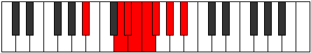 | [midi](https://github.com/edipermadi/music/blob/main/docs/ModeASharpStanian.mid?raw=true) |
| [Bb](ModeBFlatStanian.md) | Bb, **C##**, D#, **E**, **F**, **Gb**, Ab, Bb | C |  | [midi](https://github.com/edipermadi/music/blob/main/docs/ModeBFlatStanian.mid?raw=true) |
| [B](ModeBNaturalStanian.md) | B, **C###**, D##, **E#**, **F#**, **G**, A, B | C |  | [midi](https://github.com/edipermadi/music/blob/main/docs/ModeBNaturalStanian.mid?raw=true) |
