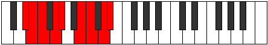

# Mode Stanyllic

## Links

- [Documentation](index.md)
- [Scales Index](Scales.md)
- [Modes Index](Modes.md)
- [Chords Index](Chords.md)

## Parent Scale

[Doptyllic](ScaleDoptyllic.md)

## Number

[2871](https://ianring.com/musictheory/scales/2871)

## Perfection

- 5 Perfect notes
- 3 Perfect notes

## Perfection Profile

[false true true true true false true false]

## Permutations

| Tonic | Notes | Signature | Illustration | Audio |
|-------|-------|-----------|--------------|-------|
| [C](ModeCNaturalStanyllic.md) | **C**, C#, D, E, F, **G#**, A, **B**, **C** | C |  | [midi](https://github.com/edipermadi/music/blob/main/docs/ModeCNaturalStanyllic.mid?raw=true) |
| [C#](ModeCSharpStanyllic.md) | **C#**, D, D#, F, F#, **A**, A#, **C**, **C#** | C |  | [midi](https://github.com/edipermadi/music/blob/main/docs/ModeCSharpStanyllic.mid?raw=true) |
| [Db](ModeDFlatStanyllic.md) | **Db**, D, Eb, F, Gb, **A**, Bb, **C**, **Db** | C |  | [midi](https://github.com/edipermadi/music/blob/main/docs/ModeDFlatStanyllic.mid?raw=true) |
| [D](ModeDNaturalStanyllic.md) | **D**, D#, E, F#, G, **A#**, B, **C#**, **D** | C |  | [midi](https://github.com/edipermadi/music/blob/main/docs/ModeDNaturalStanyllic.mid?raw=true) |
| [D#](ModeDSharpStanyllic.md) | **D#**, E, F, G, G#, **B**, C, **D**, **D#** | C |  | [midi](https://github.com/edipermadi/music/blob/main/docs/ModeDSharpStanyllic.mid?raw=true) |
| [Eb](ModeEFlatStanyllic.md) | **Eb**, E, F, G, Ab, **B**, C, **D**, **Eb** | C |  | [midi](https://github.com/edipermadi/music/blob/main/docs/ModeEFlatStanyllic.mid?raw=true) |
| [E](ModeENaturalStanyllic.md) | **E**, F, F#, G#, A, **C**, C#, **D#**, **E** | C |  | [midi](https://github.com/edipermadi/music/blob/main/docs/ModeENaturalStanyllic.mid?raw=true) |
| [F](ModeFNaturalStanyllic.md) | **F**, F#, G, A, A#, **C#**, D, **E**, **F** | C |  | [midi](https://github.com/edipermadi/music/blob/main/docs/ModeFNaturalStanyllic.mid?raw=true) |
| [F#](ModeFSharpStanyllic.md) | **F#**, G, G#, A#, B, **D**, D#, **F**, **F#** | C |  | [midi](https://github.com/edipermadi/music/blob/main/docs/ModeFSharpStanyllic.mid?raw=true) |
| [Gb](ModeGFlatStanyllic.md) | **Gb**, G, Ab, Bb, B, **D**, Eb, **F**, **Gb** | C |  | [midi](https://github.com/edipermadi/music/blob/main/docs/ModeGFlatStanyllic.mid?raw=true) |
| [G](ModeGNaturalStanyllic.md) | **G**, G#, A, B, C, **D#**, E, **F#**, **G** | C |  | [midi](https://github.com/edipermadi/music/blob/main/docs/ModeGNaturalStanyllic.mid?raw=true) |
| [G#](ModeGSharpStanyllic.md) | **G#**, A, A#, C, C#, **E**, F, **G**, **G#** | C |  | [midi](https://github.com/edipermadi/music/blob/main/docs/ModeGSharpStanyllic.mid?raw=true) |
| [Ab](ModeAFlatStanyllic.md) | **Ab**, A, Bb, C, Db, **E**, F, **G**, **Ab** | C |  | [midi](https://github.com/edipermadi/music/blob/main/docs/ModeAFlatStanyllic.mid?raw=true) |
| [A](ModeANaturalStanyllic.md) | **A**, A#, B, C#, D, **F**, F#, **G#**, **A** | C |  | [midi](https://github.com/edipermadi/music/blob/main/docs/ModeANaturalStanyllic.mid?raw=true) |
| [A#](ModeASharpStanyllic.md) | **A#**, B, C, D, D#, **F#**, G, **A**, **A#** | C |  | [midi](https://github.com/edipermadi/music/blob/main/docs/ModeASharpStanyllic.mid?raw=true) |
| [Bb](ModeBFlatStanyllic.md) | **Bb**, B, C, D, Eb, **Gb**, G, **A**, **Bb** | C |  | [midi](https://github.com/edipermadi/music/blob/main/docs/ModeBFlatStanyllic.mid?raw=true) |
| [B](ModeBNaturalStanyllic.md) | **B**, C, C#, D#, E, **G**, G#, **A#**, **B** | C |  | [midi](https://github.com/edipermadi/music/blob/main/docs/ModeBNaturalStanyllic.mid?raw=true) |
