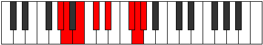

# Mode Staptian

## Links

- [Documentation](index.md)
- [Scales Index](Scales.md)
- [Modes Index](Modes.md)
- [Chords Index](Chords.md)

## Parent Scale

[Pagian](ScalePagian.md)

## Number

[3243](https://ianring.com/musictheory/scales/3243)

## Perfection

- 4 Perfect notes
- 3 Perfect notes

## Perfection Profile

[true false true true false true false]

## Permutations

| Tonic | Notes | Signature | Illustration | Audio |
|-------|-------|-----------|--------------|-------|
| [C](ModeCNaturalStaptian.md) | C, **Db**, Eb, F, **G**, A#, **B**, C | C |  | [midi](https://github.com/edipermadi/music/blob/main/docs/ModeCNaturalStaptian.mid?raw=true) |
| [C#](ModeCSharpStaptian.md) | C#, **D**, E, F#, **G#**, A##, **B#**, C# | C |  | [midi](https://github.com/edipermadi/music/blob/main/docs/ModeCSharpStaptian.mid?raw=true) |
| [Db](ModeDFlatStaptian.md) | Db, **Ebb**, Fb, Gb, **Ab**, B, **C**, Db | C |  | [midi](https://github.com/edipermadi/music/blob/main/docs/ModeDFlatStaptian.mid?raw=true) |
| [D](ModeDNaturalStaptian.md) | D, **Eb**, F, G, **A**, B#, **C#**, D | C |  | [midi](https://github.com/edipermadi/music/blob/main/docs/ModeDNaturalStaptian.mid?raw=true) |
| [D#](ModeDSharpStaptian.md) | D#, **E**, F#, G#, **A#**, B##, **C##**, D# | C |  | [midi](https://github.com/edipermadi/music/blob/main/docs/ModeDSharpStaptian.mid?raw=true) |
| [Eb](ModeEFlatStaptian.md) | Eb, **Fb**, Gb, Ab, **Bb**, C#, **D**, Eb | C |  | [midi](https://github.com/edipermadi/music/blob/main/docs/ModeEFlatStaptian.mid?raw=true) |
| [E](ModeENaturalStaptian.md) | E, **F**, G, A, **B**, C##, **D#**, E | C |  | [midi](https://github.com/edipermadi/music/blob/main/docs/ModeENaturalStaptian.mid?raw=true) |
| [F](ModeFNaturalStaptian.md) | F, **Gb**, Ab, Bb, **C**, D#, **E**, F | C |  | [midi](https://github.com/edipermadi/music/blob/main/docs/ModeFNaturalStaptian.mid?raw=true) |
| [F#](ModeFSharpStaptian.md) | F#, **G**, A, B, **C#**, D##, **E#**, F# | C |  | [midi](https://github.com/edipermadi/music/blob/main/docs/ModeFSharpStaptian.mid?raw=true) |
| [Gb](ModeGFlatStaptian.md) | Gb, **Abb**, Bbb, Cb, **Db**, E, **F**, Gb | C |  | [midi](https://github.com/edipermadi/music/blob/main/docs/ModeGFlatStaptian.mid?raw=true) |
| [G](ModeGNaturalStaptian.md) | G, **Ab**, Bb, C, **D**, E#, **F#**, G | C |  | [midi](https://github.com/edipermadi/music/blob/main/docs/ModeGNaturalStaptian.mid?raw=true) |
| [G#](ModeGSharpStaptian.md) | G#, **A**, B, C#, **D#**, E##, **F##**, G# | C |  | [midi](https://github.com/edipermadi/music/blob/main/docs/ModeGSharpStaptian.mid?raw=true) |
| [Ab](ModeAFlatStaptian.md) | Ab, **Bbb**, Cb, Db, **Eb**, F#, **G**, Ab | C |  | [midi](https://github.com/edipermadi/music/blob/main/docs/ModeAFlatStaptian.mid?raw=true) |
| [A](ModeANaturalStaptian.md) | A, **Bb**, C, D, **E**, F##, **G#**, A | C |  | [midi](https://github.com/edipermadi/music/blob/main/docs/ModeANaturalStaptian.mid?raw=true) |
| [A#](ModeASharpStaptian.md) | A#, **B**, C#, D#, **E#**, F###, **G##**, A# | C |  | [midi](https://github.com/edipermadi/music/blob/main/docs/ModeASharpStaptian.mid?raw=true) |
| [Bb](ModeBFlatStaptian.md) | Bb, **Cb**, Db, Eb, **F**, G#, **A**, Bb | C |  | [midi](https://github.com/edipermadi/music/blob/main/docs/ModeBFlatStaptian.mid?raw=true) |
| [B](ModeBNaturalStaptian.md) | B, **C**, D, E, **F#**, G##, **A#**, B | C |  | [midi](https://github.com/edipermadi/music/blob/main/docs/ModeBNaturalStaptian.mid?raw=true) |
