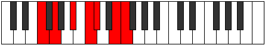

# Mode Staptimic

## Links

- [Documentation](index.md)
- [Scales Index](Scales.md)
- [Modes Index](Modes.md)
- [Chords Index](Chords.md)

## Parent Scale

[Bocrimic](ScaleBocrimic.md)

## Number

[2469](https://ianring.com/musictheory/scales/2469)

## Interval Pattern

2, 3, 2, 1, 3, 1

## Chord Pattern

iii, IV

## Perfection

- 3 Perfect notes
- 3 Perfect notes

## Perfection Profile

[true false true true false false]

## Permutations

| Tonic | Notes | Signature | Illustration | Audio |
|-------|-------|-----------|--------------|-------|
| [C](ModeCNaturalStaptimic.md) | C, **D**, E#, F##, **G#**, **A##**, C | C |  | [midi](https://github.com/edipermadi/music/blob/main/docs/ModeCNaturalStaptimic.mid?raw=true) |
| [C#](ModeCSharpStaptimic.md) | C#, **D#**, E##, F###, **G##**, **A###**, C# | C |  | [midi](https://github.com/edipermadi/music/blob/main/docs/ModeCSharpStaptimic.mid?raw=true) |
| [Db](ModeDFlatStaptimic.md) | Db, **Eb**, F#, G#, **A**, **B#**, Db | C |  | [midi](https://github.com/edipermadi/music/blob/main/docs/ModeDFlatStaptimic.mid?raw=true) |
| [D](ModeDNaturalStaptimic.md) | D, **E**, F##, G##, **A#**, **B##**, D | C |  | [midi](https://github.com/edipermadi/music/blob/main/docs/ModeDNaturalStaptimic.mid?raw=true) |
| [D#](ModeDSharpStaptimic.md) | D#, **E#**, F###, G###, **A##**, **B###**, D# | C |  | [midi](https://github.com/edipermadi/music/blob/main/docs/ModeDSharpStaptimic.mid?raw=true) |
| [Eb](ModeEFlatStaptimic.md) | Eb, **F**, G#, A#, **B**, **C##**, Eb | C |  | [midi](https://github.com/edipermadi/music/blob/main/docs/ModeEFlatStaptimic.mid?raw=true) |
| [E](ModeENaturalStaptimic.md) | E, **F#**, G##, A##, **B#**, **C###**, E | C |  | [midi](https://github.com/edipermadi/music/blob/main/docs/ModeENaturalStaptimic.mid?raw=true) |
| [F](ModeFNaturalStaptimic.md) | F, **G**, A#, B#, **C#**, **D##**, F | C |  | [midi](https://github.com/edipermadi/music/blob/main/docs/ModeFNaturalStaptimic.mid?raw=true) |
| [F#](ModeFSharpStaptimic.md) | F#, **G#**, A##, B##, **C##**, **D###**, F# | C |  | [midi](https://github.com/edipermadi/music/blob/main/docs/ModeFSharpStaptimic.mid?raw=true) |
| [Gb](ModeGFlatStaptimic.md) | Gb, **Ab**, B, C#, **D**, **E#**, Gb | C |  | [midi](https://github.com/edipermadi/music/blob/main/docs/ModeGFlatStaptimic.mid?raw=true) |
| [G](ModeGNaturalStaptimic.md) | G, **A**, B#, C##, **D#**, **E##**, G | C |  | [midi](https://github.com/edipermadi/music/blob/main/docs/ModeGNaturalStaptimic.mid?raw=true) |
| [G#](ModeGSharpStaptimic.md) | G#, **A#**, B##, C###, **D##**, **E###**, G# | C |  | [midi](https://github.com/edipermadi/music/blob/main/docs/ModeGSharpStaptimic.mid?raw=true) |
| [Ab](ModeAFlatStaptimic.md) | Ab, **Bb**, C#, D#, **E**, **F##**, Ab | C |  | [midi](https://github.com/edipermadi/music/blob/main/docs/ModeAFlatStaptimic.mid?raw=true) |
| [A](ModeANaturalStaptimic.md) | A, **B**, C##, D##, **E#**, **F###**, A | C |  | [midi](https://github.com/edipermadi/music/blob/main/docs/ModeANaturalStaptimic.mid?raw=true) |
| [A#](ModeASharpStaptimic.md) | A#, **B#**, C###, D###, **E##**, **Cbbb**, A# | C |  | [midi](https://github.com/edipermadi/music/blob/main/docs/ModeASharpStaptimic.mid?raw=true) |
| [Bb](ModeBFlatStaptimic.md) | Bb, **C**, D#, E#, **F#**, **G##**, Bb | C |  | [midi](https://github.com/edipermadi/music/blob/main/docs/ModeBFlatStaptimic.mid?raw=true) |
| [B](ModeBNaturalStaptimic.md) | B, **C#**, D##, E##, **F##**, **G###**, B | C |  | [midi](https://github.com/edipermadi/music/blob/main/docs/ModeBNaturalStaptimic.mid?raw=true) |
