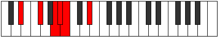
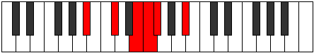

# Mode Staptitonic

## Links

- [Documentation](index.md)
- [Scales Index](Scales.md)
- [Modes Index](Modes.md)
- [Chords Index](Chords.md)

## Parent Scale

[Molitonic](ScaleMolitonic.md)

## Number

[457](https://ianring.com/musictheory/scales/457)

## Interval Pattern

3, 3, 1, 1, 4

## Chord Pattern

i⁰, i, V

## Perfection

- 2 Perfect notes
- 3 Perfect notes

## Perfection Profile

[true false false false true]

## Permutations

| Tonic | Notes | Signature | Illustration | Audio |
|-------|-------|-----------|--------------|-------|
| [C](ModeCNaturalStaptitonic.md) | C, **D#**, **F#**, **G**, G#, C | C |  | [midi](https://github.com/edipermadi/music/blob/main/docs/ModeCNaturalStaptitonic.mid?raw=true) |
| [C#](ModeCSharpStaptitonic.md) | C#, **E**, **G**, **G#**, A, C# | C |  | [midi](https://github.com/edipermadi/music/blob/main/docs/ModeCSharpStaptitonic.mid?raw=true) |
| [Db](ModeDFlatStaptitonic.md) | Db, **E**, **G**, **Ab**, A, Db | C |  | [midi](https://github.com/edipermadi/music/blob/main/docs/ModeDFlatStaptitonic.mid?raw=true) |
| [D](ModeDNaturalStaptitonic.md) | D, **F**, **G#**, **A**, A#, D | C |  | [midi](https://github.com/edipermadi/music/blob/main/docs/ModeDNaturalStaptitonic.mid?raw=true) |
| [D#](ModeDSharpStaptitonic.md) | D#, **F#**, **A**, **A#**, B, D# | C |  | [midi](https://github.com/edipermadi/music/blob/main/docs/ModeDSharpStaptitonic.mid?raw=true) |
| [Eb](ModeEFlatStaptitonic.md) | Eb, **Gb**, **A**, **Bb**, B, Eb | C |  | [midi](https://github.com/edipermadi/music/blob/main/docs/ModeEFlatStaptitonic.mid?raw=true) |
| [E](ModeENaturalStaptitonic.md) | E, **G**, **A#**, **B**, C, E | C |  | [midi](https://github.com/edipermadi/music/blob/main/docs/ModeENaturalStaptitonic.mid?raw=true) |
| [F](ModeFNaturalStaptitonic.md) | F, **G#**, **B**, **C**, C#, F | C |  | [midi](https://github.com/edipermadi/music/blob/main/docs/ModeFNaturalStaptitonic.mid?raw=true) |
| [F#](ModeFSharpStaptitonic.md) | F#, **A**, **C**, **C#**, D, F# | C |  | [midi](https://github.com/edipermadi/music/blob/main/docs/ModeFSharpStaptitonic.mid?raw=true) |
| [Gb](ModeGFlatStaptitonic.md) | Gb, **A**, **C**, **Db**, D, Gb | C |  | [midi](https://github.com/edipermadi/music/blob/main/docs/ModeGFlatStaptitonic.mid?raw=true) |
| [G](ModeGNaturalStaptitonic.md) | G, **A#**, **C#**, **D**, D#, G | C |  | [midi](https://github.com/edipermadi/music/blob/main/docs/ModeGNaturalStaptitonic.mid?raw=true) |
| [G#](ModeGSharpStaptitonic.md) | G#, **B**, **D**, **D#**, E, G# | C |  | [midi](https://github.com/edipermadi/music/blob/main/docs/ModeGSharpStaptitonic.mid?raw=true) |
| [Ab](ModeAFlatStaptitonic.md) | Ab, **B**, **D**, **Eb**, E, Ab | C |  | [midi](https://github.com/edipermadi/music/blob/main/docs/ModeAFlatStaptitonic.mid?raw=true) |
| [A](ModeANaturalStaptitonic.md) | A, **C**, **D#**, **E**, F, A | C |  | [midi](https://github.com/edipermadi/music/blob/main/docs/ModeANaturalStaptitonic.mid?raw=true) |
| [A#](ModeASharpStaptitonic.md) | A#, **C#**, **E**, **F**, F#, A# | C |  | [midi](https://github.com/edipermadi/music/blob/main/docs/ModeASharpStaptitonic.mid?raw=true) |
| [Bb](ModeBFlatStaptitonic.md) | Bb, **Db**, **E**, **F**, Gb, Bb | C |  | [midi](https://github.com/edipermadi/music/blob/main/docs/ModeBFlatStaptitonic.mid?raw=true) |
| [B](ModeBNaturalStaptitonic.md) | B, **D**, **F**, **F#**, G, B | C |  | [midi](https://github.com/edipermadi/music/blob/main/docs/ModeBNaturalStaptitonic.mid?raw=true) |
