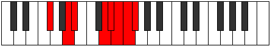

# Mode Starian

## Links

- [Documentation](README.md)
- [Scales Index](Scales.md)
- [Modes Index](Modes.md)
- [Chords Index](Chords.md)

## Parent Scale

[Thycrian](ScaleThycrian.md)

## Number

[3865](https://ianring.com/musictheory/scales/3865)

## Luminosity

-1

## Transposition

3, 1, 4, 1, 1, 1, 1

## Chord Pattern

v⁰b3, vi⁰b3

## Perfection

- 4 Perfect notes
- 3 Perfect notes

## Perfection Profile

false, true, true, true, true, false, false

## Permutations

| Tonic | Notes | Signature | Illustration | Audio |
|-------|-------|-----------|--------------|-------|
| [C](ModeCNaturalStarian.md) | **C**, D#, E, F###, G##, **A#**, **B**, **C** | C |  | [midi](https://github.com/edipermadi/music/blob/main/docs/ModeCNaturalStarian.mid?raw=true) |
| [C#](ModeCSharpStarian.md) | **C#**, D##, E#, Cbbb, Cbb, **Dbbb**, **Dbb**, **C#** | C |  | [midi](https://github.com/edipermadi/music/blob/main/docs/ModeCSharpStarian.mid?raw=true) |
| [Db](ModeDFlatStarian.md) | **Db**, E, F, G##, A#, **B**, **C**, **Db** | C |  | [midi](https://github.com/edipermadi/music/blob/main/docs/ModeDFlatStarian.mid?raw=true) |
| [D](ModeDNaturalStarian.md) | **D**, E#, F#, G###, A##, **B#**, **C#**, **D** | C |  | [midi](https://github.com/edipermadi/music/blob/main/docs/ModeDNaturalStarian.mid?raw=true) |
| [D#](ModeDSharpStarian.md) | **D#**, E##, F##, Cb, Dbb, **Ebbb**, **Fbbb**, **D#** | C |  | [midi](https://github.com/edipermadi/music/blob/main/docs/ModeDSharpStarian.mid?raw=true) |
| [Eb](ModeEFlatStarian.md) | **Eb**, F#, G, A##, B#, **C#**, **D**, **Eb** | C |  | [midi](https://github.com/edipermadi/music/blob/main/docs/ModeEFlatStarian.mid?raw=true) |
| [E](ModeENaturalStarian.md) | **E**, F##, G#, A###, B##, **C##**, **D#**, **E** | C |  | [midi](https://github.com/edipermadi/music/blob/main/docs/ModeENaturalStarian.mid?raw=true) |
| [F](ModeFNaturalStarian.md) | **F**, G#, A, B##, C##, **D#**, **E**, **F** | C |  | [midi](https://github.com/edipermadi/music/blob/main/docs/ModeFNaturalStarian.mid?raw=true) |
| [F#](ModeFSharpStarian.md) | **F#**, G##, A#, B###, C###, **D##**, **E#**, **F#** | C |  | [midi](https://github.com/edipermadi/music/blob/main/docs/ModeFSharpStarian.mid?raw=true) |
| [Gb](ModeGFlatStarian.md) | **Gb**, A, Bb, C##, D#, **E**, **F**, **Gb** | C |  | [midi](https://github.com/edipermadi/music/blob/main/docs/ModeGFlatStarian.mid?raw=true) |
| [G](ModeGNaturalStarian.md) | **G**, A#, B, C###, D##, **E#**, **F#**, **G** | C |  | [midi](https://github.com/edipermadi/music/blob/main/docs/ModeGNaturalStarian.mid?raw=true) |
| [G#](ModeGSharpStarian.md) | **G#**, A##, B#, D##, E#, **F#**, **G**, **G#** | C |  | [midi](https://github.com/edipermadi/music/blob/main/docs/ModeGSharpStarian.mid?raw=true) |
| [Ab](ModeAFlatStarian.md) | **Ab**, B, C, D##, E#, **F#**, **G**, **Ab** | C |  | [midi](https://github.com/edipermadi/music/blob/main/docs/ModeAFlatStarian.mid?raw=true) |
| [A](ModeANaturalStarian.md) | **A**, B#, C#, D###, E##, **F##**, **G#**, **A** | C |  | [midi](https://github.com/edipermadi/music/blob/main/docs/ModeANaturalStarian.mid?raw=true) |
| [A#](ModeASharpStarian.md) | **A#**, B##, C##, E##, F##, **G#**, **A**, **A#** | C |  | [midi](https://github.com/edipermadi/music/blob/main/docs/ModeASharpStarian.mid?raw=true) |
| [Bb](ModeBFlatStarian.md) | **Bb**, C#, D, E##, F##, **G#**, **A**, **Bb** | C |  | [midi](https://github.com/edipermadi/music/blob/main/docs/ModeBFlatStarian.mid?raw=true) |
| [B](ModeBNaturalStarian.md) | **B**, C##, D#, E###, F###, **G##**, **A#**, **B** | C |  | [midi](https://github.com/edipermadi/music/blob/main/docs/ModeBNaturalStarian.mid?raw=true) |
