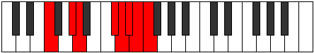

# Mode Starian

## Links

- [Documentation](index.md)
- [Scales Index](Scales.md)
- [Modes Index](Modes.md)
- [Chords Index](Chords.md)

## Parent Scale

[Thycrian](ScaleThycrian.md)

## Number

[3865](https://ianring.com/musictheory/scales/3865)

## Perfection

- 4 Perfect notes
- 3 Perfect notes

## Perfection Profile

[false true true true true false false]

## Permutations

| Tonic | Notes | Signature | Illustration | Audio |
|-------|-------|-----------|--------------|-------|
| [C](ModeCNaturalStarian.md) | **C**, D#, E, F###, G##, **A#**, **B**, **C** | C |  | [midi](ModeCNaturalStarian.mid) [ogg](ModeCNaturalStarian.ogg) |
| [C#](ModeCSharpStarian.md) | **C#**, D##, E#, Cbbb, Cbb, **Dbbb**, **Dbb**, **C#** | C |  | [midi](ModeCSharpStarian.mid) [ogg](ModeCSharpStarian.ogg) |
| [Db](ModeDFlatStarian.md) | **Db**, E, F, G##, A#, **B**, **C**, **Db** | C |  | [midi](ModeDFlatStarian.mid) [ogg](ModeDFlatStarian.ogg) |
| [D](ModeDNaturalStarian.md) | **D**, E#, F#, G###, A##, **B#**, **C#**, **D** | C |  | [midi](ModeDNaturalStarian.mid) [ogg](ModeDNaturalStarian.ogg) |
| [D#](ModeDSharpStarian.md) | **D#**, E##, F##, Cb, Dbb, **Ebbb**, **Fbbb**, **D#** | C |  | [midi](ModeDSharpStarian.mid) [ogg](ModeDSharpStarian.ogg) |
| [Eb](ModeEFlatStarian.md) | **Eb**, F#, G, A##, B#, **C#**, **D**, **Eb** | C |  | [midi](ModeEFlatStarian.mid) [ogg](ModeEFlatStarian.ogg) |
| [E](ModeENaturalStarian.md) | **E**, F##, G#, A###, B##, **C##**, **D#**, **E** | C |  | [midi](ModeENaturalStarian.mid) [ogg](ModeENaturalStarian.ogg) |
| [F](ModeFNaturalStarian.md) | **F**, G#, A, B##, C##, **D#**, **E**, **F** | C |  | [midi](ModeFNaturalStarian.mid) [ogg](ModeFNaturalStarian.ogg) |
| [F#](ModeFSharpStarian.md) | **F#**, G##, A#, B###, C###, **D##**, **E#**, **F#** | C |  | [midi](ModeFSharpStarian.mid) [ogg](ModeFSharpStarian.ogg) |
| [Gb](ModeGFlatStarian.md) | **Gb**, A, Bb, C##, D#, **E**, **F**, **Gb** | C |  | [midi](ModeGFlatStarian.mid) [ogg](ModeGFlatStarian.ogg) |
| [G](ModeGNaturalStarian.md) | **G**, A#, B, C###, D##, **E#**, **F#**, **G** | C |  | [midi](ModeGNaturalStarian.mid) [ogg](ModeGNaturalStarian.ogg) |
| [G#](ModeGSharpStarian.md) | **G#**, A##, B#, D##, E#, **F#**, **G**, **G#** | C |  | [midi](ModeGSharpStarian.mid) [ogg](ModeGSharpStarian.ogg) |
| [Ab](ModeAFlatStarian.md) | **Ab**, B, C, D##, E#, **F#**, **G**, **Ab** | C |  | [midi](ModeAFlatStarian.mid) [ogg](ModeAFlatStarian.ogg) |
| [A](ModeANaturalStarian.md) | **A**, B#, C#, D###, E##, **F##**, **G#**, **A** | C |  | [midi](ModeANaturalStarian.mid) [ogg](ModeANaturalStarian.ogg) |
| [A#](ModeASharpStarian.md) | **A#**, B##, C##, E##, F##, **G#**, **A**, **A#** | C |  | [midi](ModeASharpStarian.mid) [ogg](ModeASharpStarian.ogg) |
| [Bb](ModeBFlatStarian.md) | **Bb**, C#, D, E##, F##, **G#**, **A**, **Bb** | C |  | [midi](ModeBFlatStarian.mid) [ogg](ModeBFlatStarian.ogg) |
| [B](ModeBNaturalStarian.md) | **B**, C##, D#, E###, F###, **G##**, **A#**, **B** | C |  | [midi](ModeBNaturalStarian.mid) [ogg](ModeBNaturalStarian.ogg) |
