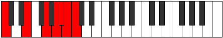
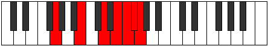

# Mode Starimic

## Links

- [Documentation](README.md)
- [Scales Index](Scales.md)
- [Modes Index](Modes.md)
- [Chords Index](Chords.md)

## Parent Scale

[Starimic](ScaleStarimic.md)

## Number

[3729](https://ianring.com/musictheory/scales/3729)

## Transposition

4, 3, 2, 1, 1, 1

## Chord Pattern

## Perfection

- 3 Perfect notes
- 3 Perfect notes

## Perfection Profile

true, true, false, true, false, false

## Permutations

| Tonic | Notes | Signature | Illustration | Audio |
|-------|-------|-----------|--------------|-------|
| [C](ModeCNaturalStarimic.md) | C, D##, **E###**, Cbbb, **Cbb**, **Dbbb**, C | C |  | [midi](https://github.com/edipermadi/music/blob/main/docs/ModeCNaturalStarimic.mid?raw=true) |
| [C#](ModeCSharpStarimic.md) | C#, D###, **F###**, G###, **A##**, **B#**, C# | C |  | [midi](https://github.com/edipermadi/music/blob/main/docs/ModeCSharpStarimic.mid?raw=true) |
| [Db](ModeDFlatStarimic.md) | Db, E#, **F###**, G###, **A##**, **B#**, Db | C |  | [midi](https://github.com/edipermadi/music/blob/main/docs/ModeDFlatStarimic.mid?raw=true) |
| [D](ModeDNaturalStarimic.md) | D, E##, **Cbbb**, Dbbb, **Dbb**, **Ebbb**, D | C |  | [midi](https://github.com/edipermadi/music/blob/main/docs/ModeDNaturalStarimic.mid?raw=true) |
| [D#](ModeDSharpStarimic.md) | D#, E###, **Cbb**, Dbb, **Ebbb**, **Fbbb**, D# | C |  | [midi](https://github.com/edipermadi/music/blob/main/docs/ModeDSharpStarimic.mid?raw=true) |
| [Eb](ModeEFlatStarimic.md) | Eb, F##, **G###**, A###, **B##**, **C##**, Eb | C |  | [midi](https://github.com/edipermadi/music/blob/main/docs/ModeEFlatStarimic.mid?raw=true) |
| [E](ModeENaturalStarimic.md) | E, F###, **Cb**, Db, **Ebb**, **Fbb**, E | C |  | [midi](https://github.com/edipermadi/music/blob/main/docs/ModeENaturalStarimic.mid?raw=true) |
| [F](ModeFNaturalStarimic.md) | F, G##, **A###**, B###, **C###**, **D##**, F | C |  | [midi](https://github.com/edipermadi/music/blob/main/docs/ModeFNaturalStarimic.mid?raw=true) |
| [F#](ModeFSharpStarimic.md) | F#, G###, **Db**, Eb, **Fb**, **Gbb**, F# | C |  | [midi](https://github.com/edipermadi/music/blob/main/docs/ModeFSharpStarimic.mid?raw=true) |
| [Gb](ModeGFlatStarimic.md) | Gb, A#, **B##**, C###, **D##**, **E#**, Gb | C |  | [midi](https://github.com/edipermadi/music/blob/main/docs/ModeGFlatStarimic.mid?raw=true) |
| [G](ModeGNaturalStarimic.md) | G, A##, **B###**, D##, **E#**, **F#**, G | C |  | [midi](https://github.com/edipermadi/music/blob/main/docs/ModeGNaturalStarimic.mid?raw=true) |
| [G#](ModeGSharpStarimic.md) | G#, A###, **C###**, D###, **E##**, **F##**, G# | C |  | [midi](https://github.com/edipermadi/music/blob/main/docs/ModeGSharpStarimic.mid?raw=true) |
| [Ab](ModeAFlatStarimic.md) | Ab, B#, **C###**, D###, **E##**, **F##**, Ab | C |  | [midi](https://github.com/edipermadi/music/blob/main/docs/ModeAFlatStarimic.mid?raw=true) |
| [A](ModeANaturalStarimic.md) | A, B##, **D##**, E##, **F##**, **G#**, A | C |  | [midi](https://github.com/edipermadi/music/blob/main/docs/ModeANaturalStarimic.mid?raw=true) |
| [A#](ModeASharpStarimic.md) | A#, B###, **D###**, E###, **F###**, **G##**, A# | C |  | [midi](https://github.com/edipermadi/music/blob/main/docs/ModeASharpStarimic.mid?raw=true) |
| [Bb](ModeBFlatStarimic.md) | Bb, C##, **D###**, E###, **F###**, **G##**, Bb | C |  | [midi](https://github.com/edipermadi/music/blob/main/docs/ModeBFlatStarimic.mid?raw=true) |
| [B](ModeBNaturalStarimic.md) | B, C###, **E##**, F###, **G##**, **A#**, B | C |  | [midi](https://github.com/edipermadi/music/blob/main/docs/ModeBNaturalStarimic.mid?raw=true) |
