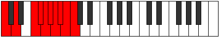

# Mode Starygic

## Links

- [Documentation](README.md)
- [Scales Index](Scales.md)
- [Modes Index](Modes.md)
- [Chords Index](Chords.md)

## Parent Scale

[Aeolacrygic](ScaleAeolacrygic.md)

## Number

[4069](https://ianring.com/musictheory/scales/4069)

## Transposition

2, 3, 1, 1, 1, 1, 1, 1, 1

## Chord Pattern

IIb5, ix

## Perfection

- 6 Perfect notes
- 3 Perfect notes

## Perfection Profile

true, true, true, false, true, false, false, true, true

## Permutations

| Tonic | Notes | Signature | Illustration | Audio |
|-------|-------|-----------|--------------|-------|
| [C](ModeCNaturalStarygic.md) | C, D, F, **F#**, G, **G#**, **A**, A#, B, C | C |  | [midi](https://github.com/edipermadi/music/blob/main/docs/ModeCNaturalStarygic.mid?raw=true) |
| [C#](ModeCSharpStarygic.md) | C#, D#, F#, **G**, G#, **A**, **A#**, B, C, C# | C |  | [midi](https://github.com/edipermadi/music/blob/main/docs/ModeCSharpStarygic.mid?raw=true) |
| [Db](ModeDFlatStarygic.md) | Db, Eb, Gb, **G**, Ab, **A**, **Bb**, B, C, Db | C |  | [midi](https://github.com/edipermadi/music/blob/main/docs/ModeDFlatStarygic.mid?raw=true) |
| [D](ModeDNaturalStarygic.md) | D, E, G, **G#**, A, **A#**, **B**, C, C#, D | C |  | [midi](https://github.com/edipermadi/music/blob/main/docs/ModeDNaturalStarygic.mid?raw=true) |
| [D#](ModeDSharpStarygic.md) | D#, F, G#, **A**, A#, **B**, **C**, C#, D, D# | C |  | [midi](https://github.com/edipermadi/music/blob/main/docs/ModeDSharpStarygic.mid?raw=true) |
| [Eb](ModeEFlatStarygic.md) | Eb, F, Ab, **A**, Bb, **B**, **C**, Db, D, Eb | C |  | [midi](https://github.com/edipermadi/music/blob/main/docs/ModeEFlatStarygic.mid?raw=true) |
| [E](ModeENaturalStarygic.md) | E, F#, A, **A#**, B, **C**, **C#**, D, D#, E | C |  | [midi](https://github.com/edipermadi/music/blob/main/docs/ModeENaturalStarygic.mid?raw=true) |
| [F](ModeFNaturalStarygic.md) | F, G, A#, **B**, C, **C#**, **D**, D#, E, F | C |  | [midi](https://github.com/edipermadi/music/blob/main/docs/ModeFNaturalStarygic.mid?raw=true) |
| [F#](ModeFSharpStarygic.md) | F#, G#, B, **C**, C#, **D**, **D#**, E, F, F# | C |  | [midi](https://github.com/edipermadi/music/blob/main/docs/ModeFSharpStarygic.mid?raw=true) |
| [Gb](ModeGFlatStarygic.md) | Gb, Ab, B, **C**, Db, **D**, **Eb**, E, F, Gb | C |  | [midi](https://github.com/edipermadi/music/blob/main/docs/ModeGFlatStarygic.mid?raw=true) |
| [G](ModeGNaturalStarygic.md) | G, A, C, **C#**, D, **D#**, **E**, F, F#, G | C |  | [midi](https://github.com/edipermadi/music/blob/main/docs/ModeGNaturalStarygic.mid?raw=true) |
| [G#](ModeGSharpStarygic.md) | G#, A#, C#, **D**, D#, **E**, **F**, F#, G, G# | C |  | [midi](https://github.com/edipermadi/music/blob/main/docs/ModeGSharpStarygic.mid?raw=true) |
| [Ab](ModeAFlatStarygic.md) | Ab, Bb, Db, **D**, Eb, **E**, **F**, Gb, G, Ab | C |  | [midi](https://github.com/edipermadi/music/blob/main/docs/ModeAFlatStarygic.mid?raw=true) |
| [A](ModeANaturalStarygic.md) | A, B, D, **D#**, E, **F**, **F#**, G, G#, A | C |  | [midi](https://github.com/edipermadi/music/blob/main/docs/ModeANaturalStarygic.mid?raw=true) |
| [A#](ModeASharpStarygic.md) | A#, C, D#, **E**, F, **F#**, **G**, G#, A, A# | C |  | [midi](https://github.com/edipermadi/music/blob/main/docs/ModeASharpStarygic.mid?raw=true) |
| [Bb](ModeBFlatStarygic.md) | Bb, C, Eb, **E**, F, **Gb**, **G**, Ab, A, Bb | C |  | [midi](https://github.com/edipermadi/music/blob/main/docs/ModeBFlatStarygic.mid?raw=true) |
| [B](ModeBNaturalStarygic.md) | B, C#, E, **F**, F#, **G**, **G#**, A, A#, B | C |  | [midi](https://github.com/edipermadi/music/blob/main/docs/ModeBNaturalStarygic.mid?raw=true) |
