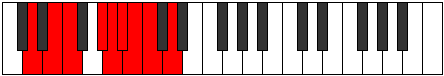

# Mode Staryllic

## Links

- [Documentation](README.md)
- [Scales Index](Scales.md)
- [Modes Index](Modes.md)
- [Chords Index](Chords.md)

## Parent Scale

[Gythyllic](ScaleGythyllic.md)

## Number

[1997](https://ianring.com/musictheory/scales/1997)

## Transposition

2, 1, 3, 1, 1, 1, 1, 2

## Chord Pattern

i, IIb5, IIIb5, IIIb5, vi⁰b3, vi⁰b3, vii⁰, VIII⁺, VIII⁺

## Perfection

- 5 Perfect notes
- 3 Perfect notes

## Perfection Profile

[true true true false true true false false]

## Permutations

| Tonic | Notes | Signature | Illustration | Audio |
|-------|-------|-----------|--------------|-------|
| [C](ModeCNaturalStaryllic.md) | C, D, D#, **F#**, G, G#, **A**, **A#**, C | C |  | [midi](https://github.com/edipermadi/music/blob/main/docs/ModeCNaturalStaryllic.mid?raw=true) |
| [C#](ModeCSharpStaryllic.md) | C#, D#, E, **G**, G#, A, **A#**, **B**, C# | C |  | [midi](https://github.com/edipermadi/music/blob/main/docs/ModeCSharpStaryllic.mid?raw=true) |
| [Db](ModeDFlatStaryllic.md) | Db, Eb, E, **G**, Ab, A, **Bb**, **B**, Db | C |  | [midi](https://github.com/edipermadi/music/blob/main/docs/ModeDFlatStaryllic.mid?raw=true) |
| [D](ModeDNaturalStaryllic.md) | D, E, F, **G#**, A, A#, **B**, **C**, D | C |  | [midi](https://github.com/edipermadi/music/blob/main/docs/ModeDNaturalStaryllic.mid?raw=true) |
| [D#](ModeDSharpStaryllic.md) | D#, F, F#, **A**, A#, B, **C**, **C#**, D# | C |  | [midi](https://github.com/edipermadi/music/blob/main/docs/ModeDSharpStaryllic.mid?raw=true) |
| [Eb](ModeEFlatStaryllic.md) | Eb, F, Gb, **A**, Bb, B, **C**, **Db**, Eb | C |  | [midi](https://github.com/edipermadi/music/blob/main/docs/ModeEFlatStaryllic.mid?raw=true) |
| [E](ModeENaturalStaryllic.md) | E, F#, G, **A#**, B, C, **C#**, **D**, E | C |  | [midi](https://github.com/edipermadi/music/blob/main/docs/ModeENaturalStaryllic.mid?raw=true) |
| [F](ModeFNaturalStaryllic.md) | F, G, G#, **B**, C, C#, **D**, **D#**, F | C |  | [midi](https://github.com/edipermadi/music/blob/main/docs/ModeFNaturalStaryllic.mid?raw=true) |
| [F#](ModeFSharpStaryllic.md) | F#, G#, A, **C**, C#, D, **D#**, **E**, F# | C |  | [midi](https://github.com/edipermadi/music/blob/main/docs/ModeFSharpStaryllic.mid?raw=true) |
| [Gb](ModeGFlatStaryllic.md) | Gb, Ab, A, **C**, Db, D, **Eb**, **E**, Gb | C |  | [midi](https://github.com/edipermadi/music/blob/main/docs/ModeGFlatStaryllic.mid?raw=true) |
| [G](ModeGNaturalStaryllic.md) | G, A, A#, **C#**, D, D#, **E**, **F**, G | C |  | [midi](https://github.com/edipermadi/music/blob/main/docs/ModeGNaturalStaryllic.mid?raw=true) |
| [G#](ModeGSharpStaryllic.md) | G#, A#, B, **D**, D#, E, **F**, **F#**, G# | C |  | [midi](https://github.com/edipermadi/music/blob/main/docs/ModeGSharpStaryllic.mid?raw=true) |
| [Ab](ModeAFlatStaryllic.md) | Ab, Bb, B, **D**, Eb, E, **F**, **Gb**, Ab | C |  | [midi](https://github.com/edipermadi/music/blob/main/docs/ModeAFlatStaryllic.mid?raw=true) |
| [A](ModeANaturalStaryllic.md) | A, B, C, **D#**, E, F, **F#**, **G**, A | C |  | [midi](https://github.com/edipermadi/music/blob/main/docs/ModeANaturalStaryllic.mid?raw=true) |
| [A#](ModeASharpStaryllic.md) | A#, C, C#, **E**, F, F#, **G**, **G#**, A# | C |  | [midi](https://github.com/edipermadi/music/blob/main/docs/ModeASharpStaryllic.mid?raw=true) |
| [Bb](ModeBFlatStaryllic.md) | Bb, C, Db, **E**, F, Gb, **G**, **Ab**, Bb | C |  | [midi](https://github.com/edipermadi/music/blob/main/docs/ModeBFlatStaryllic.mid?raw=true) |
| [B](ModeBNaturalStaryllic.md) | B, C#, D, **F**, F#, G, **G#**, **A**, B | C |  | [midi](https://github.com/edipermadi/music/blob/main/docs/ModeBNaturalStaryllic.mid?raw=true) |
